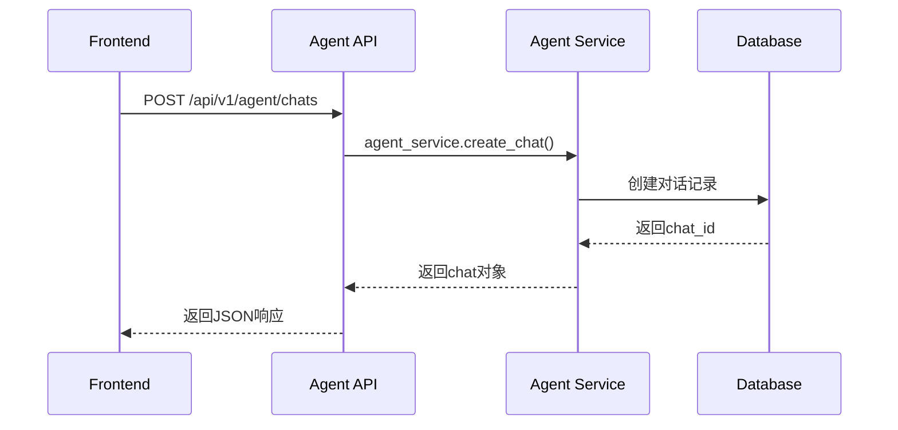
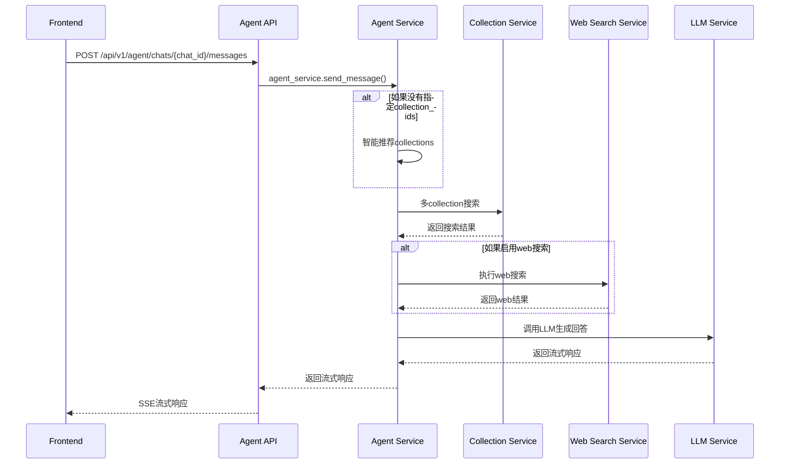
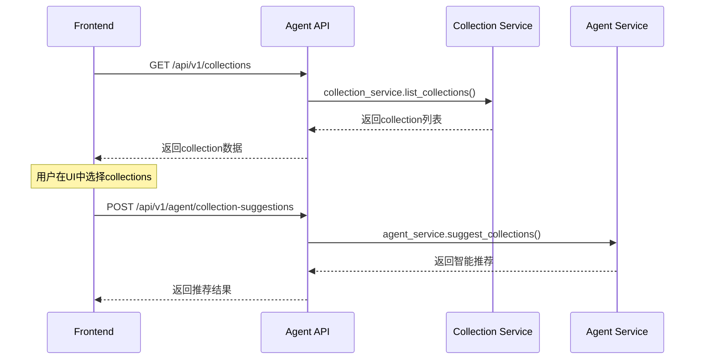

# ApeRAG Agent 后端接口设计方案

## 1. 设计概述

基于现有ApeRAG项目架构，为Agent功能设计一套完整的后端接口系统。Agent作为一个独立的智能对话助手，需要支持多collection搜索、模型切换、Web搜索等功能，并提供流畅的对话体验。

## 2. 接口架构设计

### 2.1 接口路径规划

根据现有API设计模式，Agent相关接口统一使用 `/api/v1/agent` 前缀：

```
/api/v1/agent/
├── chats/                          # 对话管理
├── search/                         # 智能搜索
├── web-search/                     # Web搜索
└── collection-suggestions/         # 智能推荐
```

### 2.2 数据流架构

```
Frontend → Agent API → Agent Service → [
    Collection Service (多collection搜索)
    Web Search Service (网络搜索)
    LLM Service (模型调用)
    Chat Service (对话历史)
]
```

## 3. 接口详细设计

### 3.1 Agent对话管理接口

#### 3.1.1 创建Agent对话
```
POST /api/v1/agent/chats
```

**请求体**：
```json
{
  "title": "新对话"  // 可选，默认自动生成
}
```

**响应**：
```json
{
  "id": "chat_12345",
  "title": "新对话",
  "created": "2025-01-07T10:00:00Z",
  "updated": "2025-01-07T10:00:00Z"
}
```

#### 3.1.2 获取对话列表
```
GET /api/v1/agent/chats
```

**响应**：
```json
{
  "items": [
    {
      "id": "chat_12345",
      "title": "技术问题讨论",
      "created": "2025-01-07T10:00:00Z",
      "updated": "2025-01-07T10:00:00Z"
    }
  ]
}
```

#### 3.1.3 获取对话详情
```
GET /api/v1/agent/chats/{chat_id}
```

**响应**：
```json
{
  "id": "chat_12345",
  "title": "技术问题讨论",
  "created": "2025-01-07T10:00:00Z",
  "updated": "2025-01-07T10:00:00Z",
  "messages": [
    {
      "id": "msg_67890",
      "type": "user",
      "content": "请介绍一下ApeRAG的架构",
      "collection_ids": ["col_1", "col_2"],
      "web_search_enabled": false,
      "model_used": "claude-3-5-sonnet",
      "timestamp": "2025-01-07T10:01:00Z"
    },
    {
      "id": "msg_67891",
      "type": "assistant",
      "content": "ApeRAG是一个...",
      "sources": [
        {
          "collection_id": "col_1",
          "collection_name": "技术文档",
          "score": 0.95,
          "text": "相关文档内容...",
          "metadata": {"source": "doc1.pdf"}
        }
      ],
      "web_search_results": null,
      "model_used": "claude-3-5-sonnet",
      "timestamp": "2025-01-07T10:01:05Z"
    }
  ]
}
```

#### 3.1.4 发送消息
```
POST /api/v1/agent/chats/{chat_id}/messages
```

**请求体**：
```json
{
  "content": "请介绍一下ApeRAG的架构",
  "collection_ids": ["col_1", "col_2"],  // 可选，为空则智能推荐
  "model_id": "claude-3-5-sonnet",       // 可选，使用默认模型
  "web_search_enabled": false,           // 可选，默认false
  "stream": true                         // 可选，是否流式响应
}
```

**流式响应**（Server-Sent Events）：
```
data: {"type": "start", "message_id": "msg_67890"}

data: {"type": "content", "content": "ApeRAG是一个"}

data: {"type": "content", "content": "强大的"}

data: {"type": "sources", "sources": [...]}

data: {"type": "end", "message_id": "msg_67890"}
```

**非流式响应**：
```json
{
  "id": "msg_67890",
  "content": "ApeRAG是一个强大的RAG系统...",
  "collection_ids": ["col_1", "col_2"],
  "sources": [
    {
      "collection_id": "col_1",
      "collection_name": "技术文档",
      "score": 0.95,
      "text": "相关文档内容...",
      "metadata": {"source": "doc1.pdf"}
    }
  ],
  "web_search_results": null,
  "model_used": "claude-3-5-sonnet",
  "created": "2025-01-07T10:01:05Z"
}
```

#### 3.1.5 WebSocket实时对话
```
WebSocket /api/v1/agent/chats/{chat_id}/connect
```

**发送消息**：
```json
{
  "type": "message",
  "content": "请介绍一下ApeRAG的架构",
  "collection_ids": ["col_1", "col_2"],
  "model_id": "claude-3-5-sonnet",
  "web_search_enabled": false
}
```

**接收消息**：
```json
{
  "type": "content",
  "message_id": "msg_67890",
  "content": "ApeRAG是一个"
}
```

### 3.2 Agent智能搜索接口

#### 3.2.1 多Collection智能搜索
```
POST /api/v1/agent/search
```

**请求体**：
```json
{
  "query": "ApeRAG的架构设计",
  "collection_ids": ["col_1", "col_2"],  // 可选，为空则搜索所有
  "max_results": 10,                     // 可选，默认10
  "search_types": ["vector", "fulltext", "graph"]  // 可选，默认全部
}
```

**响应**：
```json
{
  "query": "ApeRAG的架构设计",
  "results": [
    {
      "rank": 1,
      "score": 0.95,
      "content": "ApeRAG采用微服务架构...",
      "collection_id": "col_1",
      "collection_name": "技术文档",
      "source": "architecture.md",
      "recall_type": "vector",
      "metadata": {
        "document_id": "doc_123",
        "chunk_id": "chunk_456"
      }
    }
  ],
  "collections_used": ["col_1", "col_2"],
  "search_types_used": ["vector", "fulltext", "graph"],
  "total_results": 25
}
```

#### 3.2.2 智能Collection推荐
```
POST /api/v1/agent/collection-suggestions
```

**请求体**：
```json
{
  "query": "如何部署ApeRAG到生产环境"
}
```

**响应**：
```json
{
  "query": "如何部署ApeRAG到生产环境",
  "suggestions": [
    {
      "collection_id": "col_1",
      "collection_name": "部署文档",
      "relevance_score": 0.92,
      "reason": "包含Kubernetes部署配置和CI/CD流程"
    },
    {
      "collection_id": "col_2",
      "collection_name": "运维手册",
      "relevance_score": 0.85,
      "reason": "包含生产环境监控和故障排查指南"
    }
  ]
}
```

### 3.3 Web搜索接口

#### 3.3.1 Web搜索
```
POST /api/v1/agent/web-search
```

**请求体**：
```json
{
  "query": "ApeRAG 2025年最新发展",
  "max_results": 5,
  "search_engine": "google"  // 可选，默认google
}
```

**响应**：
```json
{
  "query": "ApeRAG 2025年最新发展",
  "results": [
    {
      "title": "ApeRAG 2025年技术路线图",
      "url": "https://example.com/aperag-2025-roadmap",
      "snippet": "ApeRAG在2025年将重点发展...",
      "score": 0.92,
      "published_date": "2025-01-01T00:00:00Z"
    }
  ],
  "search_engine": "google",
  "total_results": 1250
}
```

## 4. 前后端交互流程

### 4.1 对话创建流程



### 4.2 消息发送流程



### 4.3 Collection选择流程



## 5. 数据模型设计

### 5.1 Agent对话模型

```python
class AgentChat:
    id: str
    title: str
    created: datetime
    updated: datetime

class AgentMessage:
    id: str
    chat_id: str
    type: Literal["user", "assistant"]
    content: str
    collection_ids: List[str]
    model_used: str
    web_search_enabled: bool
    sources: List[SearchSource]
    web_search_results: List[WebSearchResult]
    created: datetime
```

### 5.2 搜索结果模型

```python
class SearchSource:
    collection_id: str
    collection_name: str
    score: float
    text: str
    metadata: Dict[str, Any]

class WebSearchResult:
    title: str
    url: str
    snippet: str
    score: float
    published_date: Optional[datetime]
```

## 6. 错误处理设计

### 6.1 标准错误响应格式

```json
{
  "error": "COLLECTION_NOT_FOUND",
  "message": "指定的collection不存在",
  "details": {
    "collection_id": "col_123",
    "available_collections": ["col_1", "col_2"]
  }
}
```

### 6.2 常见错误码

| 错误码 | HTTP状态码 | 描述 |
|--------|-----------|------|
| CHAT_NOT_FOUND | 404 | 对话不存在 |
| COLLECTION_NOT_FOUND | 404 | Collection不存在 |
| MODEL_NOT_AVAILABLE | 400 | 模型不可用 |
| WEB_SEARCH_FAILED | 500 | Web搜索失败 |
| QUOTA_EXCEEDED | 429 | 超过配额限制 |

## 7. 性能优化设计

### 7.1 缓存策略

- **Collection元数据缓存**：缓存collection列表和基本信息
- **搜索结果缓存**：相同查询的搜索结果缓存5分钟
- **模型配置缓存**：缓存用户可用的模型列表

### 7.2 异步处理

- **流式响应**：使用异步生成器实现流式输出
- **后台任务**：Web搜索和图搜索使用异步任务队列
- **连接池**：数据库和外部API使用连接池

## 8. 安全性设计

### 8.1 认证授权

- **API认证**：支持Bearer Token和Cookie认证
- **权限控制**：用户只能访问自己的对话和collection
- **API限流**：防止接口滥用

### 8.2 数据安全

- **敏感信息过滤**：API响应中过滤敏感信息
- **输入验证**：严格验证所有输入参数
- **XSS防护**：对用户输入进行sanitization

## 9. 实现优先级

### 9.1 第一阶段（核心功能）

1. Agent对话管理接口
2. 基础消息发送（非流式）
3. 多collection搜索
4. 复用现有collection和model接口

### 9.2 第二阶段（高级功能）

1. 流式响应支持
2. WebSocket实时对话
3. 智能collection推荐
4. Web搜索集成

### 9.3 第三阶段（优化功能）

1. 缓存优化
2. 性能监控
3. 高级错误处理
4. 审计日志集成

## 10. 总结

这个设计方案基于现有ApeRAG架构，通过新增Agent专用接口来支持智能对话功能。主要特点：

1. **架构兼容**：复用现有的service层和数据模型
2. **功能完整**：支持多collection搜索、模型切换、Web搜索
3. **用户友好**：提供流式响应和实时对话
4. **扩展性强**：接口设计支持未来功能扩展
5. **性能优化**：考虑缓存、异步处理等性能优化

前端可以通过这些接口实现类似Cursor的对话体验，用户可以轻松选择collection、切换模型，并获得智能的搜索和问答服务。