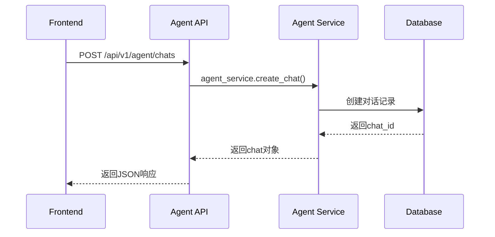
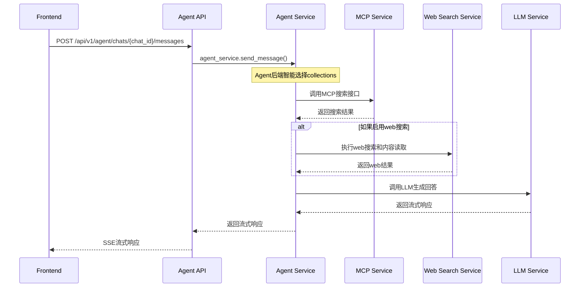
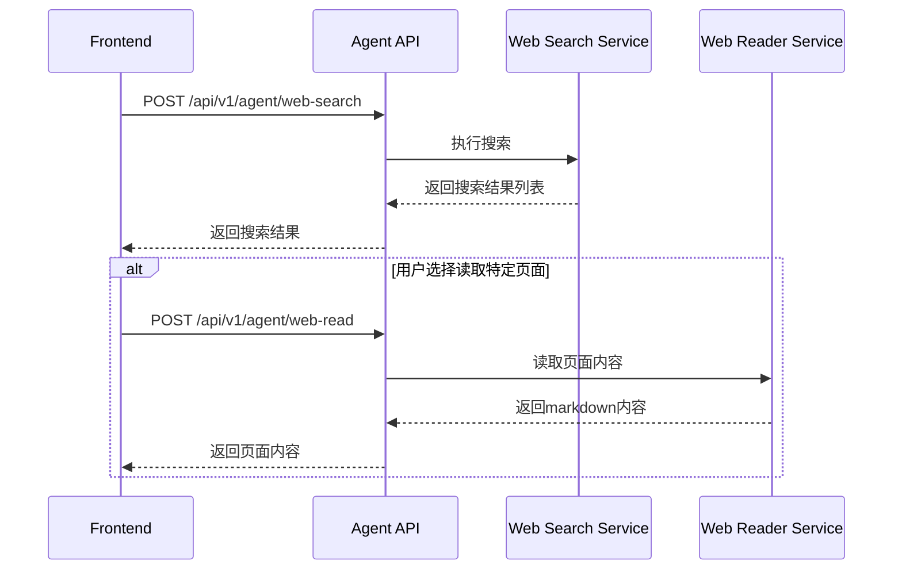

# ApeRAG Agent 后端接口设计方案

## 1. 设计概述

基于现有ApeRAG项目架构，为Agent功能设计一套完整的后端接口系统。Agent作为一个独立的智能对话助手，需要支持Web搜索、模型切换等功能，并提供流畅的对话体验。集成现有的MCP接口进行collection搜索和管理。

## 2. 接口架构设计

### 2.1 接口路径规划

根据现有API设计模式，Agent相关接口统一使用 `/api/v1/agent` 前缀：

```
/api/v1/agent/
├── chats/                          # 对话管理
└── web-search/                     # Web搜索
```

### 2.2 数据流架构

```
Frontend → Agent API → Agent Service → [
    MCP Service (collection搜索，由Agent后端调用)
    Web Search Service (网络搜索)
    LLM Service (模型调用)
    Chat Service (对话历史)
]
```

## 3. 接口详细设计

### 3.1 Agent对话管理接口

#### 3.1.1 创建Agent对话
```
POST /api/v1/agent/chats
```

**请求体**：
```json
{
  "title": "新对话"  // 可选，默认自动生成
}
```

**响应**：
```json
{
  "id": "chat_12345",
  "title": "新对话",
  "created": "2025-01-07T10:00:00Z",
  "updated": "2025-01-07T10:00:00Z"
}
```

#### 3.1.2 获取对话列表
```
GET /api/v1/agent/chats
```

**响应**：
```json
{
  "items": [
    {
      "id": "chat_12345",
      "title": "技术问题讨论",
      "created": "2025-01-07T10:00:00Z",
      "updated": "2025-01-07T10:00:00Z"
    }
  ]
}
```

#### 3.1.3 获取对话详情
```
GET /api/v1/agent/chats/{chat_id}
```

**响应**：
```json
{
  "id": "chat_12345",
  "title": "技术问题讨论",
  "created": "2025-01-07T10:00:00Z",
  "updated": "2025-01-07T10:00:00Z",
  "messages": [
    {
      "id": "msg_67890",
      "type": "user",
      "content": "请介绍一下ApeRAG的架构",
      "web_search_enabled": false,
      "model_used": "claude-3-5-sonnet",
      "timestamp": "2025-01-07T10:01:00Z"
    },
    {
      "id": "msg_67891",
      "type": "assistant",
      "content": "ApeRAG是一个...",
      "sources": [
        {
          "collection_id": "col_1",
          "collection_name": "技术文档",
          "score": 0.95,
          "text": "相关文档内容...",
          "metadata": {"source": "doc1.pdf"}
        }
      ],
      "web_search_results": null,
      "model_used": "claude-3-5-sonnet",
      "timestamp": "2025-01-07T10:01:05Z"
    }
  ]
}
```

#### 3.1.4 发送消息
```
POST /api/v1/agent/chats/{chat_id}/messages
```

**请求体**：
```json
{
  "content": "请介绍一下ApeRAG的架构",
  "model_id": "claude-3-5-sonnet",       // 可选，使用默认模型
  "web_search_enabled": false,           // 可选，默认false
  "stream": true                         // 可选，是否流式响应
}
```

**流式响应**（Server-Sent Events）：
```
data: {"type": "start", "message_id": "msg_67890"}

data: {"type": "content", "content": "ApeRAG是一个"}

data: {"type": "content", "content": "强大的"}

data: {"type": "sources", "sources": [...]}

data: {"type": "end", "message_id": "msg_67890"}
```

**非流式响应**：
```json
{
  "id": "msg_67890",
  "content": "ApeRAG是一个强大的RAG系统...",
  "sources": [
    {
      "collection_id": "col_1",
      "collection_name": "技术文档",
      "score": 0.95,
      "text": "相关文档内容...",
      "metadata": {"source": "doc1.pdf"}
    }
  ],
  "web_search_results": null,
  "model_used": "claude-3-5-sonnet",
  "created": "2025-01-07T10:01:05Z"
}
```

### 3.2 Web搜索接口

参考JINA Reader API的设计，提供search和read两个功能的接口。

#### 3.2.1 Web搜索
```
POST /api/v1/agent/web-search
```

**请求体**：
```json
{
  "query": "ApeRAG 2025年最新发展",
  "max_results": 5,                    // 可选，默认5
  "search_engine": "google",           // 可选，默认google
  "include_content": false             // 可选，默认false，是否包含完整内容
}
```

**响应**：
```json
{
  "query": "ApeRAG 2025年最新发展",
  "results": [
    {
      "rank": 1,
      "title": "ApeRAG 2025年技术路线图",
      "url": "https://example.com/aperag-2025-roadmap",
      "snippet": "ApeRAG在2025年将重点发展...",
      "score": 0.92,
      "published_date": "2025-01-01T00:00:00Z",
      "content": "完整的页面内容...",  // 仅当include_content=true时包含
      "domain": "example.com"
    }
  ],
  "search_engine": "google",
  "total_results": 1250,
  "search_time": 1.2
}
```

#### 3.2.2 Web页面内容读取
```
POST /api/v1/agent/web-read
```

**请求体**：
```json
{
  "url": "https://example.com/aperag-2025-roadmap",
  "format": "markdown",                // 可选，支持 markdown, text, html
  "extract_images": false,             // 可选，是否提取图片描述
  "extract_links": false,              // 可选，是否提取链接
  "timeout": 30                        // 可选，超时时间（秒）
}
```

**响应**：
```json
{
  "url": "https://example.com/aperag-2025-roadmap",
  "title": "ApeRAG 2025年技术路线图",
  "content": "# ApeRAG 2025年技术路线图\n\nApeRAG在2025年将...",
  "format": "markdown",
  "extracted_at": "2025-01-07T10:01:00Z",
  "word_count": 1250,
  "reading_time": 5,                   // 预估阅读时间（分钟）
  "images": [                          // 仅当extract_images=true时包含
    {
      "url": "https://example.com/image1.png",
      "alt": "架构图",
      "caption": "ApeRAG系统架构图"
    }
  ],
  "links": [                           // 仅当extract_links=true时包含
    {
      "url": "https://example.com/docs",
      "text": "详细文档",
      "type": "internal"
    }
  ]
}
```

#### 3.2.3 批量Web内容读取
```
POST /api/v1/agent/web-read/batch
```

**请求体**：
```json
{
  "urls": [
    "https://example.com/page1",
    "https://example.com/page2"
  ],
  "format": "markdown",
  "max_concurrent": 3,                 // 可选，最大并发数
  "timeout": 30
}
```

**响应**：
```json
{
  "results": [
    {
      "url": "https://example.com/page1",
      "status": "success",
      "content": "页面1的内容...",
      "title": "页面1标题"
    },
    {
      "url": "https://example.com/page2",
      "status": "error",
      "error": "页面无法访问",
      "error_code": "TIMEOUT"
    }
  ],
  "total_urls": 2,
  "successful": 1,
  "failed": 1,
  "processing_time": 5.2
}
```

## 4. 前后端交互流程

### 4.1 对话创建流程



### 4.2 消息发送流程



### 4.3 Web搜索流程



## 5. 数据模型设计

### 5.1 Agent对话模型

```python
class AgentChat:
    id: str
    title: str
    created: datetime
    updated: datetime

class AgentMessage:
    id: str
    chat_id: str
    type: Literal["user", "assistant"]
    content: str
    model_used: str
    web_search_enabled: bool
    sources: List[SearchSource]
    web_search_results: List[WebSearchResult]
    created: datetime
```

### 5.2 搜索结果模型

```python
class SearchSource:
    collection_id: str
    collection_name: str
    score: float
    text: str
    metadata: Dict[str, Any]

class WebSearchResult:
    rank: int
    title: str
    url: str
    snippet: str
    score: float
    domain: str
    published_date: Optional[datetime]
    content: Optional[str]  # 仅当请求完整内容时包含

class WebPageContent:
    url: str
    title: str
    content: str
    format: str
    word_count: int
    reading_time: int
    images: List[WebImage]
    links: List[WebLink]
```

## 6. 错误处理设计

### 6.1 标准错误响应格式

```json
{
  "error": "WEB_SEARCH_FAILED",
  "message": "网络搜索服务暂时不可用",
  "details": {
    "search_engine": "google",
    "retry_after": 30
  }
}
```

### 6.2 常见错误码

| 错误码 | HTTP状态码 | 描述 |
|--------|-----------|------|
| CHAT_NOT_FOUND | 404 | 对话不存在 |
| MODEL_NOT_AVAILABLE | 400 | 模型不可用 |
| WEB_SEARCH_FAILED | 500 | Web搜索失败 |
| WEB_READ_FAILED | 500 | 网页读取失败 |
| URL_NOT_ACCESSIBLE | 400 | URL无法访问 |
| QUOTA_EXCEEDED | 429 | 超过配额限制 |

## 7. 性能优化设计

### 7.1 缓存策略

- **Web搜索结果缓存**：相同查询的搜索结果缓存1小时
- **Web页面内容缓存**：页面内容缓存6小时，支持ETags
- **模型配置缓存**：缓存用户可用的模型列表

### 7.2 异步处理

- **流式响应**：使用异步生成器实现流式输出
- **并发Web读取**：支持批量并发读取多个页面
- **超时控制**：所有外部请求都有超时限制

### 7.3 限流和配额

- **用户级限流**：每个用户每分钟最多10次web搜索
- **IP级限流**：防止滥用
- **内容大小限制**：单个页面内容最大5MB

## 8. 安全性设计

### 8.1 认证授权

- **API认证**：支持Bearer Token和Cookie认证
- **权限控制**：用户只能访问自己的对话
- **API限流**：防止接口滥用

### 8.2 数据安全

- **URL验证**：验证URL格式和域名白名单
- **内容过滤**：过滤恶意内容和敏感信息
- **XSS防护**：对Web内容进行sanitization

## 9. 实现优先级

### 9.1 第一阶段（核心功能）

1. Agent对话管理接口
2. 基础消息发送（非流式）
3. MCP接口集成（collection搜索）
4. 基础Web搜索功能

### 9.2 第二阶段（高级功能）

1. 流式响应支持
2. Web页面内容读取
3. 批量Web读取
4. 缓存优化

### 9.3 第三阶段（优化功能）

1. 高级错误处理
2. 性能监控
3. 审计日志集成
4. 智能内容摘要

## 10. 总结

这个设计方案基于现有ApeRAG架构，通过新增Agent专用接口来支持智能对话功能。主要特点：

1. **架构兼容**：复用现有的service层和数据模型
2. **MCP集成**：通过MCP接口进行collection搜索，Agent后端智能选择
3. **Web搜索优化**：参考JINA Reader设计，分离搜索和读取功能
4. **用户友好**：提供流式响应和灵活的内容格式
5. **扩展性强**：接口设计支持未来功能扩展
6. **性能优化**：考虑缓存、异步处理等性能优化

前端可以通过这些接口实现类似Cursor的对话体验，用户可以轻松切换模型，并获得智能的搜索和问答服务。Agent后端会智能调用MCP接口进行collection搜索，无需前端干预collection选择过程。