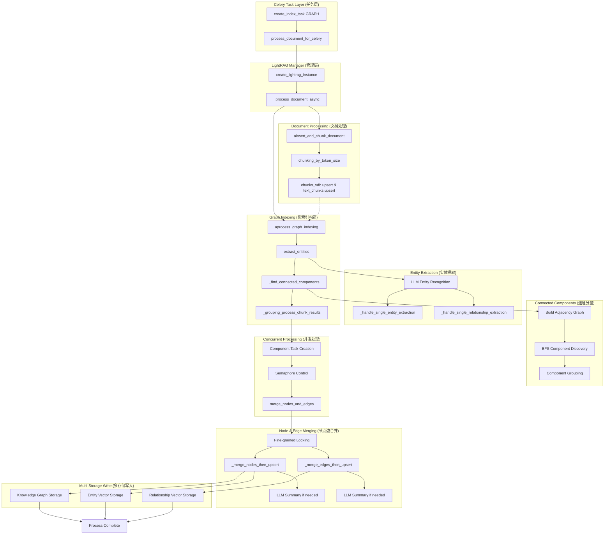

# ApeRAG Graph Index 创建流程技术文档

## 概述

ApeRAG 的 Graph Index 创建流程是整个知识图谱构建系统的核心链路，负责将原始文档转换为结构化的知识图谱。该流程采用 LightRAG 框架的无状态设计，通过多阶段流水线处理实现从文档内容到知识图谱的完整转换。

Graph Index 创建流程主要包含以下核心阶段：
1. **任务接收与实例创建**：Celery 任务调度，LightRAG 实例初始化
2. **文档分块处理**：智能分块算法，保持语义连贯性
3. **实体关系提取**：基于 LLM 的实体和关系识别
4. **连通分量分析**：实体关系网络的拓扑分析
5. **分组并发处理**：按连通分量并发处理，提升性能
6. **节点边合并**：实体去重，关系聚合，描述摘要
7. **多存储写入**：向量数据库、图数据库的一致性写入

## 架构概览



## 核心设计思路

### 1. 无状态实例设计

**LightRAG 无状态特性**：
- **目标**：每个 Celery 任务创建独立的 LightRAG 实例，避免全局状态冲突
- **实现**：通过 `create_lightrag_instance()` 为每个集合创建专用实例
- **优势**：完全避免并发冲突，支持真正的多租户隔离

```python
# lightrag_manager.py
async def create_lightrag_instance(collection: Collection) -> LightRAG:
    """为每个集合创建独立的 LightRAG 实例"""
    collection_id = str(collection.id)
    
    # 生成嵌入和 LLM 函数
    embed_func, embed_dim = await _gen_embed_func(collection)
    llm_func = await _gen_llm_func(collection)
    
    # 创建实例时使用 workspace 隔离
    rag = LightRAG(
        workspace=collection_id,  # 关键：workspace 隔离
        embedding_func=EmbeddingFunc(embedding_dim=embed_dim, func=embed_func),
        llm_model_func=llm_func,
        # ... 其他配置
    )
    
    await rag.initialize_storages()
    return rag
```

### 2. 分阶段流水线处理

**文档处理与图索引分离**：
- **ainsert_and_chunk_document**：负责文档分块和存储
- **aprocess_graph_indexing**：负责图索引构建
- **优势**：模块化设计，便于测试和维护

### 3. 连通分量并发优化

**拓扑分析驱动的并发策略**：
- **连通分量发现**：使用 BFS 算法识别实体关系网络的独立组件
- **分组并发处理**：每个连通分量独立处理，避免锁竞争
- **细粒度锁控制**：实体级别和关系级别的精确锁定

```python
# lightrag.py
def _find_connected_components(self, chunk_results: List[tuple[dict, dict]]) -> List[List[str]]:
    """发现连通分量，用于并发优化"""
    adjacency: Dict[str, set[str]] = {}
    
    # 构建邻接表
    for nodes, edges in chunk_results:
        for entity_name in nodes.keys():
            if entity_name not in adjacency:
                adjacency[entity_name] = set()
        
        for src, tgt in edges.keys():
            adjacency[src].add(tgt)
            adjacency[tgt].add(src)
    
    # BFS 查找连通分量
    visited = set()
    components = []
    
    for node in adjacency:
        if node not in visited:
            component = []
            queue = [node]
            visited.add(node)
            
            while queue:
                current = queue.pop(0)
                component.append(current)
                
                for neighbor in adjacency.get(current, set()):
                    if neighbor not in visited:
                        visited.add(neighbor)
                        queue.append(neighbor)
            
            components.append(component)
    
    return components
```

### 4. 细粒度锁机制

**实体和关系级别的精确锁定**：
- **实体锁**：`entity:{entity_name}:{workspace}`
- **关系锁**：`relationship:{src}:{tgt}:{workspace}`
- **锁范围最小化**：只在合并写入时加锁，读取不加锁

## 具体执行链路示例

### Graph Index 创建完整流程

以单个文档的图索引创建为例，详细展示完整的处理链路：

```python
# 1. 任务接收层 (config/celery_tasks.py)
@current_app.task(bind=True, autoretry_for=(Exception,), retry_kwargs={'max_retries': 3})
def create_index_task(self, document_id: str, index_type: str, parsed_data_dict: dict, context: dict = None):
    """Graph 索引创建任务入口"""
    if index_type == "GRAPH":
        # 调用 LightRAG Manager
        result = process_document_for_celery(collection, content, doc_id, file_path)
        return result

# 2. LightRAG Manager 层 (lightrag_manager.py)
def process_document_for_celery(collection: Collection, content: str, doc_id: str, file_path: str):
    """Celery 环境下的文档处理入口"""
    return _run_in_new_loop(_process_document_async(collection, content, doc_id, file_path))

async def _process_document_async(collection: Collection, content: str, doc_id: str, file_path: str):
    """异步文档处理主逻辑"""
    # 2.1 创建 LightRAG 实例
    rag = await create_lightrag_instance(collection)
    
    try:
        # 2.2 文档分块和存储
        chunk_result = await rag.ainsert_and_chunk_document(
            documents=[content], 
            doc_ids=[doc_id], 
            file_paths=[file_path]
        )
        
        # 2.3 图索引构建
        results = chunk_result.get("results", [])
        for doc_result in results:
            chunks_data = doc_result.get("chunks_data", {})
            if chunks_data:
                graph_result = await rag.aprocess_graph_indexing(
                    chunks=chunks_data, 
                    collection_id=str(collection.id)
                )
                
        return {"status": "success", "doc_id": doc_id, ...}
    finally:
        await rag.finalize_storages()

# 3. 文档分块阶段 (lightrag.py)
async def ainsert_and_chunk_document(self, documents, doc_ids, file_paths):
    """无状态文档插入和分块"""
    results = []
    
    for doc_id, content, file_path in zip(doc_ids, documents, file_paths):
        # 3.1 内容清理
        cleaned_content = clean_text(content)
        
        # 3.2 智能分块
        chunk_list = self.chunking_func(
            self.tokenizer,
            cleaned_content,
            split_by_character=None,
            split_by_character_only=False,
            self.chunk_overlap_token_size,
            self.chunk_token_size,
        )
        
        # 3.3 生成分块数据
        chunks = {}
        for i, chunk_data in enumerate(chunk_list):
            chunk_id = compute_mdhash_id(chunk_data["content"], prefix="chunk-", workspace=self.workspace)
            chunks[chunk_id] = {
                **chunk_data,
                "full_doc_id": doc_id,
                "file_path": file_path,
            }
        
        # 3.4 写入存储（串行避免冲突）
        await self.chunks_vdb.upsert(chunks)
        await self.text_chunks.upsert(chunks)
        
        results.append({
            "doc_id": doc_id,
            "chunks_data": chunks,
            "chunk_count": len(chunks),
            "status": "processed",
        })
    
    return {"results": results, "status": "success"}

# 4. 图索引构建阶段 (lightrag.py)
async def aprocess_graph_indexing(self, chunks, collection_id=None):
    """无状态图索引构建"""
    
    # 4.1 实体关系提取
    chunk_results = await extract_entities(
        chunks,
        use_llm_func=self.llm_model_func,
        entity_extract_max_gleaning=self.entity_extract_max_gleaning,
        addon_params=self.addon_params,
        llm_model_max_async=self.llm_model_max_async,
        lightrag_logger=self.lightrag_logger,
    )
    
    # 4.2 连通分量分析和分组处理
    result = await self._grouping_process_chunk_results(chunk_results, collection_id)
    
    # 4.3 统计结果
    entity_count = sum(len(nodes) for nodes, _ in chunk_results)
    relation_count = sum(len(edges) for _, edges in chunk_results)
    
    return {
        "status": "success",
        "entities_extracted": entity_count,
        "relations_extracted": relation_count,
        "groups_processed": result["groups_processed"],
    }

# 5. 实体关系提取阶段 (operate.py)
async def extract_entities(chunks, use_llm_func, entity_extract_max_gleaning, addon_params, llm_model_max_async, lightrag_logger):
    """基于 LLM 的实体关系提取"""
    
    # 5.1 构建提示模板
    entity_extract_prompt = PROMPTS["entity_extraction"]
    context_base = dict(
        tuple_delimiter=PROMPTS["DEFAULT_TUPLE_DELIMITER"],
        record_delimiter=PROMPTS["DEFAULT_RECORD_DELIMITER"],
        completion_delimiter=PROMPTS["DEFAULT_COMPLETION_DELIMITER"],
        entity_types=",".join(addon_params.get("entity_types", [])),
        language=addon_params.get("language", "English"),
    )
    
    # 5.2 并发处理分块
    semaphore = asyncio.Semaphore(llm_model_max_async)
    
    async def _process_single_content(chunk_key_dp):
        async with semaphore:
            chunk_key, chunk_dp = chunk_key_dp
            content = chunk_dp["content"]
            file_path = chunk_dp.get("file_path", "unknown_source")
            
            # 5.2.1 初始提取
            hint_prompt = entity_extract_prompt.format(**{**context_base, "input_text": content})
            final_result = await use_llm_func(hint_prompt)
            
            # 5.2.2 处理提取结果
            maybe_nodes, maybe_edges = await _process_extraction_result(final_result, chunk_key, file_path)
            
            # 5.2.3 可选的精炼提取（gleaning）
            history = pack_user_ass_to_openai_messages(hint_prompt, final_result)
            for _ in range(entity_extract_max_gleaning):
                glean_result = await use_llm_func(continue_prompt, history_messages=history)
                glean_nodes, glean_edges = await _process_extraction_result(glean_result, chunk_key, file_path)
                
                # 只接受新的实体和关系
                for entity_name, entities in glean_nodes.items():
                    if entity_name not in maybe_nodes:
                        maybe_nodes[entity_name].extend(entities)
                for edge_key, edges in glean_edges.items():
                    if edge_key not in maybe_edges:
                        maybe_edges[edge_key].extend(edges)
            
            return maybe_nodes, maybe_edges
    
    # 5.3 并发执行所有分块
    tasks = [asyncio.create_task(_process_single_content(c)) for c in chunks.items()]
    done, pending = await asyncio.wait(tasks, return_when=asyncio.FIRST_EXCEPTION)
    
    # 5.4 异常处理
    for task in done:
        if task.exception():
            for pending_task in pending:
                pending_task.cancel()
            raise task.exception()
    
    return [task.result() for task in tasks]

# 6. 连通分量分组处理 (lightrag.py)
async def _grouping_process_chunk_results(self, chunk_results, collection_id):
    """基于连通分量的分组并发处理"""
    
    # 6.1 发现连通分量
    components = self._find_connected_components(chunk_results)
    
    # 6.2 准备组件任务
    component_tasks = []
    for i, component in enumerate(components):
        component_entities = set(component)
        
        # 过滤属于该组件的分块结果
        component_chunk_results = []
        for nodes, edges in chunk_results:
            filtered_nodes = {
                entity_name: entity_data
                for entity_name, entity_data in nodes.items()
                if entity_name in component_entities
            }
            filtered_edges = {
                (src, tgt): edge_data
                for (src, tgt), edge_data in edges.items()
                if src in component_entities and tgt in component_entities
            }
            
            if filtered_nodes or filtered_edges:
                component_chunk_results.append((filtered_nodes, filtered_edges))
        
        if component_chunk_results:
            component_tasks.append({
                "index": i,
                "component": component,
                "component_chunk_results": component_chunk_results,
                "total_components": len(components),
            })
    
    # 6.3 并发处理组件（使用信号量控制）
    semaphore = asyncio.Semaphore(1)  # 可调整并发数
    
    async def _process_component_with_semaphore(task_data):
        async with semaphore:
            return await merge_nodes_and_edges(
                chunk_results=task_data["component_chunk_results"],
                component=task_data["component"],
                workspace=self.workspace,
                knowledge_graph_inst=self.chunk_entity_relation_graph,
                entity_vdb=self.entities_vdb,
                relationships_vdb=self.relationships_vdb,
                # ... 其他参数
            )
    
    # 6.4 创建并执行任务
    tasks = [asyncio.create_task(_process_component_with_semaphore(task_data)) 
             for task_data in component_tasks]
    
    done, pending = await asyncio.wait(tasks, return_when=asyncio.FIRST_EXCEPTION)
    
    # 6.5 异常处理和结果聚合
    for task in done:
        if task.exception():
            for pending_task in pending:
                pending_task.cancel()
            raise task.exception()
    
    results = [task.result() for task in tasks]
    
    return {
        "groups_processed": len(results),
        "total_entities": sum(r["entity_count"] for r in results),
        "total_relations": sum(r["relation_count"] for r in results),
    }

# 7. 节点边合并阶段 (operate.py)
async def merge_nodes_and_edges(chunk_results, component, workspace, knowledge_graph_inst, entity_vdb, relationships_vdb, ...):
    """细粒度锁控制的节点边合并"""
    
    # 7.1 收集所有节点和边
    all_nodes = defaultdict(list)
    all_edges = defaultdict(list)
    
    for maybe_nodes, maybe_edges in chunk_results:
        for entity_name, entities in maybe_nodes.items():
            all_nodes[entity_name].extend(entities)
        
        for edge_key, edges in maybe_edges.items():
            sorted_edge_key = tuple(sorted(edge_key))
            all_edges[sorted_edge_key].extend(edges)
    
    # 7.2 并发处理实体（细粒度锁）
    entity_count = 0
    for entity_name, entities in all_nodes.items():
        entity_lock = get_or_create_lock(f"entity:{entity_name}:{workspace}")
        
        async with entity_lock:
            # 7.2.1 合并实体数据
            entity_data = await _merge_nodes_then_upsert(
                entity_name, entities, knowledge_graph_inst,
                llm_model_func, tokenizer, llm_model_max_token_size,
                summary_to_max_tokens, language, force_llm_summary_on_merge,
                lightrag_logger, workspace
            )
            
            # 7.2.2 同步更新向量数据库
            if entity_vdb and entity_data:
                vdb_data = {
                    compute_mdhash_id(entity_data["entity_name"], prefix="ent-", workspace=workspace): {
                        "entity_name": entity_data["entity_name"],
                        "entity_type": entity_data["entity_type"],
                        "content": f"{entity_data['entity_name']}\n{entity_data['description']}",
                        "source_id": entity_data["source_id"],
                        "file_path": entity_data.get("file_path", "unknown_source"),
                    }
                }
                await entity_vdb.upsert(vdb_data)
            
            entity_count += 1
    
    # 7.3 并发处理关系（细粒度锁）
    relation_count = 0
    for edge_key, edges in all_edges.items():
        sorted_edge_key = tuple(sorted(edge_key))
        relationship_lock = get_or_create_lock(f"relationship:{sorted_edge_key[0]}:{sorted_edge_key[1]}:{workspace}")
        
        async with relationship_lock:
            # 7.3.1 合并关系数据
            edge_data = await _merge_edges_then_upsert(
                edge_key[0], edge_key[1], edges, knowledge_graph_inst,
                llm_model_func, tokenizer, llm_model_max_token_size,
                summary_to_max_tokens, language, force_llm_summary_on_merge,
                lightrag_logger, workspace
            )
            
            # 7.3.2 同步更新向量数据库
            if relationships_vdb and edge_data:
                vdb_data = {
                    compute_mdhash_id(edge_data["src_id"] + edge_data["tgt_id"], prefix="rel-", workspace=workspace): {
                        "src_id": edge_data["src_id"],
                        "tgt_id": edge_data["tgt_id"],
                        "keywords": edge_data["keywords"],
                        "content": f"{edge_data['src_id']}\t{edge_data['tgt_id']}\n{edge_data['keywords']}\n{edge_data['description']}",
                        "source_id": edge_data["source_id"],
                        "file_path": edge_data.get("file_path", "unknown_source"),
                    }
                }
                await relationships_vdb.upsert(vdb_data)
            
            if edge_data:
                relation_count += 1
    
    return {"entity_count": entity_count, "relation_count": relation_count}
```

## 异常处理机制

### 1. 层次化异常处理

**多层异常捕获策略**：
- **任务层异常**：Celery 自动重试机制（最多3次）
- **LightRAG 层异常**：实例级异常捕获和资源清理
- **操作层异常**：细粒度操作异常处理

```python
# 任务层异常处理
@current_app.task(bind=True, autoretry_for=(Exception,), retry_kwargs={'max_retries': 3, 'countdown': 60})
def create_index_task(self, document_id: str, index_type: str, parsed_data_dict: dict, context: dict = None):
    try:
        result = process_document_for_celery(collection, content, doc_id, file_path)
        return {"status": "success", **result}
    except LightRAGError as e:
        # LightRAG 特定错误，标记为业务失败
        logger.error(f"LightRAG processing failed for {document_id}: {e}")
        if self.request.retries >= self.max_retries:
            return {"status": "failed", "error": str(e)}
        raise  # 触发重试
    except Exception as e:
        # 其他异常，继续重试
        logger.error(f"Unexpected error processing {document_id}: {e}")
        raise

# LightRAG 层异常处理
async def _process_document_async(collection: Collection, content: str, doc_id: str, file_path: str):
    rag = None
    try:
        rag = await create_lightrag_instance(collection)
        # ... 处理逻辑
        return result
    except Exception as e:
        logger.error(f"Document processing failed: {e}")
        raise LightRAGError(f"Document processing failed: {e}") from e
    finally:
        # 确保资源清理
        if rag:
            try:
                await rag.finalize_storages()
            except Exception as cleanup_error:
                logger.warning(f"Storage cleanup failed: {cleanup_error}")
```

### 2. 并发异常处理

**并发任务的异常传播**：
- **快速失败**：使用 `asyncio.FIRST_EXCEPTION` 策略
- **资源清理**：异常时取消待处理任务
- **状态回滚**：防止部分成功导致的数据不一致

```python
# 并发异常处理示例
async def extract_entities(chunks, ...):
    tasks = [asyncio.create_task(_process_single_content(c)) for c in chunks.items()]
    
    # 等待任务完成或第一个异常
    done, pending = await asyncio.wait(tasks, return_when=asyncio.FIRST_EXCEPTION)
    
    # 检查异常并清理
    for task in done:
        if task.exception():
            # 取消所有待处理任务
            for pending_task in pending:
                pending_task.cancel()
            
            # 等待取消完成
            if pending:
                await asyncio.wait(pending)
            
            # 重新抛出异常
            raise task.exception()
    
    return [task.result() for task in tasks]
```

### 3. 存储异常处理

**数据库操作的事务性**：
- **原子操作**：确保图数据库和向量数据库的一致性
- **回滚机制**：操作失败时的数据回滚
- **连接管理**：数据库连接异常的恢复

## 性能优化策略

### 1. 连通分量优化

**拓扑驱动的并发策略**：
- **独立处理**：不同连通分量完全并行处理
- **锁竞争最小化**：组件内实体不会跨组件冲突
- **内存效率**：按组件分批处理，控制内存使用

```python
# 连通分量性能统计
def _analyze_component_distribution(self, components):
    """分析连通分量分布，用于性能调优"""
    component_sizes = [len(comp) for comp in components]
    
    stats = {
        "total_components": len(components),
        "max_component_size": max(component_sizes) if component_sizes else 0,
        "avg_component_size": sum(component_sizes) / len(component_sizes) if component_sizes else 0,
        "single_entity_components": sum(1 for size in component_sizes if size == 1),
        "large_components": sum(1 for size in component_sizes if size > 10),
    }
    
    self.lightrag_logger.debug(f"Component distribution: {stats}")
    return stats
```

### 2. LLM 调用优化

**批处理和缓存策略**：
- **并发控制**：使用信号量限制并发 LLM 调用
- **批处理优化**：相似内容的批量处理
- **缓存机制**：实体描述摘要的缓存复用

```python
# LLM 调用优化
async def _handle_entity_relation_summary(entity_or_relation_name, description, ...):
    """智能摘要处理，支持缓存"""
    
    # 1. 检查是否需要摘要
    tokens = tokenizer.encode(description)
    if len(tokens) <= summary_to_max_tokens:
        return description
    
    # 2. 检查缓存（可选）
    cache_key = compute_mdhash_id(description, prefix="summary-")
    # cached_summary = await get_summary_cache(cache_key)
    # if cached_summary:
    #     return cached_summary
    
    # 3. LLM 摘要
    lightrag_logger.debug(f"Generating summary for: {entity_or_relation_name}")
    summary = await llm_model_func(prompt, max_tokens=summary_to_max_tokens)
    
    # 4. 缓存结果（可选）
    # await set_summary_cache(cache_key, summary)
    
    return summary
```

### 3. 存储写入优化

**批量写入和连接复用**：
- **批量操作**：减少数据库往返次数
- **连接池**：复用数据库连接
- **异步写入**：并行写入不同存储系统

### 4. 内存管理优化

**流式处理和内存控制**：
- **分块处理**：大文档的流式分块
- **及时释放**：处理完成后立即释放内存
- **监控告警**：内存使用量监控

## 代码组织结构

### 目录结构

```
aperag/
├── graph/                        # 图索引核心模块
│   ├── lightrag_manager.py      # LightRAG 管理器（Celery 入口）
│   └── lightrag/                 # LightRAG 核心实现
│       ├── lightrag.py          # 主要 LightRAG 类
│       ├── operate.py           # 核心操作函数
│       ├── base.py              # 基础接口定义
│       ├── utils.py             # 工具函数
│       ├── prompt.py            # 提示词模板
│       └── kg/                  # 知识图谱存储实现
│           ├── neo4j_sync_impl.py    # Neo4j 同步实现
│           ├── nebula_sync_impl.py   # NebulaGraph 同步实现
│           └── postgres_sync_impl.py # PostgreSQL 同步实现
├── concurrent_control/           # 并发控制模块
│   ├── manager.py               # 锁管理器
│   └── protocols.py             # 锁接口定义
└── tasks/                       # 任务模块
    └── document.py              # 文档处理业务逻辑

config/
└── celery_tasks.py              # Celery 任务定义
```

### 核心接口设计

#### LightRAG 管理接口
```python
# aperag/graph/lightrag_manager.py
async def create_lightrag_instance(collection: Collection) -> LightRAG
def process_document_for_celery(collection: Collection, content: str, doc_id: str, file_path: str) -> Dict[str, Any]
def delete_document_for_celery(collection: Collection, doc_id: str) -> Dict[str, Any]
async def _gen_embed_func(collection: Collection) -> Tuple[Callable, int]
async def _gen_llm_func(collection: Collection) -> Callable
```

#### LightRAG 核心接口
```python
# aperag/graph/lightrag/lightrag.py  
class LightRAG:
    async def ainsert_and_chunk_document(self, documents, doc_ids, file_paths) -> dict[str, Any]
    async def aprocess_graph_indexing(self, chunks, collection_id) -> dict[str, Any] 
    async def adelete_by_doc_id(self, doc_id: str) -> None
    def _find_connected_components(self, chunk_results) -> List[List[str]]
    async def _grouping_process_chunk_results(self, chunk_results, collection_id) -> dict[str, Any]
```

#### 操作函数接口
```python
# aperag/graph/lightrag/operate.py
async def extract_entities(chunks, use_llm_func, entity_extract_max_gleaning, addon_params, llm_model_max_async, lightrag_logger) -> list
async def merge_nodes_and_edges(chunk_results, component, workspace, knowledge_graph_inst, entity_vdb, relationships_vdb, ...) -> dict[str, int]
async def _merge_nodes_then_upsert(entity_name, nodes_data, knowledge_graph_inst, ...) -> dict
async def _merge_edges_then_upsert(src_id, tgt_id, edges_data, knowledge_graph_inst, ...) -> dict
def chunking_by_token_size(tokenizer, content, split_by_character, split_by_character_only, overlap_token_size, max_token_size) -> list[dict[str, Any]]
```

### 数据结构设计

#### 核心数据模型
```python
# 分块数据结构
ChunkData = {
    "tokens": int,              # 分块的 token 数量
    "content": str,             # 分块内容
    "chunk_order_index": int,   # 分块在文档中的顺序
    "full_doc_id": str,         # 所属文档 ID
    "file_path": str,           # 文件路径
}

# 实体数据结构  
EntityData = {
    "entity_name": str,         # 实体名称
    "entity_type": str,         # 实体类型
    "description": str,         # 实体描述
    "source_id": str,           # 来源分块 ID（用 | 分隔多个）
    "file_path": str,           # 文件路径（用 | 分隔多个）
    "created_at": int,          # 创建时间戳
}

# 关系数据结构
RelationData = {
    "src_id": str,              # 源实体 ID
    "tgt_id": str,              # 目标实体 ID  
    "description": str,         # 关系描述
    "keywords": str,            # 关键词（用逗号分隔）
    "weight": float,            # 关系权重
    "source_id": str,           # 来源分块 ID（用 | 分隔多个）
    "file_path": str,           # 文件路径（用 | 分隔多个）
    "created_at": int,          # 创建时间戳
}

# 连通分量数据结构
ComponentData = {
    "index": int,                           # 组件索引
    "component": List[str],                 # 组件包含的实体列表
    "component_chunk_results": List[tuple], # 过滤后的分块结果
    "total_components": int,                # 总组件数
}
```

## 性能监控和调试

### 1. 性能指标

**关键性能指标（KPI）**：
- **文档处理吞吐量**：每分钟处理的文档数
- **实体提取准确率**：提取实体的质量评估
- **连通分量分布**：拓扑结构的复杂度分析
- **LLM 调用效率**：平均响应时间和并发度
- **存储写入性能**：数据库操作的延迟统计

### 2. 调试工具

**结构化日志记录**：
```python
# LightRAG Logger 示例
class LightRAGLogger:
    def log_extraction_progress(self, processed_chunks, total_chunks, entities_count, relations_count):
        """记录实体提取进度"""
        progress_pct = (processed_chunks / total_chunks) * 100
        self.info(f"Extraction progress: {processed_chunks}/{total_chunks} ({progress_pct:.1f}%) - "
                 f"Entities: {entities_count}, Relations: {relations_count}")
    
    def log_entity_merge(self, entity_name, num_fragment, num_new_fragment, is_llm_summary):
        """记录实体合并详情"""
        summary_type = "LLM" if is_llm_summary else "Simple"
        self.debug(f"Entity merge: {entity_name} - Fragments: {num_fragment} "
                  f"(+{num_new_fragment} new), Summary: {summary_type}")
    
    def log_relation_merge(self, src_id, tgt_id, num_fragment, num_new_fragment, is_llm_summary):
        """记录关系合并详情"""
        summary_type = "LLM" if is_llm_summary else "Simple"
        self.debug(f"Relation merge: {src_id}-{tgt_id} - Fragments: {num_fragment} "
                  f"(+{num_new_fragment} new), Summary: {summary_type}")
```

### 3. 性能分析

**执行时间统计**：
```python
# 性能装饰器
@timing_wrapper("extract_entities")
async def extract_entities(chunks, ...):
    # 实体提取逻辑
    pass

@timing_wrapper("merge_nodes_and_edges") 
async def merge_nodes_and_edges(chunk_results, ...):
    # 节点边合并逻辑  
    pass
```

## 配置和环境

### 1. 核心配置参数

**LightRAG 配置**：
```python
class LightRAGConfig:
    CHUNK_TOKEN_SIZE = 1200                    # 分块大小
    CHUNK_OVERLAP_TOKEN_SIZE = 100             # 分块重叠大小
    LLM_MODEL_MAX_ASYNC = 20                   # LLM 最大并发数
    COSINE_BETTER_THAN_THRESHOLD = 0.2         # 向量相似度阈值
    MAX_BATCH_SIZE = 32                        # 最大批处理大小
    ENTITY_EXTRACT_MAX_GLEANING = 0            # 实体提取精炼次数
    SUMMARY_TO_MAX_TOKENS = 2000               # 摘要最大 token 数
    FORCE_LLM_SUMMARY_ON_MERGE = 10            # 强制 LLM 摘要的片段阈值
    EMBEDDING_MAX_TOKEN_SIZE = 8192            # 嵌入最大 token 数
    DEFAULT_LANGUAGE = "Simplified Chinese"    # 默认语言
```

### 2. 存储配置

**多存储后端支持**：
```bash
# 环境变量配置
GRAPH_INDEX_KV_STORAGE=PGOpsSyncKVStorage          # KV 存储
GRAPH_INDEX_VECTOR_STORAGE=PGOpsSyncVectorStorage  # 向量存储  
GRAPH_INDEX_GRAPH_STORAGE=Neo4JSyncStorage         # 图存储

# PostgreSQL 配置
POSTGRES_HOST=localhost
POSTGRES_USER=postgres
POSTGRES_PASSWORD=postgres  
POSTGRES_DB=aperag

# Neo4j 配置
NEO4J_URI=bolt://localhost:7687
NEO4J_USER=neo4j
NEO4J_PASSWORD=password
```

## 总结

ApeRAG 的 Graph Index 创建流程通过以下技术创新实现了高效的知识图谱构建：

### 核心优势

1. **无状态设计**：每个任务独立的 LightRAG 实例，完全避免并发冲突，支持真正的多租户隔离
2. **连通分量优化**：基于图拓扑分析的智能并发策略，最大化并行处理效率
3. **细粒度锁控制**：实体和关系级别的精确锁定，最小化锁竞争
4. **分阶段流水线**：文档分块、实体提取、图构建的模块化处理
5. **多存储一致性**：图数据库和向量数据库的事务性写入

### 技术特点

1. **拓扑驱动并发**：通过连通分量分析实现最优并发策略
2. **异常快速传播**：`asyncio.FIRST_EXCEPTION` 策略确保快速失败和资源清理
3. **LLM 调用优化**：智能摘要和并发控制，平衡质量与性能
4. **存储抽象层**：支持 Neo4j、NebulaGraph、PostgreSQL 等多种图存储
5. **结构化监控**：全链路性能监控和调试支持

### 扩展性设计

1. **水平扩展**：支持多 Celery Worker 的分布式处理
2. **存储扩展**：插件化的存储后端，易于添加新的图数据库支持
3. **算法扩展**：模块化的实体提取和关系识别，支持自定义算法
4. **监控扩展**：标准化的指标接口，易于集成监控系统

这个架构在保证数据一致性和处理质量的同时，为大规模知识图谱构建场景提供了优秀的性能和可扩展性支持。通过拓扑分析驱动的并发优化和细粒度锁控制，系统能够高效处理复杂的实体关系网络，构建高质量的知识图谱。 