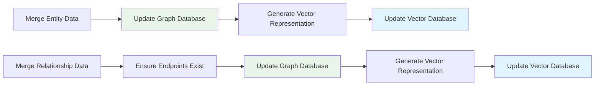
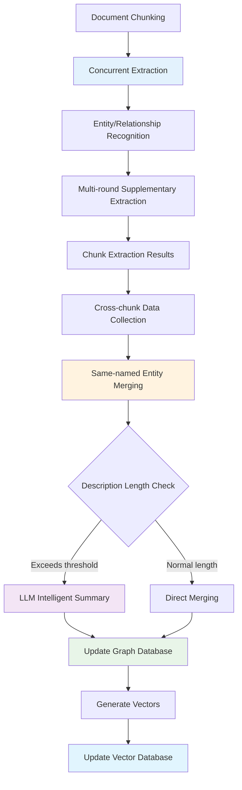

# LightRAG Entity Extraction and Merging Mechanism

> 📖 **Supplementary Reading**: This document is a technical supplement to [Indexing Architecture Design](./indexing_architecture.md), focusing on the entity extraction and merging mechanisms in the Graph Index creation process.

## Overview

This document details the working principles of two core functions in the LightRAG system:
- `extract_entities`: Extract entities and relationships from text chunks
- `merge_nodes_and_edges`: Merge extraction results and update knowledge graph

These two functions constitute the core components of the [Graph Index Creation Process](./graph_index_creation.md), responsible for converting unstructured text into structured knowledge graphs.

## Entity Extraction Mechanism (extract_entities)

### Core Workflow

#### 1. Concurrent Processing Strategy
```python
# Use semaphore to control concurrency, avoiding LLM service overload
semaphore = asyncio.Semaphore(llm_model_max_async)

# Create async tasks for each text chunk
tasks = [
    asyncio.create_task(_process_single_content(chunk, context))
    for chunk in ordered_chunks
]

# Wait for all tasks to complete with exception handling
done, pending = await asyncio.wait(tasks, return_when=asyncio.FIRST_EXCEPTION)
```

#### 2. Multi-round Extraction Mechanism (Gleaning)
LightRAG employs a multi-round extraction strategy to improve entity recognition completeness:

1. **Initial Extraction**: Use entity extraction prompts for first-time extraction
2. **Supplementary Extraction**: Discover missed entities through "continue extraction" prompts
3. **Stop Decision**: LLM autonomously determines whether to continue extraction

```python
for glean_index in range(entity_extract_max_gleaning):
    # Supplementary extraction: only accept new entity names
    glean_result = await use_llm_func(continue_prompt, history_messages=history)
    
    # Merge results (deduplication)
    for entity_name, entities in glean_nodes.items():
        if entity_name not in maybe_nodes:  # Only accept new entities
            maybe_nodes[entity_name].extend(entities)
    
    # Determine whether to continue
    if_continue = await use_llm_func(if_loop_prompt, history_messages=history)
    if if_continue.strip().lower() != "yes":
        break
```

#### 3. Extraction Result Format

**Entity Format**:
```python
{
    "entity_name": "Standardized entity name",
    "entity_type": "Entity type",
    "description": "Entity description",
    "source_id": "chunk_key",
    "file_path": "File path"
}
```

**Relationship Format**:
```python
{
    "src_id": "Source entity",
    "tgt_id": "Target entity", 
    "weight": 1.0,
    "description": "Relationship description",
    "keywords": "Keywords",
    "source_id": "chunk_key",
    "file_path": "File path"
}
```

### Key Design Features

#### Independent Chunk Processing
Each text chunk is independently extracted, with results returned as:
```python
chunk_results = [
    (chunk1_nodes, chunk1_edges),  # First chunk extraction results
    (chunk2_nodes, chunk2_edges),  # Second chunk extraction results
    # ... more chunk results
]
```

**Design Advantages**:
- 🚀 **Concurrent Efficiency**: Text chunks can be processed completely in parallel
- 💾 **Memory Friendly**: Avoid building huge intermediate merged results
- 🛡️ **Error Isolation**: Single chunk failure doesn't affect other chunks
- 🔧 **Processing Flexibility**: Different strategies can be applied to different chunks

**Data Characteristics**:
- ⚠️ **Contains Duplicates**: Same entity may be repeatedly extracted across multiple chunks
- 📊 **Scattered Data**: Complete entity information is scattered across different chunks

## Entity Merging Mechanism (merge_nodes_and_edges)

### Core Merging Strategy

#### 1. Cross-Chunk Data Collection
```python
# Collect all same-named entities and relationships
all_nodes = defaultdict(list)  # {entity_name: [entity1, entity2, ...]}
all_edges = defaultdict(list)  # {(src, tgt): [edge1, edge2, ...]}

for maybe_nodes, maybe_edges in chunk_results:
    # Merge same-named entities
    for entity_name, entities in maybe_nodes.items():
        all_nodes[entity_name].extend(entities)
    
    # Merge same-direction relationships
    for edge_key, edges in maybe_edges.items():
        sorted_key = tuple(sorted(edge_key))  # Unify direction
        all_edges[sorted_key].extend(edges)
```

#### 2. Entity Merging Rules

**Type Selection**: Choose the most frequently occurring entity type
```python
entity_type = Counter([
    entity["entity_type"] for entity in entities
]).most_common(1)[0][0]
```

**Description Merging**: Use separators to join, deduplicate and sort
```python
descriptions = [entity["description"] for entity in entities]
if existing_entity:
    descriptions.extend(existing_entity["description"].split(GRAPH_FIELD_SEP))

merged_description = GRAPH_FIELD_SEP.join(sorted(set(descriptions)))
```

**Intelligent Summarization**: Automatically generate summaries when description fragments are too many
```python
fragment_count = merged_description.count(GRAPH_FIELD_SEP) + 1

if fragment_count >= force_llm_summary_threshold:
    # Use LLM to generate summary, compress long descriptions
    merged_description = await llm_summarize(
        entity_name, merged_description, max_tokens
    )
```

#### 3. Relationship Merging Rules

**Weight Accumulation**: Reflect enhancement of relationship strength
```python
total_weight = sum([edge["weight"] for edge in edges])
if existing_edge:
    total_weight += existing_edge["weight"]
```

**Description Aggregation**: Similar to entity description merging strategy
**Keyword Deduplication**: Extract and merge all keywords

#### 4. Database Update Process



### Concurrency Control and Consistency

#### Workspace Isolation
```python
# Use workspace for multi-tenant isolation
lock_manager = get_lock_manager()
entity_lock = f"entity:{entity_name}:{workspace}"
relation_lock = f"relation:{src_id}:{tgt_id}:{workspace}"

async with lock_manager.lock(entity_lock):
    # Atomic read-merge-write operations
    existing = await graph_db.get_node(entity_name)
    merged_entity = merge_entity_data(existing, new_entities)
    await graph_db.upsert_node(entity_name, merged_entity)
```

#### Lock Granularity Optimization
- **Entity-level Locking**: Each entity locked independently, avoiding global competition
- **Relationship-level Locking**: Each relationship pair processed independently
- **Sorted Lock Acquisition**: Prevent deadlocks, ensure consistent lock acquisition order

## Performance Optimization Features

### 1. Connected Component Concurrency
Intelligent grouping based on graph topology analysis:
- 🧠 **Topology Analysis**: Use BFS algorithm to discover independent entity groups
- ⚡ **Parallel Processing**: Different connected components merge completely in parallel
- 🔒 **Zero Lock Competition**: No shared entities between components, avoiding lock conflicts

### 2. Memory and I/O Optimization
- 📦 **Batch Processing**: Process by connected components in batches, control memory peaks
- 🔄 **Connection Reuse**: Database connection pools reduce connection overhead
- 📊 **Batch Operations**: Use batch database operations whenever possible

### 3. Intelligent Summarization Strategy
- 🎯 **Threshold Control**: Only call LLM for summary generation when necessary
- ⚖️ **Performance Balance**: Avoid frequent LLM calls affecting performance
- 💡 **Information Preservation**: Retain key information during summarization

## Data Flow Overview



## Key Technical Features

### 1. Incremental Update Design
- ✅ **Non-destructive Merging**: New information enhances rather than replaces existing data
- 📈 **Weight Accumulation**: Relationship strength increases with repeated occurrences
- 🔍 **Information Aggregation**: Multi-source descriptions provide more comprehensive entity profiles

### 2. Fault Tolerance and Recovery
- 🛡️ **Exception Isolation**: Individual task failures don't affect overall process
- 🔄 **Auto-completion**: Automatically create missing relationship endpoint entities
- ✔️ **Data Validation**: Strict format and content validation mechanisms

### 3. Scalability Support
- 🏗️ **Modular Design**: Extraction and merging logic completely decoupled
- 🔌 **Interface Standards**: Support different graph databases and vector storage
- 📊 **Monitoring Friendly**: Complete logging and performance metrics

## Summary

LightRAG's entity extraction and merging mechanism achieves efficient knowledge graph construction through the following innovations:

1. **🚀 High-concurrency Extraction**: Chunk parallel processing + multi-round supplementary extraction, ensuring accuracy and efficiency
2. **🧠 Intelligent Merging**: Connected component-based concurrency optimization, maximizing parallel processing capability  
3. **📊 Incremental Updates**: Non-destructive data merging, supporting continuous evolution of knowledge graphs
4. **🔒 Concurrent Safety**: Fine-grained lock mechanism + workspace isolation, ensuring multi-tenant data security
5. **⚡ Performance Optimization**: Intelligent summarization + batch operations, balancing accuracy and processing speed

These technical features enable LightRAG to achieve efficient knowledge graph construction for large-scale documents while ensuring data quality.

---

## Related Documents

- 📋 [Indexing Architecture Design](./indexing_architecture.md) - Overall architecture design
- 🏗️ [Graph Index Creation Process](./graph_index_creation.md) - Detailed graph index construction process
- 📖 [LightRAG 实体提取与合并机制详解](./lightrag_entity_extraction_and_merging_zh.md) - Chinese Version 