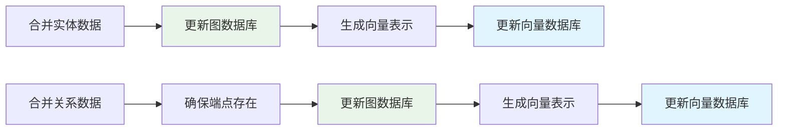
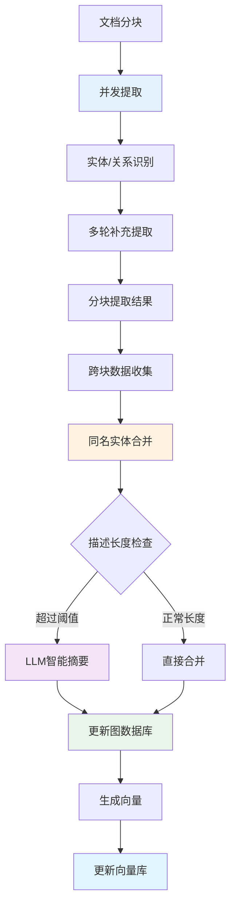

# LightRAG 实体提取与合并机制详解

> 📖 **补充阅读**：本文档是 [索引链路架构设计](./indexing_architecture_zh.md) 的技术细节补充，专注于 Graph Index 创建过程中的实体提取与合并机制。

## 概述

本文档详细介绍 LightRAG 系统中两个核心函数的工作原理：
- `extract_entities`: 从文本块中提取实体和关系
- `merge_nodes_and_edges`: 合并提取结果并更新知识图谱

这两个函数构成了 [Graph Index 创建流程](./graph_index_creation_zh.md) 的核心环节，负责将非结构化文本转换为结构化的知识图谱。

## 实体提取机制 (extract_entities)

### 核心工作流程

#### 1. 并发处理策略
```python
# 使用信号量控制并发数，避免LLM服务过载
semaphore = asyncio.Semaphore(llm_model_max_async)

# 为每个文本块创建异步任务
tasks = [
    asyncio.create_task(_process_single_content(chunk, context))
    for chunk in ordered_chunks
]

# 等待所有任务完成，支持异常处理
done, pending = await asyncio.wait(tasks, return_when=asyncio.FIRST_EXCEPTION)
```

#### 2. 多轮提取机制 (Gleaning)
LightRAG 采用多轮提取策略提高实体识别的完整性：

1. **初始提取**：使用实体提取提示词进行首次提取
2. **补充提取**：通过"继续提取"提示词发现遗漏的实体
3. **停止判断**：LLM 自主判断是否需要继续提取

```python
for glean_index in range(entity_extract_max_gleaning):
    # 补充提取：只接受新的实体名称
    glean_result = await use_llm_func(continue_prompt, history_messages=history)
    
    # 合并结果（去重）
    for entity_name, entities in glean_nodes.items():
        if entity_name not in maybe_nodes:  # 只接受新实体
            maybe_nodes[entity_name].extend(entities)
    
    # 判断是否继续
    if_continue = await use_llm_func(if_loop_prompt, history_messages=history)
    if if_continue.strip().lower() != "yes":
        break
```

#### 3. 提取结果格式

**实体格式**：
```python
{
    "entity_name": "标准化实体名称",
    "entity_type": "实体类型",
    "description": "实体描述",
    "source_id": "chunk_key",
    "file_path": "文件路径"
}
```

**关系格式**：
```python
{
    "src_id": "源实体",
    "tgt_id": "目标实体", 
    "weight": 1.0,
    "description": "关系描述",
    "keywords": "关键词",
    "source_id": "chunk_key",
    "file_path": "文件路径"
}
```

### 关键设计特点

#### 分块独立处理
每个文本块独立提取，返回结果为：
```python
chunk_results = [
    (chunk1_nodes, chunk1_edges),  # 第一个chunk的提取结果
    (chunk2_nodes, chunk2_edges),  # 第二个chunk的提取结果
    # ... 更多chunk结果
]
```

**设计优势**：
- 🚀 **并发效率**：文本块可以完全并行处理
- 💾 **内存友好**：避免构建巨大的中间合并结果
- 🛡️ **错误隔离**：单个块失败不影响其他块
- 🔧 **处理灵活**：可对不同块应用不同策略

**数据特点**：
- ⚠️ **存在重复**：同一实体可能在多个chunk中重复提取
- 📊 **分散数据**：完整的实体信息分散在不同chunk中

## 实体合并机制 (merge_nodes_and_edges)

### 核心合并策略

#### 1. 跨Chunk数据收集
```python
# 收集所有同名实体和关系
all_nodes = defaultdict(list)  # {entity_name: [entity1, entity2, ...]}
all_edges = defaultdict(list)  # {(src, tgt): [edge1, edge2, ...]}

for maybe_nodes, maybe_edges in chunk_results:
    # 合并同名实体
    for entity_name, entities in maybe_nodes.items():
        all_nodes[entity_name].extend(entities)
    
    # 合并同向关系
    for edge_key, edges in maybe_edges.items():
        sorted_key = tuple(sorted(edge_key))  # 统一方向
        all_edges[sorted_key].extend(edges)
```

#### 2. 实体合并规则

**类型选择**：选择最频繁出现的实体类型
```python
entity_type = Counter([
    entity["entity_type"] for entity in entities
]).most_common(1)[0][0]
```

**描述合并**：使用分隔符连接，去重排序
```python
descriptions = [entity["description"] for entity in entities]
if existing_entity:
    descriptions.extend(existing_entity["description"].split(GRAPH_FIELD_SEP))

merged_description = GRAPH_FIELD_SEP.join(sorted(set(descriptions)))
```

**智能摘要**：当描述片段过多时自动生成摘要
```python
fragment_count = merged_description.count(GRAPH_FIELD_SEP) + 1

if fragment_count >= force_llm_summary_threshold:
    # 使用LLM生成摘要，压缩长描述
    merged_description = await llm_summarize(
        entity_name, merged_description, max_tokens
    )
```

#### 3. 关系合并规则

**权重累加**：反映关系强度的增强
```python
total_weight = sum([edge["weight"] for edge in edges])
if existing_edge:
    total_weight += existing_edge["weight"]
```

**描述聚合**：类似实体描述的合并策略
**关键词去重**：提取并合并所有关键词

#### 4. 数据库更新流程



### 并发控制与一致性

#### 工作空间隔离
```python
# 使用工作空间实现多租户隔离
lock_manager = get_lock_manager()
entity_lock = f"entity:{entity_name}:{workspace}"
relation_lock = f"relation:{src_id}:{tgt_id}:{workspace}"

async with lock_manager.lock(entity_lock):
    # 原子性的读取-合并-写入操作
    existing = await graph_db.get_node(entity_name)
    merged_entity = merge_entity_data(existing, new_entities)
    await graph_db.upsert_node(entity_name, merged_entity)
```

#### 锁粒度优化
- **实体级锁定**：每个实体独立加锁，避免全局竞争
- **关系级锁定**：每个关系对独立处理
- **排序锁获取**：防止死锁，确保一致的锁获取顺序

## 性能优化特性

### 1. 连通分量并发
基于图拓扑分析的智能分组：
- 🧠 **拓扑分析**：使用BFS算法发现独立的实体群组
- ⚡ **并行处理**：不同连通分量完全并行合并
- 🔒 **零锁竞争**：组件间无共享实体，避免锁冲突

### 2. 内存与I/O优化
- 📦 **分批处理**：按连通分量分批，控制内存峰值
- 🔄 **连接复用**：数据库连接池减少建连开销
- 📊 **批量操作**：尽可能使用批量数据库操作

### 3. 智能摘要策略
- 🎯 **阈值控制**：只在必要时调用LLM生成摘要
- ⚖️ **性能平衡**：避免频繁LLM调用影响性能
- 💡 **信息保全**：摘要过程中保留关键信息

## 数据流总览



## 关键技术特点

### 1. 增量更新设计
- ✅ **非破坏性合并**：新信息增强而非替换现有数据
- 📈 **权重累积**：关系强度随重复出现而增强
- 🔍 **信息聚合**：多源描述提供更全面的实体画像

### 2. 容错与恢复
- 🛡️ **异常隔离**：单个任务失败不影响整体流程
- 🔄 **自动补全**：自动创建缺失的关系端点实体
- ✔️ **数据验证**：严格的格式和内容验证机制

### 3. 扩展性支持
- 🏗️ **模块化设计**：提取和合并逻辑完全解耦
- 🔌 **接口标准**：支持不同的图数据库和向量存储
- 📊 **监控友好**：完整的日志记录和性能指标

## 总结

LightRAG 的实体提取与合并机制通过以下创新实现了高效的知识图谱构建：

1. **🚀 高并发提取**：分块并行处理 + 多轮补充提取，确保准确性和效率
2. **🧠 智能合并**：基于连通分量的并发优化，最大化并行处理能力  
3. **📊 增量更新**：非破坏性数据合并，支持知识图谱的持续演化
4. **🔒 并发安全**：细粒度锁机制 + 工作空间隔离，确保多租户数据安全
5. **⚡ 性能优化**：智能摘要 + 批量操作，平衡准确性和处理速度

这些技术特性使得 LightRAG 能够在保证数据质量的同时，实现大规模文档的高效知识图谱构建。

---

## 相关文档

- 📋 [索引链路架构设计](./indexing_architecture_zh.md) - 整体架构设计
- 🏗️ [Graph Index 创建流程](./graph_index_creation_zh.md) - 详细的图索引构建流程
- 📖 [Entity Extraction and Merging Mechanism](./lightrag_entity_extraction_and_merging.md) - English Version 