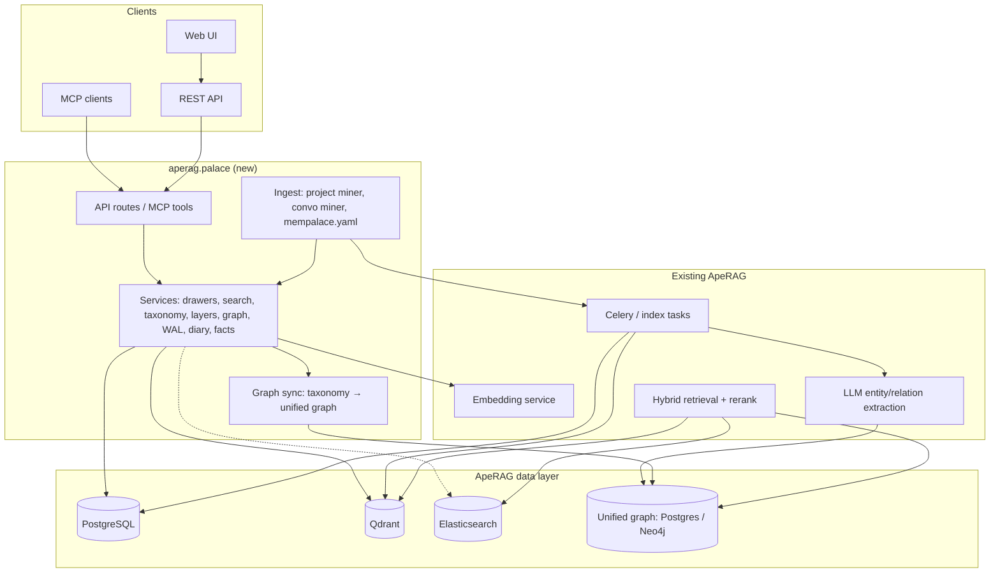
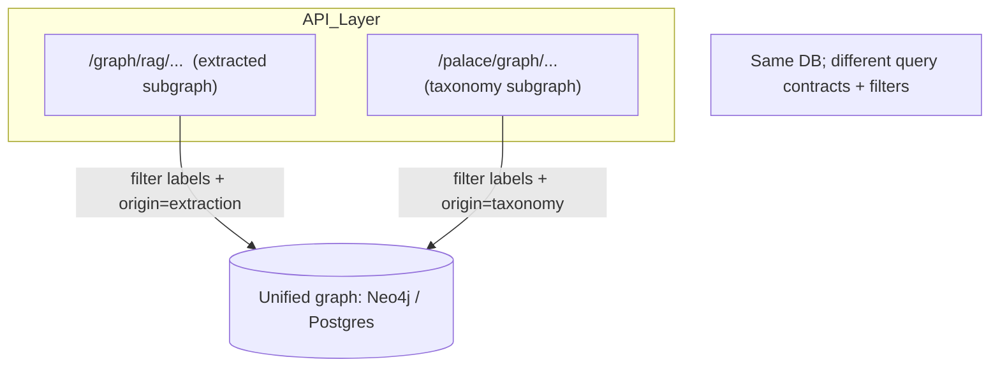

# MemPalace semantics on ApeRAG — design plan

This document describes how to add **MemPalace-style storing and retrieval** (verbatim drawers, wing/room/hall taxonomy, wake-up layers, derived palace graph, optional temporal facts, diary, and write-ahead logging) **on top of ApeRAG’s existing data layer** — without introducing Chroma.

It also specifies a **unified graph architecture**: one graph **store** with two **semantic layers** (RAG-extracted vs palace-taxonomy), **separate APIs** for each concern, and **provenance** so queries stay unambiguous.

**Related:** [System architecture](./architecture.md), [Indexing architecture](./indexing_architecture.md), [Graph index creation](./graph_index_creation.md).

---

## 1. Goals and principles

| Principle | Description |
|-----------|-------------|
| **Reuse ApeRAG stores** | PostgreSQL for authoritative metadata and audit; Qdrant for vectors + **payload filters**; Elasticsearch for BM25 where already used; **one graph backend** (Postgres edges or Neo4j — same as today’s RAG graph index) holds **both** extracted and palace-structural data when unified mode is enabled. |
| **MemPalace semantics** | Verbatim chunks (“drawers”), taxonomy metadata, L0–L3 context, **palace graph** (tunnels across wings), duplicate-near check, agent diary convention, WAL on mutations. |
| **Safe rollout** | Feature flag per **collection** (e.g. `palace_enabled`) so default ApeRAG behavior is unchanged. |
| **Unified graph (recommended)** | **Do not** run three independent graph databases. Use **one graph store** with **typed nodes/edges** and **`origin` / provenance** (`extraction` \| `taxonomy` \| `manual` \| `agent`). Expose **two API surfaces** (RAG graph vs palace graph) that query **different labels or edge types** on the **same** store. See [§3 Unified graph system](#3-unified-graph-system). |
| **API clarity** | **RAG graph API** answers “what does the corpus say connects these concepts?” **Palace graph API** answers “how are wings/rooms/chunks organized; where do topics bridge wings?” Documentation and OpenAPI tags must **never** conflate the two query contracts even though storage may be shared. |

---

## 2. High-level architecture

The diagram below shows **Palace** services, existing indexing/hybrid retrieval, and a **single graph store** fed by (1) the document **extraction** pipeline and (2) **palace taxonomy** sync from PG/chunk metadata.



**Data flow (write — drawers):** Palace drawer create → validate taxonomy → embed (reuse ApeRAG) → upsert Qdrant point with **palace payload** → insert/update **palace_chunk_meta** in PostgreSQL → append **palace_wal** → **optional** sync **palace-typed** nodes/edges into **unified graph** (`origin=taxonomy`).

**Data flow (write — documents):** Existing pipeline → chunks + **extraction** → **extracted** nodes/edges in **unified graph** (`origin=extraction`).

**Data flow (read — search):** Filtered search → embed query → Qdrant `query_filter` on `collection_id`, `wing`, `room` → return verbatim `text` from payload or PG.

**Data flow (read — graph):** Callers use either **RAG graph** endpoints (extracted types, local/global/hybrid patterns) or **palace graph** endpoints (wings, rooms, tunnels, chunk membership) — both scoped to `collection_id` and backed by **UG** when unified mode is on.

---

## 3. Unified graph system

### 3.1 Problem: “Third graph with all powers”

A **third standalone graph database** alongside (a) RAG extraction storage and (b) palace-only storage would duplicate facts, add sync latency, and blur **source of truth**. The recommended design is:

- **One physical graph store** (the same Postgres/Neo4j stack ApeRAG already uses for Graph RAG).
- **Two logical subgraphs** distinguished by **node labels / edge `type` / `origin` metadata**.
- **Two HTTP (and MCP) API families** so clients never send one kind of query to the wrong semantics.

That yields **all capabilities of both** “graphs” without operating three systems.

### 3.2 Comparison: separate vs unified

| Approach | Pros | Cons |
|----------|------|------|
| **Two DBs** (RAG graph DB + palace graph DB) | Hard isolation | Sync drift, double ops cost, reconciling duplicates |
| **Third DB** “union of both” | None inherent | Still need to **feed** it from two sources = same sync problem |
| **One unified graph store** (recommended) | Single backup, one query engine, joint traversals possible with explicit Cypher/SQL + filters | Requires **strict schema + provenance** and migration of palace tunnels into typed edges or computed views |

### 3.3 Provenance and typing

Every **edge** (and optionally every **node**) SHOULD include:

| Field | Purpose |
|-------|---------|
| `origin` | `extraction` — from LLM pipeline; `taxonomy` — from wing/room/chunk metadata; `manual` — user edit; `agent` — tool writes |
| `collection_id` | Tenant scope (required) |
| `confidence` | For extraction (optional) |
| `valid_from` / `valid_to` | For temporal facts (optional) |

Queries from the **RAG graph API** MUST default-filter `origin IN ('extraction', …)` or equivalent **label set** (e.g. `:ExtractedEntity`). Queries from the **palace graph API** MUST default-filter **palace labels** (`:PalaceWing`, `:PalaceRoom`, `:Drawer`) and `origin=taxonomy` where applicable.

### 3.4 Illustrative node and edge types (unified store)

*Names are indicative — align with existing LightRAG / graph models in `db/models.py` and Neo4j schema.*

**Nodes (examples)**

| Label / type | Source | Role |
|--------------|--------|------|
| `ExtractedEntity` | `extraction` | Person, org, concept from text |
| `ExtractedRelation` (as edge only) | `extraction` | Typed edge between entities |
| `Chunk` / `Drawer` | `taxonomy` (+ link to Qdrant id) | Verbatim segment anchor |
| `PalaceWing` | `taxonomy` | Domain / project wing |
| `PalaceRoom` | `taxonomy` | Topic slug (e.g. `auth-migration`) |
| `Document` | both | Bridge from file to chunks |

**Edges (examples)**

| Edge | `origin` | Meaning |
|------|----------|---------|
| `(Entity)-[:RELATES {predicate}]->(Entity)` | `extraction` | Corpus-level relation |
| `(Drawer)-[:IN_WING]->(PalaceWing)` | `taxonomy` | Filing location |
| `(Drawer)-[:IN_ROOM]->(PalaceRoom)` | `taxonomy` | Topic room |
| `(PalaceRoom)-[:TUNNEL {via_shared_slug:true}]->(PalaceWing)` *or* computed | `taxonomy` / derived | Bridges when same room appears under multiple wings — see §3.5 |
| `(Drawer)-[:EVIDENCE_FOR]->(ExtractedEntity)` | `extraction` or `taxonomy` | Optional link chunk ↔ entity for grounded answers |

### 3.5 Tunnels: computed vs materialized

- **Computed (v1):** Palace graph API runs the same **aggregate** as MemPalace today: group by `room`, list distinct `wing`s; return tunnel list without persisting extra edges. Reads can use **PostgreSQL** only for speed, **without** writing to UG.
- **Materialized (v2):** On drawer upsert or batch job, upsert `(:PalaceRoom)-[:APPEARS_IN]->(:PalaceWing)` and optionally `(:PalaceWing_A)-[:TUNNEL_TOPIC {room_slug}]-(:PalaceWing_B)` for pure graph traversals. Keeps **palace graph API** as true graph walks.

Choose one per collection via config (`palace.tunnels.materialized: bool`).

### 3.6 Diagram: dual ingestion into one graph store

```mermaid
flowchart LR
  subgraph Sources
    Docs[Document upload + chunking]
    Palace[Palace drawer / miner]
    PGMeta[(palace_chunk_meta PG)]
  end

  subgraph UnifiedGraph[(Unified graph store)]
    EE[Extracted entities / relations]
    PW[PalaceWing / PalaceRoom / Drawer nodes]
    EE -. optional link .- PW
  end

  Docs --> Extract[LLM extract]
  Extract -->|origin=extraction| EE
  Palace --> PGMeta
  PGMeta -->|sync job| Sync[Taxonomy graph sync]
  Sync -->|origin=taxonomy| PW
```

### 3.7 Diagram: two APIs, one store



### 3.8 Optional cross-subgraph queries

Advanced use cases (e.g. “show extracted entities **mentioned in** drawers filed under `wing=X` `room=Y`”) MAY join subgraphs in **one** Cypher/SQL query with **explicit** predicates on both `origin` and node labels. These belong behind a **separate** endpoint (e.g. `/palace/graph/cross_scope`) and MUST NOT be the default for RAG or palace tools — to avoid accidental mixing in agent prompts.

---

## 4. Feature backlog

| ID | Feature | Behavior | Primary storage |
|----|---------|----------|-----------------|
| P1 | Taxonomy on chunks | `wing`, `room`, `hall`, `chunk_index`, `source_file`, `filed_at`, `added_by`, optional `importance`, `date` | PG + Qdrant payload (+ ES fields if hybrid) |
| P2 | Verbatim drawer API | Add/update/delete; responses return raw text, not server summaries | PG + Qdrant |
| P3 | Filtered semantic search | Query + optional `wing` / `room` (MemPalace-style) | Qdrant + filters |
| P4 | Duplicate check | Near-duplicate via similarity threshold | Qdrant top-k query |
| P5 | Status / taxonomy | Counts, wing → room tree | PG aggregates |
| P6 | Palace graph | Tunnels, traverse, stats | **PG aggregate (computed)** and/or **unified graph** (materialized tunnels) — see §3.5 |
| P7 | Wake-up L0–L3 | L0 identity; L1 top drawers; L2 filtered get; L3 search | PG + Qdrant |
| P8 | Temporal facts (optional) | Triples + `valid_from` / `valid_to` / invalidate | Unified graph edges or `palace_fact` + sync |
| P9 | Agent diary | Convention: `wing_agent_*`, `room=diary` | Same as P2 + WAL |
| P10 | Write-ahead log | Audit add/delete/kg/diary | PG `palace_wal` |
| P11 | Ingest adapters | Project mine (gitignore), convo mine, `mempalace.yaml` | Celery / CLI |
| P12 | MCP tools | Parity with MemPalace tool names where useful | FastMCP registration |
| P13 | Unified graph sync | Taxonomy → UG; provenance; optional materialized tunnels | Unified graph store |
| P14 | Web UI (optional) | Taxonomy browser, search filters | `web/` — later phase |

---

## 5. Data model

### 5.1 PostgreSQL (new tables)

- **`palace_chunk_meta`**  
  `id`, `collection_id` (FK), `document_id` (FK, optional), `chunk_id` (stable id = Qdrant point id),  
  `wing`, `room`, `hall`, `chunk_order_index`, `source_path`, `filed_at`, `added_by`,  
  `importance` (float, default 3), `content_date` (optional), `raw_text_hash`, `extra` (JSONB).  

  Indexes: `(collection_id, wing, room)`, unique `(collection_id, chunk_id)`.

- **`palace_identity`** — L0 per collection (or user): `body TEXT`, `updated_at`.

- **`palace_wal`** — `ts`, `user_id`, `operation`, `payload JSONB`, `result JSONB`.

- **`palace_fact` (optional)** — temporal triples if not represented only in UG; may **sync** into unified graph for traversal.

- **`palace_graph_sync_state` (optional)** — cursor / version for incremental taxonomy sync to UG (last synced `filed_at`, checksum).

### 5.2 Qdrant payload

Mirror filter fields on every point: `collection_id`, `wing`, `room`, `hall`, `chunk_id`, `document_id`, `source_file`, `chunk_index`, `importance`, `date`, `type` (`drawer` | `diary` | …).

### 5.3 Elasticsearch

Add the same facet fields for collections that use hybrid BM25 + vector, keeping filters consistent.

### 5.4 Unified graph schema (conceptual)

Store **alongside** existing extracted-graph tables or in Neo4j with:

- Constraints or indexes on `(collection_id, node_key)` for palace nodes.
- Migration plan: backfill `PalaceWing` / `PalaceRoom` / `Drawer` from `palace_chunk_meta` + sync job.

---

## 6. Services and APIs

| Service | Responsibility |
|---------|------------------|
| `PalaceDrawerService` | CRUD drawer; embedding via existing service; PG + Qdrant sync; WAL |
| `PalaceSearchService` | Semantic search with `query_filter` |
| `PalaceTaxonomyService` | Status, list wings/rooms, tree |
| `PalaceGraphService` | Tunnels + traverse: **PG path** (computed) and/or **UG path** (materialized); never mix with RAG extract queries internally unless cross_scope API |
| `PalaceGraphSyncService` | Upsert taxonomy nodes/edges into UG with `origin=taxonomy`; optional tunnel materialization |
| `PalaceLayersService` | `wake_up(collection_id, wing?)` |
| `PalaceDuplicateService` | Embedding similarity threshold |
| `PalaceDiaryService` | Diary naming convention wrapper |
| `PalaceFactService` | Temporal facts CRUD + invalidate; bridge to UG |

**REST (sketch):**

- **Palace:** `/api/v1/collections/{id}/palace/...` (drawers, search, taxonomy, `graph/tunnels`, `graph/traverse`, wake-up).
- **RAG graph (existing):** keep current paths; document that they query **extracted** subgraph only.
- **Cross-scope (optional):** `/api/v1/collections/{id}/palace/graph/cross_scope` — gated, explicit schema.

**MCP:** `mempalace_*` tools map to palace APIs; RAG graph tools remain separate tool names.

---

## 7. Folder structure (proposed)

```text
ApeRAG/
├── aperag/
│   ├── palace/
│   │   ├── __init__.py
│   │   ├── config.py
│   │   ├── constants.py
│   │   ├── schemas/
│   │   │   ├── drawer.py
│   │   │   ├── taxonomy.py
│   │   │   ├── wake_up.py
│   │   │   ├── graph.py
│   │   │   └── facts.py
│   │   ├── db/
│   │   │   ├── models.py
│   │   │   └── repository.py
│   │   ├── services/
│   │   │   ├── drawer_service.py
│   │   │   ├── search_service.py
│   │   │   ├── taxonomy_service.py
│   │   │   ├── palace_graph_service.py
│   │   │   ├── graph_sync_service.py      # taxonomy → unified graph
│   │   │   ├── layers_service.py
│   │   │   ├── duplicate_service.py
│   │   │   ├── diary_service.py
│   │   │   └── facts_service.py
│   │   ├── graph/                         # optional: UG adapters
│   │   │   ├── unified_types.py           # labels, origin enums
│   │   │   └── tunnel_materializer.py
│   │   ├── ingest/
│   │   │   ├── project_miner.py
│   │   │   ├── convo_miner.py
│   │   │   └── mempalace_yaml.py
│   │   ├── api/
│   │   │   └── routes.py
│   │   └── mcp/
│   │       └── tools.py
│   ├── db/models.py
│   └── views/
│       └── palace.py
├── alembic/versions/
│   └── xxxx_add_palace_tables.py
└── tests/palace/
    ├── test_drawer_crud.py
    ├── test_search_filters.py
    ├── test_palace_graph.py
    ├── test_graph_sync.py
    └── test_wake_up_layers.py
```

---

## 8. Phased delivery

| Phase | Deliverable | Exit criteria |
|-------|-------------|----------------|
| 0 | Feature flag, package skeleton | CI green |
| 1 | PG tables + Alembic migration | Migration applied |
| 2 | Drawer CRUD + Qdrant payload + WAL | E2E add → search → delete |
| 3 | Filtered search, duplicate check, taxonomy/status | Core MCP/REST parity |
| 4 | Palace graph (PG computed tunnels + traverse) | Tests on multi-wing fixtures |
| 4b | Unified graph: taxonomy sync + palace API over UG (optional materialized tunnels) | Provenance filters in integration tests |
| 5 | L0–L3 wake-up | Token budget tests |
| 6 | Temporal facts or graph bridge | Query + invalidate tests |
| 7 | Diary + MCP bundle | Client smoke test |
| 8 | Project/convo miners | Sample ingest job |

---

## 9. Risks and decisions

- **AAAK / compression:** Prefer embedding **raw** text; store compressed form in metadata if needed (compressed embeddings often hurt recall).
- **Chunk ID stability:** Required for idempotent re-mine (e.g. hash of `collection_id + source_path + chunk_index` or content hash).
- **ACL:** Every query filters by `collection_id` and existing user/tenant rules.
- **Unified graph discipline:** All writes set **`origin`**; integration tests MUST assert RAG API never returns pure-taxonomy edges and palace API never returns raw extraction edges unless **cross_scope** is used.
- **Avoid three graph databases:** Prefer **one UG** + two APIs; if a separate analytics replica is added, treat it as a **read replica** or batch export, not a third source of truth.

---

## 10. Success criteria

- With `palace_enabled` on a collection: add verbatim drawer → filtered search → duplicate check → taxonomy → tunnels → wake-up → WAL entry per mutation.
- **Unified mode:** taxonomy sync writes **only** `origin=taxonomy` records to UG; extraction pipeline unchanged for `origin=extraction`.
- Collections without the flag behave as today.
- Design doc and API reference describe: **MemPalace ↔ ApeRAG** field mapping; **two API surfaces**; **one graph store**; optional **cross_scope** joint queries.

---

## Document history

| Date | Change |
|------|--------|
| 2026-04-10 | Initial plan: MemPalace features on ApeRAG data layer, folder layout, diagrams |
| 2026-04-10 | **Unified graph system**: single store, dual subgraphs, provenance, tunnels computed vs materialized, dual-ingestion + dual-API diagrams, P13/P14, `graph_sync_service`, phase 4b, success criteria and risks updated |
