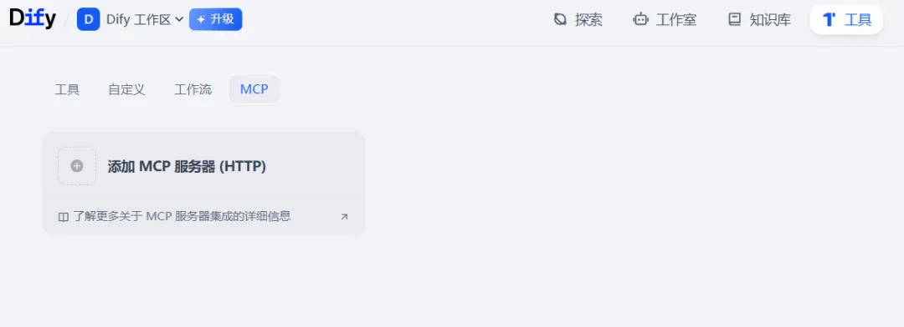
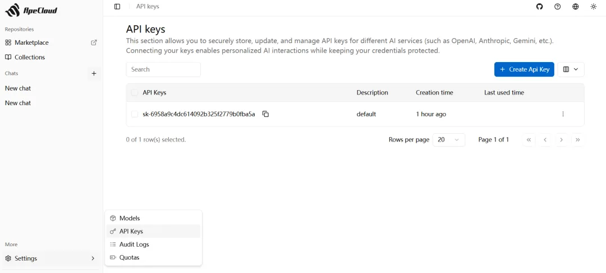
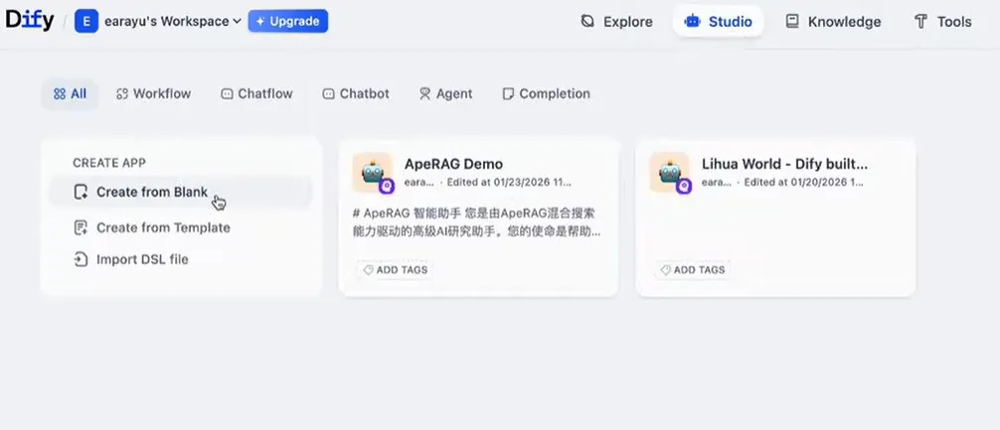
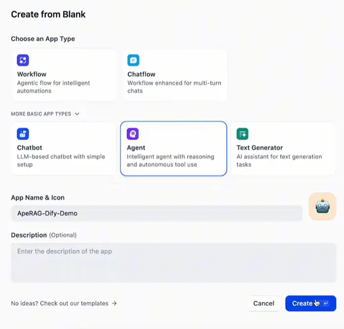
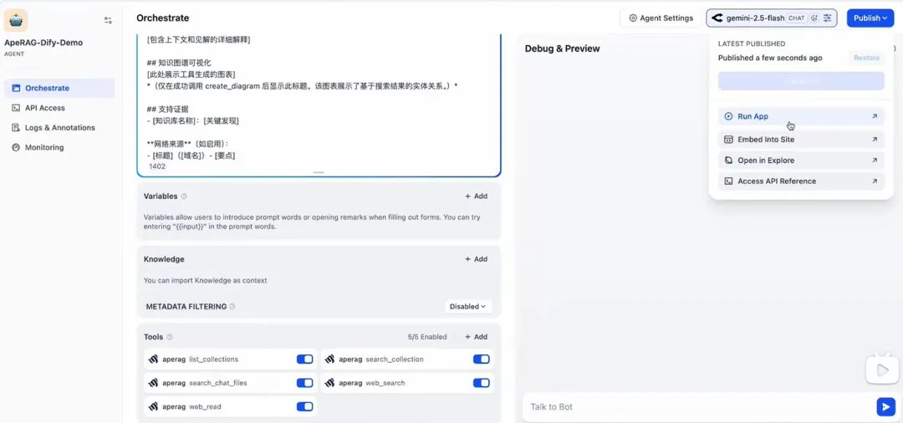

# Integrating ApeRAG with Dify

## Introduction

ApeRAG is a production-grade RAG (Retrieval-Augmented Generation) platform with multimodal indexing, AI agents, MCP support, and scalable K8s deployment capabilities. Through the MCP (Model Context Protocol), ApeRAG seamlessly integrates with Dify to provide powerful knowledge retrieval capabilities for your AI applications.

### Core Advantages of ApeRAG

**🔗 Graph RAG Capability**
- Unlike "standard" RAG, ApeRAG implements Graph-RAG
- Not only stores data but also extracts data elements and their deep relationships to **build knowledge graphs**
- Excels at handling **complex queries requiring association of multiple knowledge points and reasoning**

**📄 Powerful Document Processing**
- Integrates MinerU, an advanced parsing tool designed for complex documents, scientific papers, and financial reports
- Accurately extracts tables, formulas, and even engineering diagrams

**🔄 Hybrid Retrieval**
- Vector retrieval: Semantic similarity matching
- Full-text retrieval: Exact keyword search
- Graph retrieval: Relational queries and reasoning

**☁️ Enterprise-Grade Capabilities**
- Full Kubernetes support
- Built-in **high availability**, **scalability**, and **enterprise management capabilities**

## Integration Steps

### Step 1: Prepare ApeRAG Knowledge Base

#### 1.1 Access ApeRAG Platform

Visit and register/login to ApeRAG:

**https://rag.apecloud.com/**

#### 1.2 Select or Create Knowledge Base

After logging in, you can:
- Select existing knowledge bases
- Create new knowledge bases and upload documents
- Subscribe to public knowledge bases (e.g., the "Romance of the Three Kingdoms" example)


#### 1.3 Get API Key

In ApeRAG platform:
1. Navigate to personal settings or API management
2. Create or copy your API Key
3. Save the API Key for later use in Dify configuration

### Step 2: Configure MCP Server in Dify

#### 2.1 Add MCP Server

1. In Dify platform, navigate to **Tools → MCP**
2. Click **Add MCP Server** button



#### 2.2 Configure Connection

Fill in the configuration:

**Server URL**: 
```
https://rag.apecloud.com/mcp/
```

**API Key**:
```
<Your API Key copied from ApeRAG>
```




#### 2.3 Verify Connection

After clicking **Confirm**, the system will verify the connection. If configured correctly, you'll see a success message:


### Step 3: Create Dify Application

#### 3.1 Create New App

1. Navigate to Dify **Studio**
2. Click **Create Application** button



#### 3.2 Select Application Type

1. Click **More Basic Application Types**
2. Select **Agent** type
3. Name your application (e.g., "ApeRAG Smart Assistant")
4. Click **Create**



> **Why Agent Type?**
> Agent-type applications can autonomously call tools, perform reasoning and planning, making them ideal for working with ApeRAG's knowledge retrieval capabilities.

### Step 4: Configure Agent

#### 4.1 Basic Configuration

On the Agent configuration page:

1. **Select LLM**: Choose the LLM to drive your Agent (e.g., GPT-4, Claude, etc.) in the top-right corner
2. **Add Tools**: Find and add the ApeRAG MCP you just configured in the tool list
3. **Write Prompt**: Input the Agent's system prompt (see recommended prompt below)


#### 4.2 Recommended Prompt

```markdown
# ApeRAG Smart Assistant

You are an advanced AI research assistant powered by ApeRAG's hybrid search capabilities. Your mission is to help users accurately and autonomously find, understand, and synthesize information from knowledge bases and the web.

## Core Behaviors

**Autonomous Research**: Work independently until user queries are fully resolved. Search multiple sources, analyze findings, and provide comprehensive answers without waiting for permission.

**Language Intelligence**: Always respond in the language the user asks in. When users ask in Chinese, respond in Chinese regardless of source language.

**Visual Thinking**: [Critical] You are an assistant that prefers visual explanations. For any information involving entity relationships, processes, or structures, you must prioritize visualization.

**Complete Solutions**: Explore from multiple angles, cross-validate sources, and ensure comprehensive coverage before responding.

## Search Strategy

### Priority System
1. **User-specified knowledge base** (mentioned via "@"): Strictly limit search to specified base
2. **Unspecified knowledge base**: Autonomously discover and search relevant bases
3. **Web search** (if enabled): Supplement information
4. **Clear attribution**: Always cite sources

### Search Execution
- **Knowledge base search**: Use vector + graph search by default
- **Result processing logic**:
  1. Execute search
  2. **Detect graph data**: Check if search results contain `entities` and `relationships`
  3. **Mandatory visualization**: If search results contain non-empty entity or relation data, **you must** call the `create_diagram` tool
  4. **Content filtering**: Ignore irrelevant results

## Available Tools

### Knowledge Management
- `list_collections()`: Discover available knowledge sources
- `search_collection(collection_id, query, ...)`: [Primary tool] Hybrid search in persistent knowledge bases
- `search_chat_files(chat_id, query, ...)`: [Chat only] Search only files temporarily uploaded by users in current chat session
- `create_diagram(content)`: [Mandatory tool] When search results contain structured information (entities/relations), must call this tool to generate Mermaid diagrams

### Web Intelligence
- `web_search(query, ...)`: Multi-engine web search
- `web_read(url_list, ...)`: Extract and analyze web content

## Response Format & Workflow

Strictly follow these steps to build responses:

1. **Analyze search results**: Check data returned by `search_collection`
2. **Tool call determination**:
   - IF (search results contain entity/relation data) -> **Immediately call `create_diagram`**
   - Note: Don't output raw Mermaid code blocks in text, must render through tool calls
3. **Build text response**:

## Direct Answer
[Clear, actionable answer in user's language]

## Comprehensive Analysis
[Detailed explanation with context and insights]

## Knowledge Graph Visualization
[Tool-generated diagram displayed here]
*(Only show this heading after successfully calling create_diagram. The diagram shows entity relationships based on search results.)*

## Supporting Evidence
- [Knowledge Base Name]: [Key Findings]

**Web Sources** (if enabled):
- [Title] ([Domain]) - [Key Points]
```

#### 4.3 Test Application

After configuration:
1. Click **Publish**
2. Enter questions in the test area
3. Observe how Agent calls ApeRAG for knowledge retrieval



## Usage Examples

### Example 1: Basic Knowledge Query

**User Question**:
```
Tell me about Zhuge Liang from Romance of the Three Kingdoms
```

**Agent Workflow**:
1. Call `list_collections()` to find "Romance of the Three Kingdoms" knowledge base
2. Call `search_collection()` to search for information about Zhuge Liang
3. If entity-relation data is retrieved, call `create_diagram()` to generate knowledge graph
4. Synthesize information to generate answer

### Example 2: Relationship Query

**User Question**:
```
What's the relationship between Liu Bei, Guan Yu, and Zhang Fei?
```

**Agent Workflow**:
1. Search entity information for all three characters
2. Retrieve relationship data between them
3. Generate knowledge graph visualization showing their relationships
4. Provide detailed text explanation

### Example 3: Specify Knowledge Base

**User Question**:
```
@Romance of the Three Kingdoms What was the background of the Battle of Red Cliffs?
```

**Agent Behavior**:
- Strictly limit search to "Romance of the Three Kingdoms" knowledge base
- Won't search other knowledge bases or the internet

## Advanced Configuration

### Hybrid Retrieval Modes

ApeRAG supports three graph retrieval modes, can be specified in Agent's Prompt:

- **local**: Query local information about an entity
- **global**: Query overall relationships and patterns
- **hybrid**: Combine local and global (recommended)

### Enable Web Search

If your application needs real-time information or supplementary knowledge:

1. Enable web search tools in Dify
2. Agent will automatically choose whether to search knowledge base or internet

### Configure Retrieval Parameters

Parameters can be specified when calling `search_collection`:

- `top_k`: Number of results to return (default 5)
- `mode`: Retrieval mode (vector/fulltext/graph/hybrid)
- `rerank`: Whether to use reranking (recommended)

## FAQ

### Q: MCP connection failed?

**Checklist**:
1. Confirm Server URL is correct: `https://rag.apecloud.com/mcp/`
2. Confirm API Key is valid and not expired
3. Check network connection
4. Review Dify's error logs

### Q: Agent not calling ApeRAG tools?

**Possible reasons**:
1. Prompt not clear enough, recommend using the provided template
2. LLM capability insufficient, recommend using GPT-4 or Claude 3.5
3. Tool configuration issue, confirm MCP Server is properly added

### Q: Search results inaccurate?

**Optimization suggestions**:
1. Upload more relevant documents to knowledge base
2. Adjust retrieval mode (try hybrid mode)
3. Increase top_k value for more candidate results
4. Enable rerank for better scoring

### Q: How to use multiple knowledge bases?

**Method**:
1. Create or subscribe to multiple knowledge bases in ApeRAG
2. Agent automatically calls `list_collections()` to discover all available bases
3. Users can specify a particular base via "@knowledge_base_name"

### Q: Graph visualization not showing?

**Check**:
1. Confirm knowledge base has Graph index enabled
2. Confirm documents are successfully processed and graph built
3. Confirm Prompt includes `create_diagram` tool call logic

## Best Practices

### 1. Prompt Optimization

- **Define clear role**: Let Agent know it's a knowledge assistant
- **Specify workflow**: Clarify when to call which tools
- **Standardize output format**: Unify answer structure and style

### 2. Knowledge Base Management

- **Organize by category**: Create different knowledge bases by topic
- **Regular updates**: Add new documents and remove outdated content timely
- **Quality control**: Check document quality and format before uploading

### 3. Performance Optimization

- **Set reasonable top_k**: Too large slows down speed, too small affects recall
- **Enable caching**: Dify can cache results for high-frequency queries
- **Choose appropriate retrieval mode**: Not all queries need Graph retrieval

### 4. User Experience

- **Provide usage instructions**: Tell users how to ask questions effectively
- **Show capability boundaries**: Clarify what Agent can and cannot do
- **Collect feedback**: Continuously optimize Prompt and knowledge base

## Summary

By integrating ApeRAG with Dify through MCP protocol, you can:

✅ **Quick Setup**: Complete integration in minutes, no coding required  
✅ **Powerful Capabilities**: Enjoy Graph RAG's relational reasoning abilities  
✅ **Flexible Configuration**: Adjust retrieval strategies and parameters as needed  
✅ **Visual Display**: Automatically generate knowledge graph visualizations  
✅ **Enterprise-Grade Stability**: Based on production-ready platform, reliable and stable  

The integration of ApeRAG and Dify is very simple. Once integrated, you can not only experience Dify's platform features but also enjoy **ApeRAG's powerful Graph-RAG capabilities**.

## Related Links

- **ApeRAG Website**: https://rag.apecloud.com/
- **GitHub**: https://github.com/apecloud/ApeRAG
- **Dify Website**: https://dify.ai/
- **MCP Protocol Docs**: https://modelcontextprotocol.io/

---


**Start using ApeRAG + Dify to build your intelligent knowledge assistant!**
