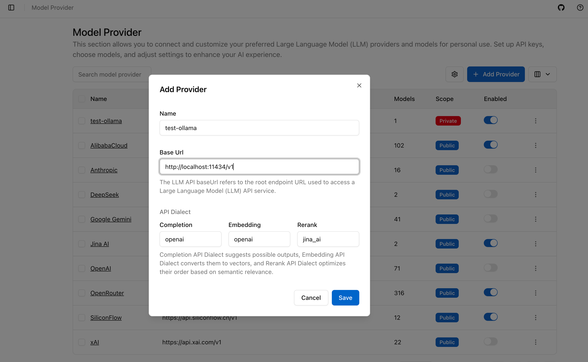
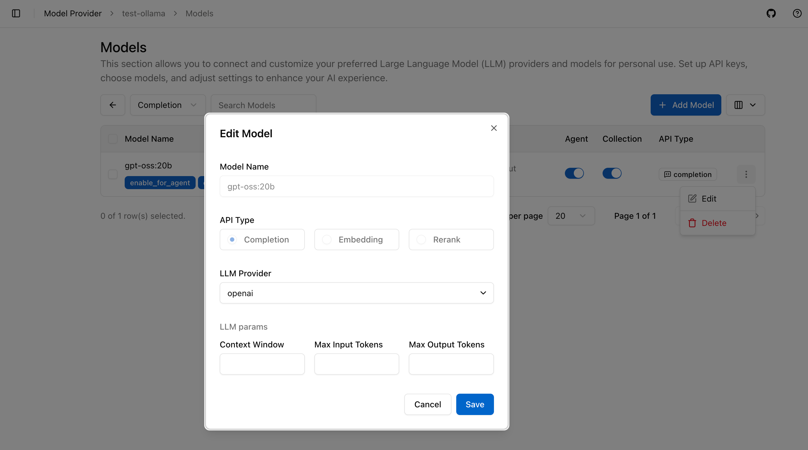
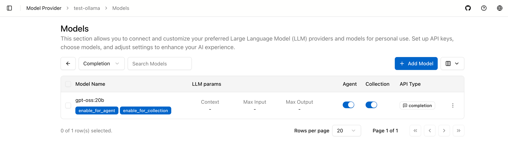
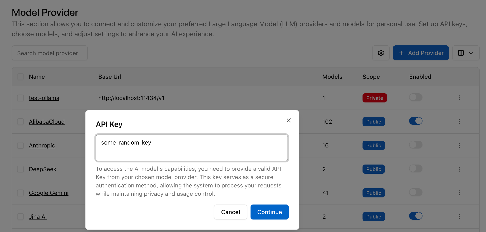
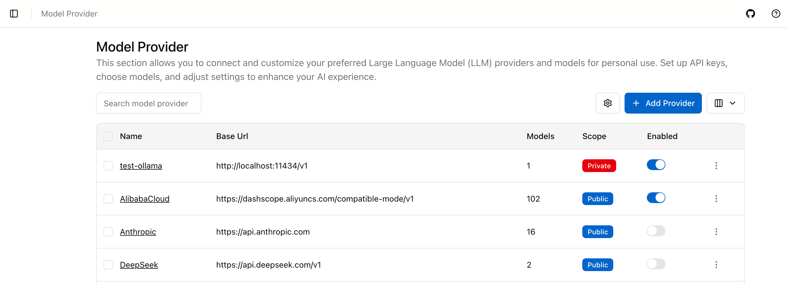
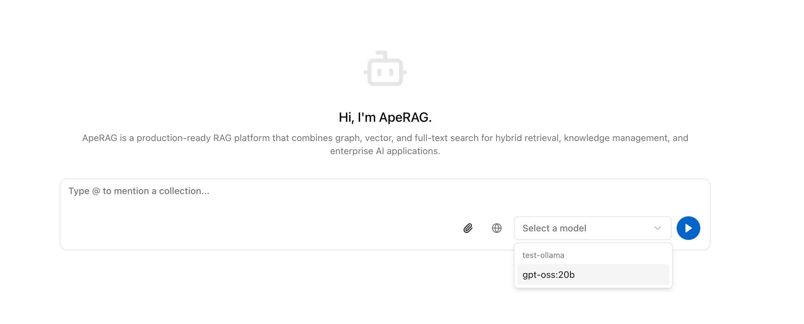
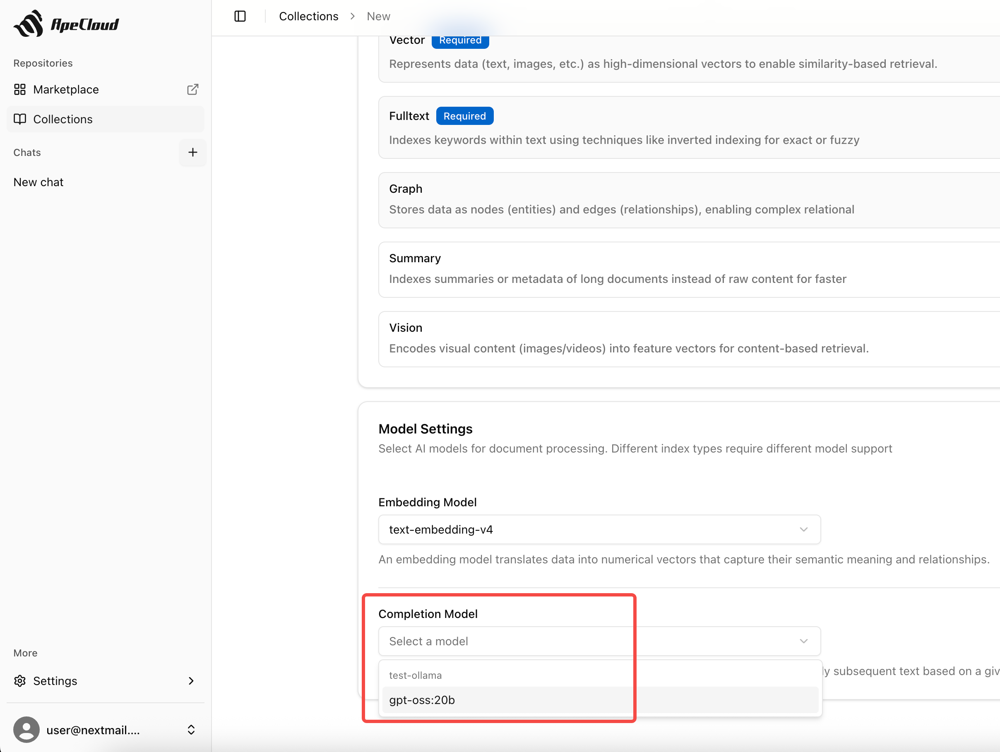

# 配置 Ollama 模型提供商

Ollama 可以在本地运行模型，并提供 OpenAI-compatible API。ApeRAG 可以把 Ollama 作为一个模型提供商，用于对话、智能体和知识库索引流程。

## 前提条件

- ApeRAG 已启动；
- Ollama 已安装并运行；
- 需要使用的模型已通过 Ollama 拉取；
- ApeRAG 后端能够访问 Ollama 的 API 地址。

本机验证时，Ollama 默认地址通常是：

```text
http://localhost:11434/v1
```

如果 ApeRAG 运行在 Docker 容器中，容器内的 `localhost` 指向容器自身，不一定能访问宿主机 Ollama。此时需要把 Base URL 改成容器可访问的宿主机地址，例如 Docker Desktop 上常见的：

```text
http://host.docker.internal:11434/v1
```

Linux 环境下可以使用宿主机网关地址，或把 Ollama 与 ApeRAG 放在同一 Docker 网络中。

## 1. 添加模型提供商

在 ApeRAG Web 界面进入 **设置 > 模型**，点击 **添加提供商**。

填写：

- **名称**：例如 `local-ollama`
- **Base URL**：例如 `http://localhost:11434/v1` 或容器可访问的 Ollama 地址
- **API Key**：Ollama 本地服务通常不校验 API Key，可以填任意占位字符串

保存后，确认 provider 出现在模型列表中。



## 2. 添加模型

点击 provider 右侧菜单，进入模型管理页面，点击 **添加模型**。

填写：

- **模型名称**：必须与 Ollama 中的模型名一致，例如 `gpt-oss:20b`
- **模型类型**：通常选择 `Completion`
- **LLM 提供商**：选择 `openai`，因为 Ollama 暴露的是 OpenAI-compatible 接口

保存后，模型会挂在该 provider 下。



## 3. 启用模型用途

每个模型可以按用途启用：

- **Agent**：允许模型用于聊天、智能体回答和 Prompt 生成；
- **Collection**：允许模型参与知识库索引、摘要或其他 Collection 相关流程。

首次验证可以同时开启 Agent 和 Collection；生产环境建议按模型成本、速度和能力拆分用途。



## 4. 启用提供商

返回 provider 列表，启用刚创建的 Ollama provider。提示输入 API Key 时，填写任意占位字符串即可。



启用后，模型会出现在可选模型列表中。



## 5. 在 ApeRAG 中使用

配置完成后，可以在以下位置选择 Ollama 模型：

- **Collection 配置**：用于构建索引、摘要或知识库相关任务；
- **Chat / Agent 配置**：用于回答问题或执行智能体任务；
- **Prompt 模板相关配置**：如果该流程需要模型生成内容，也可以选择已启用的模型。





## 常见问题

### ApeRAG 连接不上 Ollama

先确认 Ollama 在 ApeRAG 后端所在环境可访问。若后端运行在容器中，不要盲目使用 `localhost`，应改成容器能访问的宿主机或服务地址。

可以在宿主机上验证：

```bash
curl http://localhost:11434/v1/models
```

如果后端在容器内，还需要进入对应容器或同网络容器中验证实际 Base URL。

### 模型名称找不到

ApeRAG 中填写的模型名称必须与 Ollama 模型名称一致。先用以下命令确认：

```bash
ollama list
```

### Collection 构建失败或很慢

本地模型性能受 CPU / GPU / 内存影响很大。首次验证建议使用小文档和较轻模型；如果只想验证问答流程，可以先关闭不必要的重型索引能力。
