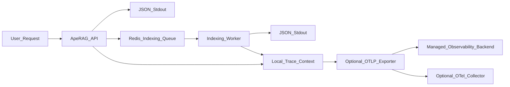
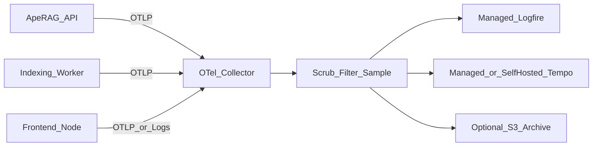
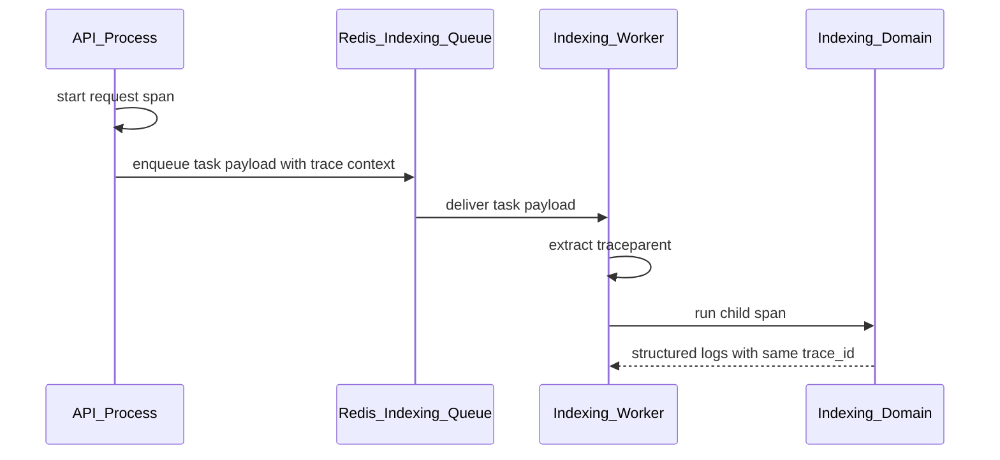

# 可观测性设计

本文描述 ApeRAG 可观测性的目标架构和落地原则。它不是对旧实现的背书；历史 `aperag/trace`、旧后端专用追踪变量、Docker Compose 专用追踪后端 profile 已经退出推荐路径，新设计以 `aperag.observability` 和 OTLP 为准。

目标是让 ApeRAG 在默认部署下尽量“零答疑”和“免维护”：不要求用户额外部署观测系统，也能通过标准日志、健康状态和诊断信息完成大多数问题定位；当用户需要集中查询、告警或多租户治理时，再平滑接入托管后端或 OpenTelemetry Collector。

## 设计目标

1. **默认不新增常驻基础设施**：不默认部署 Collector、Prometheus、Grafana、Loki、Tempo 等组件。
2. **一个操作模型**：API、indexing worker、前端 Node 进程遵循同一套日志、trace id、健康检查和诊断约定。
3. **标准优先**：进程内使用 OpenTelemetry API/SDK，外部出口使用 OTLP；不要在应用代码里绑定 Logfire、Datadog 等具体后端。
4. **自助排障优先**：任何线上问题都应该能先通过 `trace_id`、结构化日志、任务状态和诊断包定位到大致子系统。
5. **安全默认**：prompt、文档正文、密钥、Authorization、Cookie、LLM 原始响应默认不得进入日志、span 或 metric。
6. **面向重构稳定根**：只依赖相对稳定的根：`aperag/app.py`、`aperag/cli/indexing_worker.py`、`aperag/domains/**`、`web/`、`deploy/aperag/**`。不要围绕短期 shim 或历史模块做长期设计。

非目标：

- 不建设自研 APM。
- 不把业务审计日志当作技术可观测性的替代品。
- 不为兼容历史 exporter、历史环境变量或 monkey patch 方式牺牲未来模型。

## 当前系统 review 结论

近期主线已经集中在 domain 化、API v2 hard-cut、agent/message/stream 协议和 model-platform 重构。可观测性设计应面向这些稳定边界，而不是当前零散 trace 代码。

关键判断：

- `aperag/domains/**` 已经成为业务所有权边界。span、metric、日志字段应该显式带 `domain`，但不能让 domain 反向依赖某个观测后端。
- `aperag/app.py` 是 API 进程装配点。FastAPI instrumentation 应在 `app = FastAPI(...)` 之后显式绑定 app，而不是依赖全局 monkey patch 时机。
- `aperag/cli/indexing_worker.py` 是索引 worker 的进程根。indexing worker 必须和 API 使用同一套观测初始化、日志格式和 trace context propagation。
- 历史专用 exporter、No-op exporter、MCP monkey patch 和重复 trace 工具函数都是历史实现细节。未来应收敛为标准 OTLP 出口和明确的 integration seam。
- 默认 `OTEL_ENABLED=True` 但没有有效 exporter 会造成“看似开启、实际无输出”的答疑成本。未来配置必须让默认行为可解释。

## 推荐架构

默认架构只要求进程输出结构化日志。trace 在进程内生成上下文，用于日志关联；远端导出默认关闭。



### 默认模式：local

默认模式适合 Docker Compose、单机、私有化轻量部署和没有平台团队的用户。

行为：

- API、indexing worker、frontend 都输出 JSON stdout 日志。
- API 请求、中间件、indexing task、关键业务操作都创建 trace context。
- 即使没有 exporter，日志也带 `trace_id` / `span_id`，便于通过现有日志系统或 `docker compose logs` 串联问题。
- metrics 定义可以存在，但默认不启动远端导出。
- 不启动额外常驻组件。

### 关闭模式：off

用于极端性能敏感或用户明确不需要观测能力的场景。

行为：

- 保留普通 JSON 日志。
- 不创建 OpenTelemetry provider，不导出 trace/metric/log。
- 日志字段中 `trace_id` / `span_id` 可为空。

### OTLP 模式：otlp

用于已有观测平台、托管后端或企业统一采集的场景。

行为：

- 应用进程通过 OTLP 直接发送到一个 endpoint。
- endpoint 可以是托管 Logfire、Honeycomb、Datadog、New Relic，也可以是用户自己的 Collector。
- 应用不关心后端类型，只关心 OTLP endpoint、headers、TLS 和 sampling。

### Collector 模式：collector

Collector 不是默认依赖，只在下列需求出现时启用：

- 多副本、多 namespace 或多集群统一采集。
- 需要集中脱敏、过滤、tail sampling。
- 需要一份数据同时发往多个后端。
- 需要为 Kubernetes 补充 pod、node、deployment 等资源属性。
- 需要长期归档到对象存储。



## 配置模型

为降低答疑成本，建议用一个 ApeRAG 自有模式变量表达默认行为，再映射到标准 OTEL 配置。

```text
APERAG_OBSERVABILITY_MODE=local  # local | off | otlp | collector
APERAG_OBSERVABILITY_LOG_FORMAT=json
APERAG_OBSERVABILITY_CAPTURE_CONTENT=false
APERAG_OBSERVABILITY_SAMPLE_RATIO=1.0

OTEL_SERVICE_NAME=aperag-api
OTEL_SERVICE_VERSION=1.0.0
OTEL_RESOURCE_ATTRIBUTES=deployment.environment=production
OTEL_EXPORTER_OTLP_ENDPOINT=
OTEL_EXPORTER_OTLP_HEADERS=
OTEL_EXPORTER_OTLP_PROTOCOL=http/protobuf
```

推荐解释：

| 模式 | 默认 exporter | 是否需要额外系统 | 适用场景 |
| --- | --- | --- | --- |
| `local` | 无远端 exporter | 否 | 默认部署、本地、轻量私有化 |
| `off` | 无 | 否 | 极简或性能敏感 |
| `otlp` | OTLP | 需要一个外部 endpoint | 托管后端或企业平台 |
| `collector` | OTLP 到 Collector | 是 | 统一采集、脱敏、多后端、采样 |

历史变量处理：

- 新设计不再提供后端专用追踪开关。
- 如果某个部署环境仍想使用兼容 OTLP 的 trace 后端，应通过 `OTEL_EXPORTER_OTLP_ENDPOINT` 接入，而不是在应用内添加后端专用 exporter。
- 文档、Docker Compose 和 Helm values 只维护 OTLP 配置。

## 日志契约

日志是默认模式下最重要的观测信号，必须稳定。

每条后端日志至少包含：

| 字段 | 说明 |
| --- | --- |
| `timestamp` | ISO 8601 UTC 时间 |
| `level` | `DEBUG` / `INFO` / `WARNING` / `ERROR` |
| `logger` | Python logger 名称 |
| `message` | 人类可读摘要 |
| `service.name` | `aperag-api`、`aperag-indexing-worker` |
| `service.version` | 版本号或 git sha |
| `deployment.environment` | `development` / `staging` / `production` |
| `trace_id` | 当前 trace id，无则为空 |
| `span_id` | 当前 span id，无则为空 |
| `request_id` | HTTP 请求 id，无则为空 |
| `task_id` | indexing task id 或 document index id，无则为空 |
| `domain` | 业务 domain，例如 `indexing`、`retrieval` |
| `operation` | 稳定操作名，例如 `document.parse` |
| `outcome` | `success` / `failure` / `skipped` |
| `error.type` | 异常类名或稳定错误类型 |
| `error.message` | 脱敏后的短错误摘要 |

日志规则：

- 业务日志必须是事件式摘要，不输出大对象。
- 禁止日志里出现完整 prompt、文档正文、Authorization、Cookie、API key、数据库密码。
- 允许记录长度、token 数、数量、耗时、稳定状态码和 hash。
- `logger.exception(...)` 必须自动带 exception 类型、堆栈和当前 trace context。

## Trace 契约

trace 的目标不是记录所有细节，而是建立跨 API、任务、检索、LLM、工具调用的因果链。

### 命名规范

推荐 span 名称：

```text
http.server.request
indexing.task.run
document.parse
document.chunk
index.vector.write
index.fulltext.write
index.graph.build
retrieval.vector.search
retrieval.fulltext.search
retrieval.hybrid.merge
retrieval.rerank
llm.chat.completion
llm.embedding
agent.turn.run
agent.tool.call
evaluation.item.run
```

公共属性：

| 属性 | 说明 |
| --- | --- |
| `aperag.domain` | domain 名 |
| `aperag.operation` | 稳定操作名 |
| `aperag.user.id` | 用户 id，必要时 hash |
| `aperag.collection.id` | collection id |
| `aperag.document.id` | document id |
| `aperag.bot.id` | bot id |
| `aperag.chat.id` | chat id |
| `aperag.task.id` | indexing task id 或 document index id |
| `aperag.task.name` | indexing task name |
| `gen_ai.provider.name` | LLM provider |
| `gen_ai.request.model` | 模型名 |
| `gen_ai.usage.input_tokens` | 输入 token |
| `gen_ai.usage.output_tokens` | 输出 token |

高基数字段处理：

- id 可以记录；正文、query 原文、prompt 原文不记录。
- 如果需要定位用户输入，只记录 hash、长度、语言、token 数。
- 大数组只记录 count。

### API 到 indexing worker 的上下文传播

Redis-backed indexing queue 是 RAG 系统的主要异步边界，必须一等支持。



要求：

- 发送 task 时把 W3C `traceparent` / `baggage` 注入 queue payload 或等价 metadata。
- worker 执行 task 时提取上下文，创建 `indexing.task.run` span。
- task retry、skip、failure 都写入 span event 和结构化日志。
- reconciler / cleanup 触发的任务没有上游请求，应创建新的 root trace，并在日志中标记 `trigger=reconciler` 或 `trigger=cleanup`。

## Metrics 契约

默认不部署 Prometheus，但业务代码可以定义 metric。只有在 `otlp` 或 `collector` 模式下导出。

优先级：

1. **业务结果指标**：文档索引成功率、失败率、耗时；检索耗时；LLM tokens/cost/error。
2. **任务指标**：indexing task 运行时长、重试次数、失败次数、队列等待时间。
3. **API 指标**：请求数、错误数、延迟直方图。
4. **依赖指标**：Postgres、Redis、Qdrant、Elasticsearch、对象存储调用耗时和错误数。

指标命名示例：

```text
aperag.document.index.duration
aperag.document.index.errors
aperag.retrieval.duration
aperag.llm.tokens
aperag.llm.cost
aperag.indexing.task.duration
aperag.indexing.task.retries
```

metric label 必须低基数。允许 `domain`、`operation`、`status`、`provider`、`model`、`index_type`；禁止 prompt、document title、URL 原文、异常全文。

## 面向 domain 的埋点边界

每个 domain 只声明自己的业务操作，不知道 exporter 和后端。

推荐所有业务埋点通过未来的新包承载：

```text
aperag/observability/
  __init__.py
  config.py
  logging.py
  tracing.py
  metrics.py
  indexing.py
  fastapi.py
  privacy.py
```

迁移时可以从 `aperag/trace` 过渡，但长期公共入口应是 `aperag.observability`。

各 domain 的首批观测重点：

| Domain | 重点操作 |
| --- | --- |
| `knowledge_base` | collection/document CRUD、状态流转、触发索引 |
| `indexing` | parse、chunk、embedding、vector/fulltext/graph/summary/vision index |
| `retrieval` | vector/fulltext/graph search、merge、rerank |
| `conversation` | chat、bot、OpenAI-compatible completion |
| `agent_runtime` | turn lifecycle、timeline event、tool call、artifact |
| `model_platform` | provider/model 选择、凭证错误、模型可用性 |
| `evaluation` | run/item/attempt、judge、score |
| `web_access` | search/read provider、外部 HTTP 错误 |
| `governance` | API key 使用、审计写入错误 |

## 零答疑能力

为了减少支持沟通，系统应提供“一个命令/一个页面能拿到足够上下文”的诊断能力。

推荐未来增加诊断包能力：

```text
aperag diagnose --redact --output aperag-diagnostic.zip
```

诊断包内容：

- 版本、git sha、启动模式、关键 feature flags。
- 脱敏后的 env 摘要。
- 最近 N 分钟 API / indexing worker 错误日志。
- 最近 N 个失败 indexing task 的 task name、document id、trace id、错误类型。
- `/health`、`/health/live`、`/health/ready`、`/health/diagnostics` 的结果。
- 数据库、Redis、Qdrant、Elasticsearch、对象存储的连通性摘要。
- LLM provider 配置可用性摘要，不包含密钥。

诊断包不包含：

- prompt 原文。
- 文档正文。
- 用户上传文件。
- API key、token、cookie、数据库密码。

## 健康检查和就绪检查

当前已区分：

- `/health`：兼容旧探针，语义等同轻量 liveness。
- `/health/live`：进程是否存活，只检查应用自身。
- `/health/ready`：HTTP 入口是否可以接收流量，不做 PG / Redis / Qdrant 等重依赖检查。
- `/health/diagnostics`：受保护接口，使用隔离小预算连接检查子系统健康摘要。

这样可以减少“Pod Running 但业务不可用”的答疑成本。

## Logfire 与类似产品的建议

Logfire 可以作为可选托管后端，尤其适合 Python、FastAPI、Pydantic-heavy 系统。但它不应成为应用架构前提。

推荐策略：

- 默认不要求部署 Logfire 或 Collector。
- 如果用户接受 SaaS，优先支持 OTLP 直连 Logfire endpoint，这是最低运维路径。
- 如果用户需要集中脱敏、采样、多出口，再通过 Collector 转发到 Logfire。
- 所有敏感字段在应用侧先脱敏；Collector 脱敏是第二道防线，不是唯一防线。

## 实施顺序

1. 新建 `aperag.observability` 作为未来唯一公共入口，停止扩展历史 `aperag.trace` API。
2. 定义 `APERAG_OBSERVABILITY_MODE`，让默认行为从配置层自解释。
3. 统一 API 与 indexing worker 的 JSON 日志格式和 trace/span 注入。
4. 在 FastAPI app 创建后显式 instrument app。
5. 为 Redis-backed indexing queue payload 实现 W3C trace context 传播。
6. 移除后端专用 exporter，主出口统一为 OTLP。
7. 为 indexing、retrieval、LLM、agent_runtime 增加业务 span 和低基数 metric。
8. 增加脱敏工具和测试，确保敏感字段不会进入日志/span。
9. 增加诊断包或诊断接口，形成支持闭环。
10. 提供可选 Collector/Logfire 示例，但所有示例默认 disabled。

## 验收标准

默认 `local` 模式：

- 不启动额外观测服务时，API 与 indexing worker 正常启动。
- JSON 日志包含稳定字段，API 请求和 indexing task 可通过 `trace_id` 串联。
- 用户可以仅凭日志和诊断包定位到失败 domain、operation、task、依赖和错误类型。
- 日志和 span 不包含 prompt、文档正文或密钥。

`otlp` / `collector` 模式：

- 配置一个 OTLP endpoint 后，API 与 indexing worker 的 trace 能在后端串成完整链路。
- 文档上传到索引完成能看到 parse、embedding、index write 等阶段。
- LLM 调用能看到 provider、model、tokens、latency、error/cost 摘要。
- Collector 只作为可选增强，不影响默认部署。

## 迁移说明

迁移时不要试图兼容所有历史行为。建议采用“新入口 + 旧入口冻结 + 分阶段删除”：

- 冻结 `aperag/trace`：只保留兼容 re-export，不再增加新能力。
- 新代码只 import `aperag.observability`。
- 删除后端专用追踪配置和 Docker Compose 专用追踪后端 profile，改用 OTLP endpoint。
- MCP trace 注入目标保留，实现方式从 monkey patch 迁移到显式 adapter 或上游支持。
