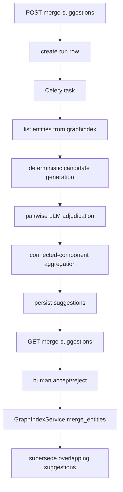

# Graph Curation Module

## 1. Decision

### 1.1 Do we need merge-suggestion discovery?

Yes.

Current graphindex v2 already keeps the **manual merge primitive**
(`GraphIndexService.merge_entities()`), which means the product still
accepts graph curation as a valid user workflow. What v2 removed was the
**discovery layer** that finds likely duplicate entities and turns them
into reviewable suggestions.

From first principles:

- If graph data is only a transient retrieval scaffold, manual merge
  should not exist at all.
- If manual merge exists, users need a reliable way to find candidates.
- Therefore, merge-suggestion discovery is a missing product layer, not
  an optional old feature to half-revive.

### 1.2 What should be rebuilt?

Rebuild a **new** `graph_curation` module.

Do **not** revive the LightRAG-era pipeline shape:

- not `top-degree -> LLM grouping -> action`
- not stateless request-time analysis
- not prompt/state/review logic mixed into `graphindex`

## 2. Goals And Non-Goals

### 2.1 Goals

- Provide a simple async workflow that scans one collection and produces
  persisted merge suggestions.
- Keep graph truth on a single write path: accept uses the existing
  `GraphIndexService.merge_entities()` only.
- Stay viable across PostgreSQL / Neo4j / Nebula graph backends.
- Keep API and interaction surface minimal.
- Keep performance and token cost bounded by deterministic blocking and
  explicit caps.

### 2.2 Non-Goals

- No full-graph LLM clustering.
- No synchronous analysis in index/query/UI hot paths.
- No second merge implementation in the curation module.
- No backend-specific fuzzy search logic that only works on one graph DB.

## 3. Module Boundary

### 3.1 `graphindex`

Responsibilities remain:

- graph truth writes
- graph query context
- label/subgraph reads
- structural merge primitive
- graph shadow vector maintenance

It may expose **read-only helper methods** for curation, but it does not
own:

- suggestion state
- review workflow
- run orchestration
- invalidation policy

### 3.2 `graph_curation`

New module responsibilities:

- create async analysis runs
- enumerate candidate entities from graph truth
- build cheap candidate pairs
- ask LLM for pairwise adjudication
- aggregate positive pairs into suggestions
- persist suggestion state
- accept/reject/expire/supersede suggestions

## 4. First-Principles Architecture

Key design choice:

- candidate discovery uses **graph truth + graph shadow vectors**
- not graph-backend-native fuzzy/text search

This keeps the module portable across PG / Neo4j / Nebula.

## 5. Data Model

### 5.1 `graph_curation_runs`

One row per async scan.

Fields:

- `id`
- `user_id`
- `collection_id`
- `status`: `PENDING | RUNNING | COMPLETED | FAILED`
- `config_json`: immutable run config snapshot
- `stats`: counts for analyzed entities, candidate pairs, positive pairs,
  final suggestions
- `error_message`
- `gmt_created / gmt_updated / gmt_started / gmt_finished`

### 5.2 `graph_curation_suggestions`

One row per reviewable suggestion.

Fields:

- `id`
- `run_id`
- `user_id`
- `collection_id`
- `status`: `PENDING | ACCEPTED | REJECTED | EXPIRED | SUPERSEDED`
- `entity_ids`: all entities in the suggestion
- `entity_snapshots`: display payload captured at generation time
- `target_entity_id`: deterministic target chosen from existing nodes
- `confidence_score`
- `reason`
- `evidence`: structured trace of pairwise signals / adjudications
- `resolution_note`
- `operated_by`
- `gmt_created / gmt_updated / gmt_operated`

No separate suggestion-items table is required in v1 of this module:

- entity membership is already naturally represented as JSON array
- the workflow is simple and collection-scoped
- write/read paths stay cheaper and easier to reason about

If later UI/product needs per-item moderation or cross-suggestion joins,
that is a future schema migration, not a reason to over-model now.

## 6. Candidate Generation

### 6.1 Input Set

The module scans up to a bounded number of entities per collection
(`max_entities`).

Enumeration comes from `GraphIndexService.list_entities_for_curation()`,
which is implemented as a bounded read over the existing graph truth.

### 6.2 Candidate Signals

Generate pair candidates only within the same `entity_type`, then score
them with cheap deterministic signals:

- normalized-name exact match
- normalized-name containment
- acronym match
- token overlap
- description token overlap
- shared source chunk overlap
- optional graph shadow vector nearest neighbors

This gives three important properties:

- bounded compute
- explainable candidate provenance
- backend independence

### 6.3 Why use graph shadow vectors?

Entity vectors are already written to the existing vector store as
`indexer=graph_entity`.

Using those shadows means:

- no duplicate vector infrastructure
- no graph-backend-specific text indexing
- same candidate discovery logic works across PG / Neo4j / Nebula

## 7. LLM Adjudication

### 7.1 Unit Of Judgement

Use **pairwise** adjudication.

Input:

- entity A snapshot
- entity B snapshot
- deterministic candidate signals

Output JSON only:

- `same_entity: bool`
- `confidence: float`
- `reason: str`
- `recommended_target_entity_id: str | null`

Constraint:

- `recommended_target_entity_id` must be one of the two existing ids
- the model cannot invent a new canonical node

### 7.2 Why pairwise instead of cluster-level?

Because pairwise is:

- easier to prompt
- easier to test
- easier to bound in cost
- easier to aggregate deterministically

Multi-entity suggestions are formed **after** pairwise positives are
known.

## 8. Suggestion Aggregation

Positive pair edges form a graph over entity ids.

The module builds connected components:

- size `< 2` -> ignored
- size `>= 2` -> one suggestion

Target selection is deterministic:

1. pairwise recommendation votes
2. larger supporting chunk count
3. lexical tie-break on entity id

This preserves a single graph identity rule without delegating target
creation to the LLM.

## 9. API Contract

Keep the public API narrow.

### 9.1 Start Run

`POST /collections/{collection_id}/graphs/merge-suggestions`

Behavior:

- if a run is already `PENDING/RUNNING`, return that run
- otherwise create a new run and enqueue Celery work

### 9.2 Read Latest Suggestions

`GET /collections/{collection_id}/graphs/merge-suggestions`

Behavior:

- return the latest run summary
- return suggestions from that run

### 9.3 Act On A Suggestion

`POST /collections/{collection_id}/graphs/merge-suggestions/{suggestion_id}/action`

Body:

- `{"action": "accept"}` or `{"action": "reject"}`

Accept:

- call existing `GraphIndexService.merge_entities()`
- mark accepted suggestion as `ACCEPTED`
- mark overlapping pending suggestions as `SUPERSEDED`

Reject:

- mark suggestion as `REJECTED`

No target override API is exposed. The point of this module is simple,
low-support review, not a second complex merge editor.

## 10. Invalidation Rules

Freshness is conservative by design.

### 10.1 Expire Pending Suggestions On

- document re-index
- document delete
- manual merge

### 10.2 Purge Everything On

- collection delete

### 10.3 Supersede Pending Suggestions On

- successful completion of a newer run
- accepting one suggestion that overlaps their entity set

The module prefers **expire + rerun** over trying to incrementally patch
old suggestions in place.

## 11. Performance And Cost

Hard caps are server-side, not UI-driven:

- max entities analyzed per run
- max candidate pairs kept after blocking
- max vector neighbors per entity
- max concurrent LLM adjudications
- max final suggestions persisted

This keeps the feature predictable in three dimensions:

- DB cost
- vector search cost
- LLM token cost

## 12. Backend Viability

### 12.1 PostgreSQL

Works through existing graphindex tables and vector shadows.

### 12.2 Neo4j

Works because the curation module does not rely on Neo4j-specific text
or full-text behavior. It reads entities through graphindex and uses the
same vector shadow path.

### 12.3 Nebula

Works for the same reason: graph truth comes from graphindex storage
calls, not Nebula-specific fuzzy search. This avoids Nebula's async
schema/index readiness problems from becoming curation-specific product
bugs.

## 13. Historical Cleanup

The implementation removes stale v1/v2 residuals:

- old `410` merge-suggestion routes
- old stateless request/response schemas
- stale OpenAPI contract that still described high-degree LightRAG scan

Historical code and analysis docs remain only as archaeology input, not
as active runtime contract.

## 14. Implementation Notes

This rollout intentionally keeps one truth path:

- discover in `graph_curation`
- merge in `graphindex`

That gives us a simple rule for future maintenance:

> if code changes graph truth directly, it belongs in `graphindex`;
> if code proposes or reviews graph edits, it belongs in
> `graph_curation`.
