# 图索引构建流程

## 1. 什么是图索引

图索引（Graph Index）是 ApeRAG 的核心特色功能，它能从非结构化文本中自动提取出结构化的知识图谱。

想象一下，你有一份关于公司组织架构的文档，里面提到：

> "张三是数据库团队的负责人，他擅长 PostgreSQL 和 MySQL。李四在前端团队工作，经常和张三的团队协作开发后台管理系统。"

传统的向量检索只能找到"语义相似"的段落，但无法回答这些问题：
- 张三负责什么？
- 张三和李四是什么关系？
- 数据库团队都有哪些技术栈？

**图索引能做到**：

1. **提取实体**：张三（人物）、李四（人物）、数据库团队（组织）、PostgreSQL（技术）、MySQL（技术）
2. **提取关系**：张三 --负责--> 数据库团队，张三 --擅长--> PostgreSQL，李四 --协作--> 张三
3. **构建图谱**：将这些实体和关系组织成一个可查询的知识网络

这样，系统就能准确回答上面那些需要理解"关系"的问题。

### 核心价值

与传统检索方式相比，图索引提供了：

| 能力 | 向量检索 | 全文检索 | 图索引 |
|------|---------|---------|--------|
| 语义相似搜索 | ✅ 强 | ❌ 弱 | ✅ 强 |
| 精确关键词匹配 | ❌ 弱 | ✅ 强 | ✅ 中 |
| 关系查询 | ❌ 不支持 | ❌ 不支持 | ✅ 强 |
| 多跳推理 | ❌ 不支持 | ❌ 不支持 | ✅ 支持 |
| 适用问题 | "如何优化性能" | "PostgreSQL 配置" | "张三和李四的关系" |

**图索引让 AI 能够"理解"知识之间的关联，而不仅仅是文本的相似度。**

## 2. 核心设计理念

ApeRAG 的图索引系统采用了多项先进的设计理念，以确保生产环境的稳定性和高性能。

### 2.1 数据隔离

每个 Collection 拥有完全独立的命名空间，确保多租户场景下的数据安全：

```python
# 每个集合有独立的命名空间
# 用户 A 的 collection_1：entity:张三:collection_1 -> 财务部经理
# 用户 B 的 collection_2：entity:张三:collection_2 -> 技术总监
# 完全隔离，互不影响
```

**优势**：
- ✅ 多租户支持：不同用户的数据完全隔离
- ✅ 数据安全：避免数据混淆和冲突
- ✅ 易于管理：每个 Collection 独立维护

### 2.2 无状态架构

每个处理任务创建独立的实例，避免状态污染：

```python
# 每次处理创建新实例
async def process_document(collection, document):
    instance = await create_graph_instance(collection)  # 独立实例
    await instance.insert_document(document)
    # 处理完成后实例被销毁，资源释放
```

**优势**：
- ✅ 零状态污染：任务之间完全独立
- ✅ 易于扩展：可以并行运行多个任务
- ✅ 资源管理：自动清理，无内存泄漏

### 2.3 智能并发控制

细粒度的锁管理，最大化并发性能：

```python
# 只锁定需要合并的实体
async with lock_manager.lock("entity:张三:collection_1"):
    # 只有这个实体被锁定，其他实体可以并发处理
    merge_entity("张三")
```

**优势**：
- ✅ 高并发：实体级别的锁，最小化锁范围
- ✅ 无死锁：排序获取锁，避免循环等待
- ✅ 高性能：最大化利用多核 CPU

### 2.4 连通分量并发优化

基于图拓扑分析，智能分组并发处理：

```python
# 技术团队的实体：张三、李四、数据库团队
# 财务团队的实体：王五、赵六、财务部
# 这两个子图完全独立，可以并行处理
```

**优势**：
- ✅ 智能分组：自动发现独立子图
- ✅ 零冲突：不同分量完全并行
- ✅ 性能提升：2-3 倍加速

## 3. 构建流程

当你上传一个文档并启用图索引后，ApeRAG 会经历以下步骤：

### 3.1 流程概览

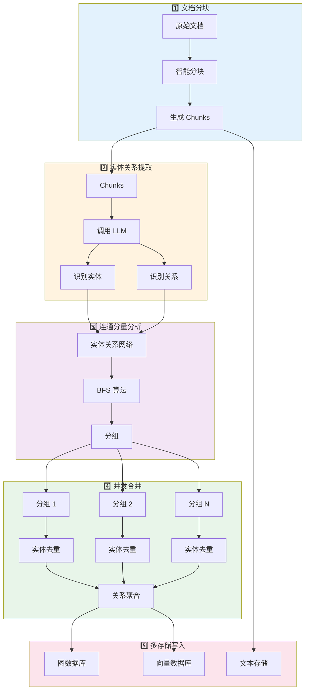

### 3.2 文档分块

第一步是把长文档切成合适大小的块（chunks）。这个步骤很关键，块太大会影响 LLM 提取质量，太小会丢失上下文。

**分块策略**：

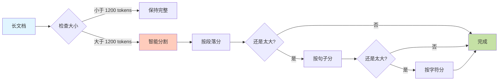

**分块参数**：

- **默认大小**：1200 tokens（约 800-1000 个中文字）
- **重叠大小**：100 tokens（保证上下文连续）
- **智能分割**：优先按段落分，不行再按句子分，最后才按字符分

**实际例子**：

```
原始文档（2500 tokens）:
"张三是数据库团队的负责人...（很长的内容）...李四负责前端开发。"

分块后：
Chunk 1 (1200 tokens): "张三是数据库团队的负责人..."
Chunk 2 (1200 tokens): "...PostgreSQL 和 MySQL。李四负责前端开发..." 
                        ↑ 包含 100 tokens 的重叠部分
```

### 3.3 实体关系提取

这是图索引的核心步骤，使用 LLM 从每个 chunk 中提取实体和关系。

**提取过程**：

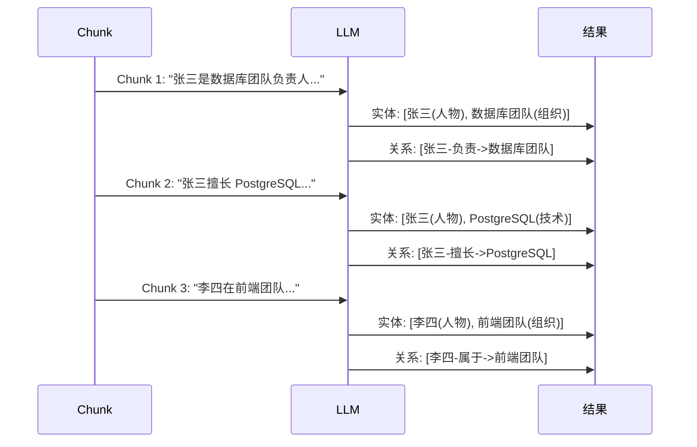

**提取的数据结构**：

```json
{
  "entities": [
    {
      "name": "张三",
      "type": "人物",
      "description": "数据库团队的负责人，擅长 PostgreSQL 和 MySQL",
      "source_id": "chunk-001"
    },
    {
      "name": "数据库团队",
      "type": "组织",
      "description": "负责公司数据库相关工作的团队",
      "source_id": "chunk-001"
    }
  ],
  "relationships": [
    {
      "source": "张三",
      "target": "数据库团队",
      "description": "张三是数据库团队的负责人",
      "keywords": "负责,管理",
      "weight": 1
    }
  ]
}
```

**并发优化**：

- 多个 chunks 可以同时调用 LLM 提取
- 使用信号量控制并发数（默认 20 个）
- 避免 LLM API 被限流

### 3.4 连通分量分析

提取出的实体和关系会形成一个网络。我们使用连通分量算法把这个网络分成独立的子图。

**为什么需要连通分量？**

假设你有两份文档：
- 文档 A：讨论技术团队（张三、李四、数据库团队）
- 文档 B：讨论财务部门（王五、赵六、财务部）

这两个话题的实体之间没有连接，可以完全并行处理，互不影响！

**连通分量算法**：

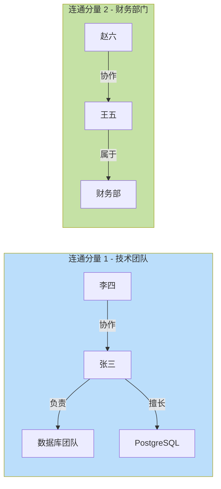

**BFS 算法步骤**：

1. 从任意一个实体开始
2. 遍历所有与它连接的实体
3. 再遍历这些实体连接的实体
4. 直到没有新的连接为止
5. 这就是一个连通分量
6. 重复上述过程，找出所有分量

**实际效果**：

```
发现 3 个连通分量：
- 分量 1：20 个实体（技术团队）
- 分量 2：15 个实体（财务部门）
- 分量 3：8 个实体（市场部门）

可以并发处理这 3 个分量，速度提升 3 倍！
```

### 3.5 并发合并

每个连通分量内部的实体需要去重和合并。同一个实体可能在不同 chunks 中被提取多次，需要合并成一个。

**合并过程**：

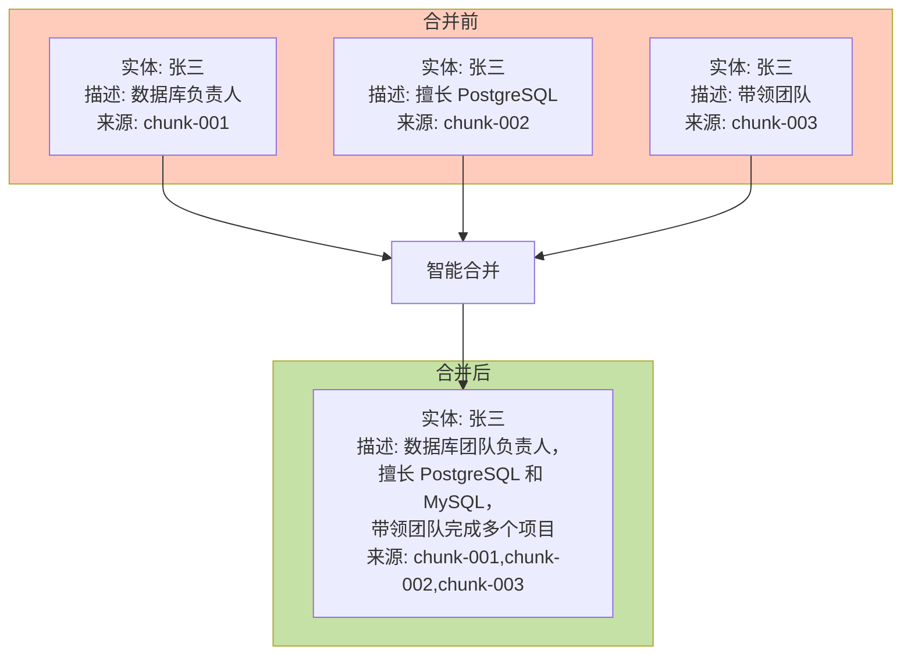

**合并策略**：

1. **实体合并**：
   - 相同名字的实体 → 合并成一个
   - 描述内容 → 智能拼接或 LLM 摘要
   - 来源信息 → 保留所有来源

2. **关系合并**：
   - 相同方向的关系 → 合并权重
   - 描述内容 → 智能拼接
   - 权重累加 → 表示关系强度

**细粒度锁控制**：

```python
# 只锁定需要合并的实体
async with lock_manager.lock("entity:张三:collection_1"):
    # 其他实体（李四、王五）可以并发处理
    merge_entity("张三")
```

**为什么需要锁？**

如果两个 chunks 同时包含"张三"，两个线程可能同时尝试合并，导致数据冲突。锁确保同一时间只有一个线程能修改"张三"这个实体。

### 3.6 多存储写入

最终的知识图谱需要写入多个存储系统，以支持不同类型的查询。

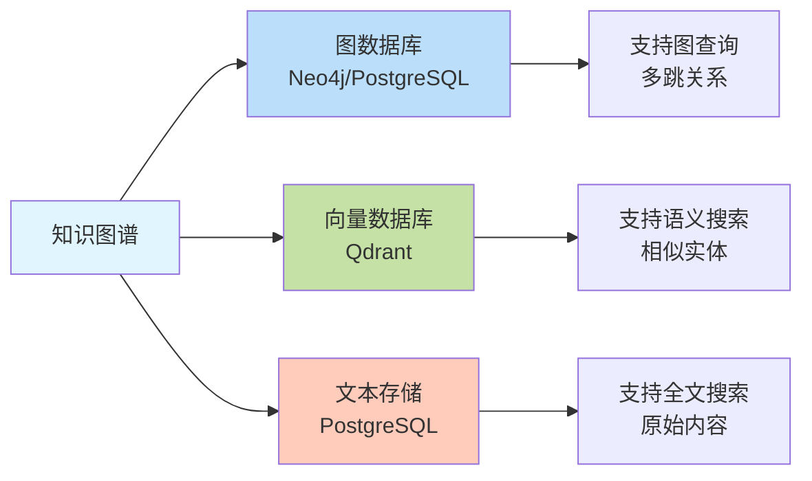

**存储内容**：

| 存储系统 | 存储内容 | 用途 |
|---------|---------|------|
| **图数据库** | 实体节点、关系边 | 图遍历查询、关系分析 |
| **向量数据库** | 实体的语义向量 | 相似实体搜索 |
| **文本存储** | 原始分块内容 | 全文检索、上下文展示 |

**写入策略**：

- 批量写入，减少数据库往返
- 事务保证，要么全部成功，要么全部失败
- 并行写入不同存储，提高速度

## 4. 核心技术亮点

### 4.1 workspace 数据隔离

每个 Collection 拥有独立的命名空间，实现完全的数据隔离。

**命名规范**：

```python
# 实体命名
entity:{entity_name}:{workspace}
# 示例
entity:张三:collection_abc123

# 关系命名
relationship:{source}:{target}:{workspace}
# 示例
relationship:张三:数据库团队:collection_abc123
```

**隔离效果**：

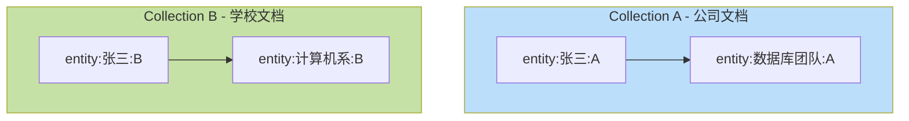

两个 Collection 中的"张三"完全独立，互不干扰！

### 4.2 无状态实例管理

每个处理任务创建独立的图索引实例，处理完成后销毁。

**生命周期管理**：

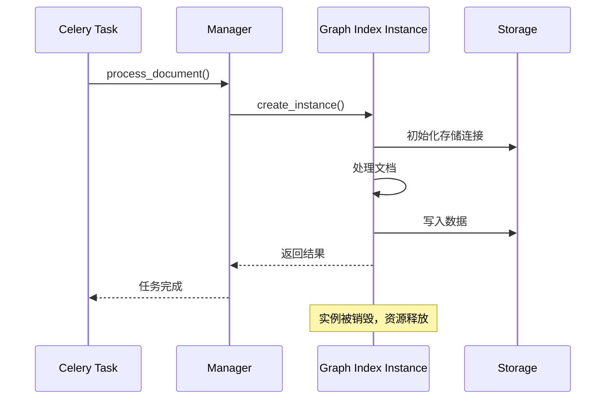

**优势**：

- ✅ 零状态污染：每个任务独立，不会互相干扰
- ✅ 自动资源管理：实例销毁时自动释放资源
- ✅ 易于扩展：可以同时运行多个 Worker

### 4.3 连通分量并发优化

这是性能提升的关键。通过图拓扑分析，找出可以并行处理的部分。

**算法原理**：

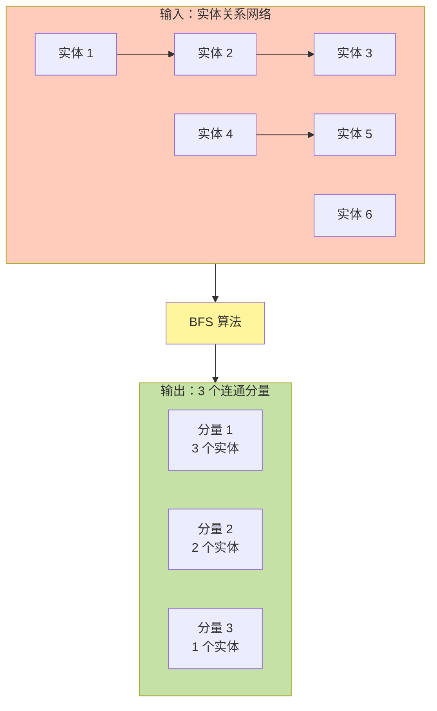

**性能对比**：

假设有 100 个实体，分成 5 个连通分量：

```
串行处理（原版）：
分量 1 (30个) → 分量 2 (25个) → 分量 3 (20个) → 分量 4 (15个) → 分量 5 (10个)
总时间 = T1 + T2 + T3 + T4 + T5

并发处理（ApeRAG）：
分量 1、2、3、4、5 同时处理
总时间 = max(T1, T2, T3, T4, T5) ≈ T1

速度提升：约 3-5 倍！
```

**统计信息**：

系统会输出连通分量的统计信息，帮助你了解数据特征：

```
发现 15 个连通分量：
- 最大分量：50 个实体
- 平均分量：6.7 个实体
- 单实体分量：5 个
- 大型分量（>20个实体）：3 个
```

### 4.4 细粒度锁管理

自研的 Concurrent Control 模型，实现实体级别的锁定。

**锁的层次**：

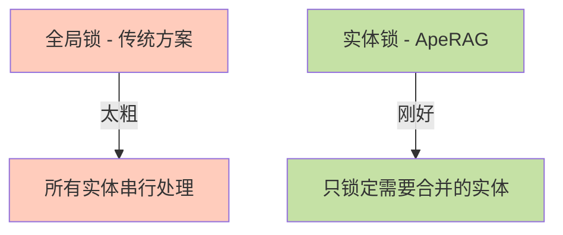

**锁策略**：

1. **提取阶段无锁**：不同 chunks 的实体提取完全并行
2. **合并阶段加锁**：只在合并同名实体时加锁
3. **排序获取锁**：避免死锁（A 等 B，B 等 A）

**死锁预防**：

```python
# 按实体名称排序后获取锁
entities_to_merge = ["张三", "李四", "王五"]
entities_to_merge.sort()  # 排序：李四、王五、张三

# 按顺序获取锁
for entity in entities_to_merge:
    await lock_manager.lock(f"entity:{entity}:{workspace}")
    # 合并实体
```

所有线程都按相同顺序获取锁，不会出现循环等待！

### 4.5 智能摘要生成

当实体或关系的描述太长时，使用 LLM 生成摘要。

**何时触发摘要**：

```python
if len(description) > 2000 tokens:
    # 太长了，调用 LLM 生成摘要
    summary = await llm_summarize(description)
else:
    # 直接保留原内容
    summary = description
```

**摘要策略**：

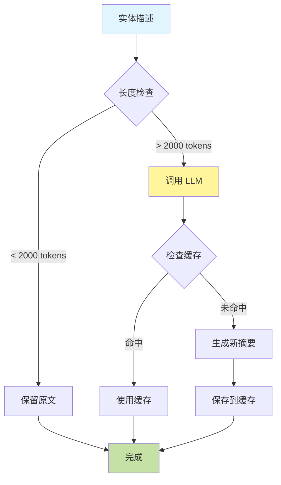

**实际例子**：

```
原始描述（2500 tokens）：
"张三，男，1985 年出生，毕业于清华大学计算机系...（很多细节）...
擅长 PostgreSQL、MySQL、Redis、MongoDB...（很多技术）...
曾参与项目 A、B、C、D...（很多项目）..."

生成摘要（200 tokens）：
"数据库团队负责人，清华大学计算机系毕业，10年+数据库经验，
擅长 PostgreSQL 和 MySQL，带领团队完成多个大型项目。"
```

### 4.6 多存储后端支持

ApeRAG 支持两种图数据库：Neo4j 和 PostgreSQL。

**如何选择？**

| 场景 | 推荐方案 | 原因 |
|------|---------|------|
| **小规模**（< 10万实体） | PostgreSQL | 运维简单，成本低 |
| **中等规模**（10-100万） | PostgreSQL 或 Neo4j | 根据查询复杂度选择 |
| **大规模**（> 100万） | Neo4j | 图查询性能更好 |
| **预算有限** | PostgreSQL | 无需额外部署 |
| **复杂图算法** | Neo4j | 内置图算法支持 |

**切换方式**：

```bash
# 使用 PostgreSQL（默认）
export GRAPH_INDEX_GRAPH_STORAGE=PGOpsSyncGraphStorage

# 使用 Neo4j
export GRAPH_INDEX_GRAPH_STORAGE=Neo4JSyncStorage
```

**性能对比**：

| 操作 | PostgreSQL | Neo4j |
|------|-----------|-------|
| **简单查询**（1-2跳） | 快 | 快 |
| **复杂查询**（3+跳） | 中 | 快 |
| **批量写入** | 快 | 中 |
| **图算法** | 需要自己实现 | 内置支持 |

## 5. 完整数据流

整个图索引构建过程是一个数据转换流水线，从非结构化文本到结构化知识图谱：

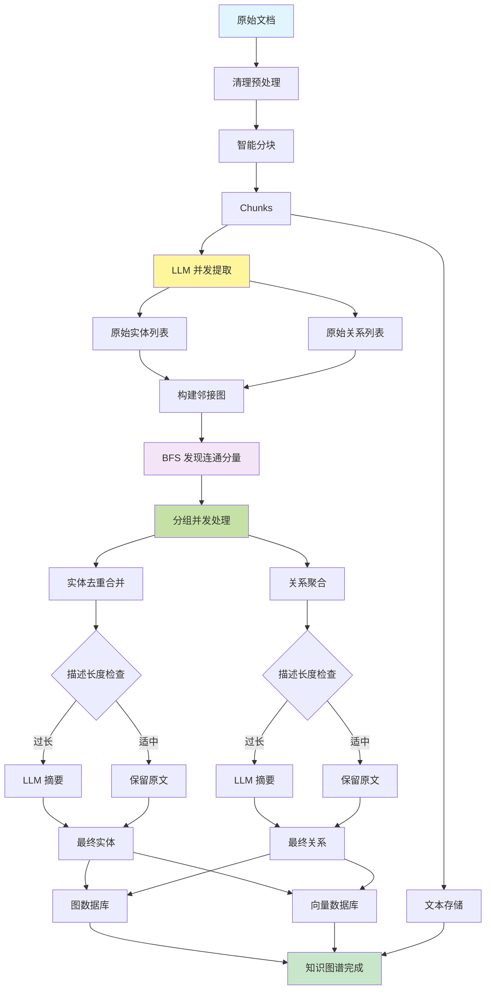

### 数据转换示例

让我们用一个具体例子，看看数据是如何一步步转换的：

**输入文档**：

```text
张三是数据库团队的负责人，他擅长 PostgreSQL 和 MySQL。
李四在前端团队工作，经常和张三的团队协作开发后台管理系统。
王五是财务部的会计，负责公司的财务报表。
```

**Step 1: 分块**

```json
[
  {
    "chunk_id": "chunk-001",
    "content": "张三是数据库团队的负责人，他擅长 PostgreSQL 和 MySQL。",
    "tokens": 25
  },
  {
    "chunk_id": "chunk-002",
    "content": "李四在前端团队工作，经常和张三的团队协作开发后台管理系统。",
    "tokens": 28
  },
  {
    "chunk_id": "chunk-003",
    "content": "王五是财务部的会计，负责公司的财务报表。",
    "tokens": 20
  }
]
```

**Step 2: 实体关系提取**

```json
{
  "entities": [
    {"name": "张三", "type": "人物", "source": "chunk-001"},
    {"name": "数据库团队", "type": "组织", "source": "chunk-001"},
    {"name": "PostgreSQL", "type": "技术", "source": "chunk-001"},
    {"name": "MySQL", "type": "技术", "source": "chunk-001"},
    {"name": "李四", "type": "人物", "source": "chunk-002"},
    {"name": "前端团队", "type": "组织", "source": "chunk-002"},
    {"name": "王五", "type": "人物", "source": "chunk-003"},
    {"name": "财务部", "type": "组织", "source": "chunk-003"}
  ],
  "relationships": [
    {"source": "张三", "target": "数据库团队", "relation": "负责"},
    {"source": "张三", "target": "PostgreSQL", "relation": "擅长"},
    {"source": "张三", "target": "MySQL", "relation": "擅长"},
    {"source": "李四", "target": "前端团队", "relation": "属于"},
    {"source": "李四", "target": "张三", "relation": "协作"},
    {"source": "王五", "target": "财务部", "relation": "属于"}
  ]
}
```

**Step 3: 连通分量分析**

```
连通分量 1（技术部门）：
- 实体：张三、李四、数据库团队、前端团队、PostgreSQL、MySQL
- 关系：6 条

连通分量 2（财务部门）：
- 实体：王五、财务部
- 关系：1 条
```

**Step 4: 并发合并**

两个分量可以并行处理！

**Step 5: 最终知识图谱**

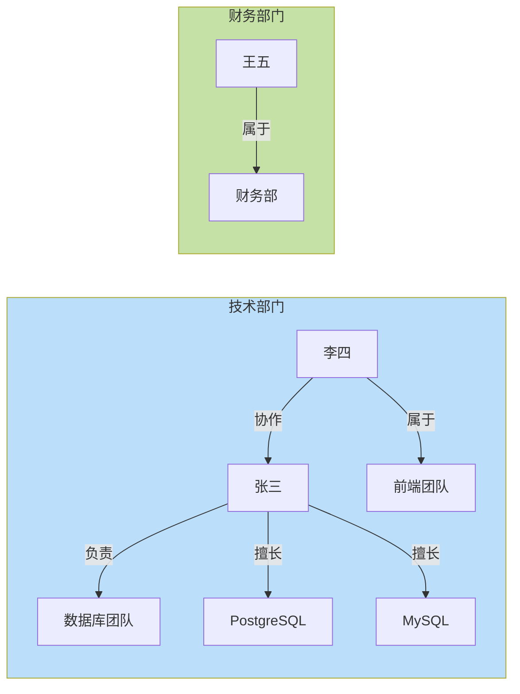

### 性能优化特性

1. **细粒度并发控制**
   - 实体级别的锁：`entity:张三:collection_abc`
   - 只在合并时加锁，提取时完全并行

2. **连通分量并发**
   - 技术部门和财务部门可以并行处理
   - 零锁竞争，充分利用多核 CPU

3. **智能摘要**
   - 描述 < 2000 tokens：保留原文
   - 描述 > 2000 tokens：LLM 摘要压缩

## 6. 性能优化策略

### 6.1 并发度控制

图索引构建涉及大量的 LLM 调用和数据库操作，需要合理控制并发度。

**并发层次**：

```mermaid
graph TB
    A[文档级并发] --> B[Chunk 级并发]
    B --> C[连通分量级并发]
    C --> D[实体级并发]
    
    A1[Celery Workers<br/>多个文档同时处理] --> A
    B1[LLM 并发调用<br/>多个 chunks 同时提取] --> B
    C1[分量并行合并<br/>多个分量同时处理] --> C
    D1[实体并发合并<br/>不同实体同时合并] --> D
    
    style A fill:#e3f2fd
    style B fill:#fff3e0
    style C fill:#f3e5f5
    style D fill:#e8f5e9
```

**并发参数配置**：

| 参数 | 默认值 | 说明 |
|------|--------|------|
| `llm_model_max_async` | 20 | LLM 并发调用数 |
| `embedding_func_max_async` | 16 | Embedding 并发调用数 |
| `max_batch_size` | 32 | 批量处理大小 |

**调优建议**：

```python
# 场景 1：LLM API 限流严格
llm_model_max_async = 5  # 降低并发，避免触发限流

# 场景 2：性能充足，想提速
llm_model_max_async = 50  # 提高并发，加快处理速度

# 场景 3：内存有限
max_batch_size = 16  # 减小批量大小，降低内存占用
```

### 6.2 LLM 调用优化

LLM 调用是最耗时的环节，需要重点优化。

**优化策略**：

1. **批量提取**
   ```python
   # 多个 chunks 一起提取，减少 LLM 调用次数
   extract_entities(chunks=[chunk1, chunk2, chunk3])
   ```

2. **并发调用**
   ```python
   # 多个 LLM 请求并发发送
   tasks = [extract_entities(chunk) for chunk in chunks]
   results = await asyncio.gather(*tasks)
   ```

3. **缓存复用**
   ```python
   # 相似的描述复用摘要结果
   if similar_description in cache:
       return cache[similar_description]
   ```

4. **Smart Gleaning（可选）**
   ```python
   # 第一次提取可能不完整，可以再提取一次
   entity_extract_max_gleaning = 1  # 最多提取 2 次
   ```

**LLM 调用统计**：

```
处理 1 个文档（10 个 chunks）：
- 实体提取：10 次 LLM 调用
- 摘要生成：2 次 LLM 调用（有 2 个描述过长）
- 总耗时：约 30 秒（并发）
- 如果串行：约 120 秒
```

### 6.3 存储优化

知识图谱需要写入多个存储系统，批量写入可以显著提升性能。

**批量写入策略**：

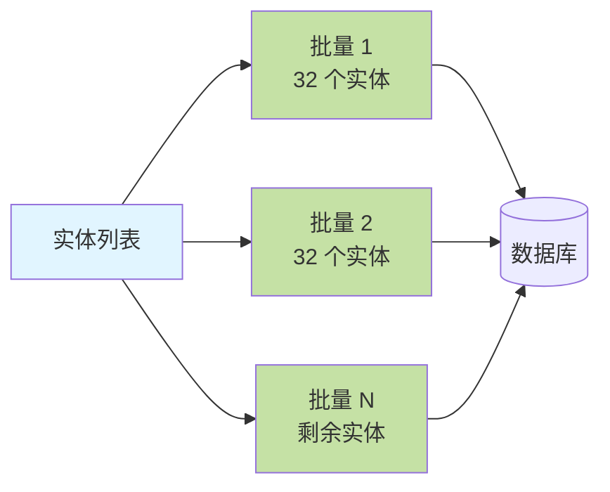

**性能对比**：

| 方式 | 100 个实体写入时间 |
|------|------------------|
| **逐个写入** | ~10 秒 |
| **批量写入（32 个/批）** | ~1 秒 |

**优化效果**：10 倍速度提升！

### 6.4 内存优化

大文档处理需要注意内存占用。

**内存管理策略**：

1. **流式分块**
   ```python
   # 不要一次性加载整个文档到内存
   for chunk in stream_chunks(document):
       process(chunk)
   ```

2. **及时释放**
   ```python
   # 处理完一个分量后，立即释放内存
   del component_data
   gc.collect()
   ```

3. **分批处理**
   ```python
   # 把大批量分成小批量
   for batch in chunks(entities, batch_size=32):
       process_batch(batch)
   ```

**内存使用估算**：

```
处理 1 万个实体的文档：
- Chunk 数据：~50 MB
- 提取结果：~100 MB
- 图谱数据：~200 MB
- 峰值内存：~400 MB
```

### 6.5 性能监控

系统会输出详细的性能统计，帮助你了解瓶颈。

**监控指标**：

```
图索引构建完成：
✓ 文档分块：10 个 chunks，耗时 0.5 秒
✓ 实体提取：120 个实体，耗时 25 秒
✓ 关系提取：85 个关系，耗时 25 秒（并发）
✓ 连通分量：发现 8 个分量，耗时 0.2 秒
✓ 并发合并：耗时 15 秒
✓ 存储写入：耗时 2 秒
━━━━━━━━━━━━━━━━━━━━━━━━━
总耗时：42.7 秒
```

**性能分析**：

- **瓶颈**：实体/关系提取（占 60% 时间）
- **优化方向**：提高 LLM 并发度或使用更快的模型
- **效果**：如果 LLM 并发度从 20 提到 50，可以降到约 28 秒

## 7. 配置参数

### 7.1 核心配置

图索引构建可以通过以下参数进行调优：

**分块参数**：

```python
# 分块大小（tokens）
CHUNK_TOKEN_SIZE = 1200

# 重叠大小（tokens）
CHUNK_OVERLAP_TOKEN_SIZE = 100
```

**调优建议**：
- 小文档（< 5000 tokens）：`CHUNK_TOKEN_SIZE = 800`
- 大文档（> 50000 tokens）：`CHUNK_TOKEN_SIZE = 1500`
- 需要更多上下文：增加 `CHUNK_OVERLAP_TOKEN_SIZE`

**并发参数**：

```python
# LLM 并发调用数
LLM_MODEL_MAX_ASYNC = 20

# Embedding 并发调用数
EMBEDDING_FUNC_MAX_ASYNC = 16

# 批量处理大小
MAX_BATCH_SIZE = 32
```

**调优建议**：
- LLM API 限流严格：降低 `LLM_MODEL_MAX_ASYNC` 到 5-10
- 性能充足想提速：提高到 50-100
- 内存有限：降低 `MAX_BATCH_SIZE` 到 16

**实体提取参数**：

```python
# 实体提取重试次数（0 = 只提取 1 次）
ENTITY_EXTRACT_MAX_GLEANING = 0

# 摘要最大 token 数
SUMMARY_TO_MAX_TOKENS = 2000

# 强制摘要的描述片段数
FORCE_LLM_SUMMARY_ON_MERGE = 10
```

**调优建议**：
- 提取质量重要：`ENTITY_EXTRACT_MAX_GLEANING = 1`（多提取一次）
- 追求速度：`ENTITY_EXTRACT_MAX_GLEANING = 0`
- 描述经常很长：降低 `SUMMARY_TO_MAX_TOKENS` 到 1000

### 7.2 知识图谱配置

在 Collection 配置中可以设置：

```json
{
  "knowledge_graph_config": {
    "language": "simplified chinese",
    "entity_types": [
      "organization",
      "person",
      "geo",
      "event",
      "product",
      "technology",
      "date",
      "category"
    ]
  }
}
```

**参数说明**：

- **language**：提取语言，影响 LLM 提示词
  - `simplified chinese`：简体中文
  - `English`：英文
  - `traditional chinese`：繁体中文

- **entity_types**：要提取的实体类型
  - 默认：8 种类型（组织、人物、地点、事件、产品、技术、日期、类别）
  - 可自定义：比如只提取人物和组织

### 7.3 存储配置

通过环境变量配置存储后端：

```bash
# KV 存储（键值对）
export GRAPH_INDEX_KV_STORAGE=PGOpsSyncKVStorage

# 向量存储
export GRAPH_INDEX_VECTOR_STORAGE=PGOpsSyncVectorStorage

# 图存储
export GRAPH_INDEX_GRAPH_STORAGE=Neo4JSyncStorage
# 或者使用 PostgreSQL
export GRAPH_INDEX_GRAPH_STORAGE=PGOpsSyncGraphStorage
```

**存储选择建议**：

| 场景 | KV 存储 | 向量存储 | 图存储 |
|------|---------|---------|--------|
| **默认** | PostgreSQL | PostgreSQL | PostgreSQL |
| **高性能向量搜索** | PostgreSQL | Qdrant | Neo4j |
| **大规模图谱** | PostgreSQL | Qdrant | Neo4j |
| **简单部署** | PostgreSQL | PostgreSQL | PostgreSQL |

### 7.4 完整配置示例

```bash
# 分块配置
export CHUNK_TOKEN_SIZE=1200
export CHUNK_OVERLAP_TOKEN_SIZE=100

# 并发配置
export LLM_MODEL_MAX_ASYNC=20
export MAX_BATCH_SIZE=32

# 提取配置
export ENTITY_EXTRACT_MAX_GLEANING=0
export SUMMARY_TO_MAX_TOKENS=2000

# 存储配置
export GRAPH_INDEX_KV_STORAGE=PGOpsSyncKVStorage
export GRAPH_INDEX_VECTOR_STORAGE=PGOpsSyncVectorStorage
export GRAPH_INDEX_GRAPH_STORAGE=PGOpsSyncGraphStorage

# 数据库连接（PostgreSQL）
export POSTGRES_HOST=127.0.0.1
export POSTGRES_PORT=5432
export POSTGRES_DB=aperag
export POSTGRES_USER=postgres
export POSTGRES_PASSWORD=your_password

# 数据库连接（Neo4j，可选）
export NEO4J_HOST=127.0.0.1
export NEO4J_PORT=7687
export NEO4J_USERNAME=neo4j
export NEO4J_PASSWORD=your_password
```

## 8. 实际应用场景

图索引特别适合以下场景：

### 8.1 企业知识库

**场景描述**：公司有大量的技术文档、组织架构、项目资料。

**图索引的价值**：

- ✅ 理解人员关系：谁和谁在一起工作过
- ✅ 追溯项目历史：哪些人参与了哪些项目
- ✅ 技术栈分析：哪个团队用什么技术
- ✅ 知识传承：某个领域的专家是谁

**查询示例**：

```
用户："张三参与过哪些项目？"
图索引：查询 张三 --参与--> 项目 的关系
结果：项目 A、项目 B、项目 C

用户："数据库团队都有哪些人？"
图索引：查询 人物 --属于--> 数据库团队 的关系
结果：张三、李四、王五
```

### 8.2 研究论文分析

**场景描述**：分析大量学术论文，理解研究脉络。

**图索引的价值**：

- ✅ 作者合作网络：谁和谁合作过
- ✅ 引用关系：哪些论文互相引用
- ✅ 研究主题：某个领域的核心概念
- ✅ 技术演进：技术如何发展的

**查询示例**：

```
用户："Graph RAG 相关的研究有哪些？"
图索引：查询 论文 --研究--> Graph RAG 的关系
结果：论文 A、论文 B、论文 C

用户："某作者和谁合作过？"
图索引：查询 作者 --合作--> 其他作者 的关系
结果：合作者列表及合作项目
```

### 8.3 产品文档

**场景描述**：软件产品的用户手册、API 文档。

**图索引的价值**：

- ✅ 功能依赖：某个功能依赖哪些其他功能
- ✅ API 关联：哪些 API 经常一起使用
- ✅ 配置关系：某个配置项影响哪些功能
- ✅ 问题诊断：出现某个错误可能是什么原因

**查询示例**：

```
用户："如何配置图索引？"
图索引：查询 配置项 --影响--> 图索引 的关系
结果：GRAPH_INDEX_GRAPH_STORAGE、knowledge_graph_config

用户："Neo4j 和 PostgreSQL 有什么区别？"
图索引：查询 Neo4j、PostgreSQL 的属性和关系
结果：性能对比、适用场景、配置方式
```

### 8.4 对话场景对比

让我们看看不同检索方式在实际对话中的表现：

**问题："张三和李四是什么关系？"**

| 检索方式 | 能否回答 | 回答质量 |
|---------|---------|---------|
| **纯向量检索** | ⚠️ 部分 | 找到提到两人的段落，但不清楚关系 |
| **纯全文检索** | ⚠️ 部分 | 找到包含"张三"和"李四"的段落 |
| **图索引** | ✅ 可以 | 直接返回：张三和李四是协作关系 |

**问题："PostgreSQL 配置文件在哪？"**

| 检索方式 | 能否回答 | 回答质量 |
|---------|---------|---------|
| **纯向量检索** | ✅ 可以 | 找到相关配置段落 |
| **纯全文检索** | ✅ 可以 | 精确匹配"PostgreSQL"和"配置" |
| **图索引** | ✅ 可以 | 找到 PostgreSQL --配置--> 文件 的关系 |

**问题："如何提升系统性能？"**

| 检索方式 | 能否回答 | 回答质量 |
|---------|---------|---------|
| **纯向量检索** | ✅ 强 | 找到所有性能优化相关内容 |
| **纯全文检索** | ⚠️ 中 | 需要精确关键词"性能"、"优化" |
| **图索引** | ✅ 强 | 找到 优化方法 --提升--> 性能 的关系 |

**最佳实践**：结合使用多种检索方式！

## 9. 总结

ApeRAG 的图索引提供了生产级的知识图谱构建能力，具有高性能、高可靠性和易扩展的特点。

### 关键特性

1. **workspace 数据隔离**：每个 Collection 完全独立，支持真正的多租户
2. **无状态架构**：每个任务独立实例，零状态污染
3. **连通分量并发**：智能并发策略，性能提升 2-3 倍
4. **细粒度锁管理**：实体级别的锁，最大化并发度
5. **智能摘要**：自动压缩过长描述，节省存储和提升检索效率
6. **多存储支持**：灵活选择 Neo4j 或 PostgreSQL

### 适用场景

- ✅ **企业知识库**：理解组织结构、人员关系、项目历史
- ✅ **研究论文分析**：作者合作网络、引用关系、研究脉络
- ✅ **产品文档**：功能依赖、配置关系、问题诊断
- ✅ **任何需要理解"关系"的场景**

### 性能表现

- 处理 10,000 个实体：约 2-5 分钟（取决于 LLM 速度）
- 连通分量并发：性能提升 2-3 倍
- 内存占用：约 400 MB（10,000 个实体）
- 存储空间：约 100 MB（10,000 个实体）

### 下一步

图索引构建完成后，就可以进行图谱检索了。ApeRAG 支持三种图谱查询模式：

- **Local 模式**：查询某个实体的局部信息
- **Global 模式**：查询整体关系和模式
- **Hybrid 模式**：综合性查询

详细的检索流程请参考 [系统架构文档](./architecture.md#42-知识图谱查询)。

---

## 相关文档

- 📋 [系统架构](./architecture.md) - ApeRAG 整体架构设计
- 📖 [实体提取与合并机制](./lightrag_entity_extraction_and_merging.md) - 核心算法详解
- 🔗 [连通分量优化](./connected_components_optimization.md) - 并发优化原理
- 🌐 [索引链路架构](./indexing_architecture.md) - 完整索引流程
