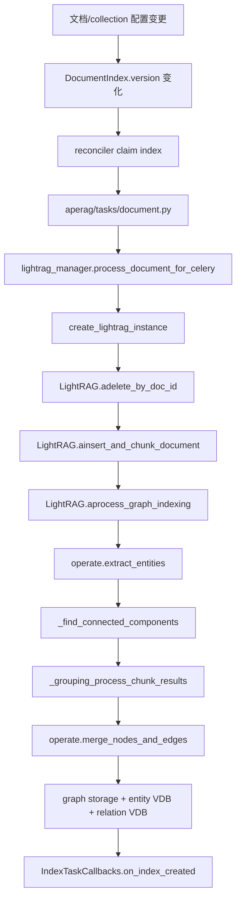

# Graph 归一化与合并全链路分析

> 本文档基于当前仓库 `main` 附近状态梳理，分析基线为 `c389f5cf`。  
> 同时把最近几轮已经合入的修复也当成当前事实的一部分：
> - `#1519`：PG `chunk_ids` overlap 查询修复
> - `#1523`：LightRAG query contract 收紧
> - `#1525`：chunk identity + delete contract 收紧
> - `#1528`：`varchar[] && text[]` follow-up cast 修复
> - `#1531`：orchestration contract tests

## 1. 先给结论

当前 Graph/LightRAG 这条线已经从“明显 correctness 漏洞很多”的状态，推进到了“核心 contract 初步被测住”的状态，但整体架构仍然有 4 个根问题没有解决：

1. **写路径不是事务性链路，而是多存储、多阶段的 best-effort orchestration**
   - `chunk`、`vector`、`graph` 三层写入和删除没有统一事务边界。
   - 一旦在中途失败，当前实现只能靠后续重跑或人工修复收敛。

2. **归一化与 merge 语义散落在多个层次，核心 contract 依然过度依赖隐式约定**
   - `entity_name` 归一化、`source_id/chunk_ids` 追踪、图节点/边合并、手工 merge、删除引用扣减，都在不同文件里各自维护。
   - 数据形态本身也不统一：有的地方用 `chunk_ids: list[str]`，有的地方用 `source_id: str` 加分隔符拼接。

3. **文件/类职责边界不清，存在明显的 god file 与平行实现**
   - `aperag/graph/lightrag/lightrag.py` 既是 facade，又承担 chunking、indexing、query、delete、merge suggestion、manual merge。
   - `aperag/graph/lightrag/operate.py` 同时承担 extraction、merge/upsert、query context、merge suggestion。
   - `aperag/graph/lightrag/utils_graph.py` 中还保留了一套看起来已经不再被主线调用的 edit/merge 实现，存在漂移风险。

4. **数据库/图存储层已经有一批明确的性能风险点**
   - `source_id` 的分隔符拼接 + `LIKE/CONTAINS` 检索，是当前删除路径和部分查询路径最脆弱的地方。
   - PG / Neo4j / Nebula 三套 backend 的能力并不对齐，导致上层逻辑在不同后端下性能和行为并不对等。

一句话概括当前状态：

- **当前代码已经可用，但仍然是“contract 刚开始被补齐、架构还没收平、性能热点还没系统治理”的阶段。**

## 2. 文档范围

本文档只分析当前实现，不混整改 patch。本次范围覆盖 5 条线：

1. **Graph 写路径**
   - 文档状态变更
   - reconciler / task 调度
   - LightRAG 文档处理、chunking、entity/relation extraction
   - 归一化、connected components 分组、merge、graph/vector/text 写入

2. **Graph 删除/更新路径**
   - `adelete_by_doc_id`
   - update 时的 delete + rebuild 语义

3. **Graph 读路径**
   - 图谱读取
   - query context 构建
   - merge suggestion 读取与生成

4. **人工 merge / suggestion action 路径**
   - `GraphService.merge_nodes`
   - `handle_suggestion_action`
   - `LightRAG.amerge_nodes`

5. **DB / storage / test 审计**
   - schema、index、query 形态
   - 后端差异
   - 现有单测覆盖与缺口

## 3. 代码地图

### 3.1 入口与调度层

| 角色 | 主要文件 | 说明 |
| --- | --- | --- |
| 索引入口抽象 | `aperag/index/graph_index.py` | GraphIndexer 抽象入口，但不是真正执行者 |
| 文档任务执行 | `aperag/tasks/document.py` | 真正调用 `process_document_for_celery` / `delete_document_for_celery` |
| reconciler | `aperag/tasks/reconciler.py` | 通过 `DocumentIndex` 的 `version / observed_version / lease` 推进实际任务 |
| 文档索引模型 | `aperag/db/models.py` 中 `DocumentIndex` | Graph 写路径的上位状态机 |

### 3.2 Graph 主逻辑层

| 角色 | 主要文件 | 说明 |
| --- | --- | --- |
| LightRAG 实例构造 | `aperag/graph/lightrag_manager.py` | 每次处理新建 `LightRAG` 实例，并注入 backend / embed / llm |
| LightRAG facade | `aperag/graph/lightrag/lightrag.py` | chunking、indexing、query、delete、merge suggestions、manual merge |
| extraction/query/suggestion 细节 | `aperag/graph/lightrag/operate.py` | 实体提取、关系提取、merge/upsert、query context、merge suggestion 分析 |
| 旧的图编辑/合并工具 | `aperag/graph/lightrag/utils_graph.py` | 包含 `aedit_entity`、`amerge_entities`，当前主线未直接调用 |

### 3.3 服务/API 层

| 角色 | 主要文件 | 说明 |
| --- | --- | --- |
| 图服务 | `aperag/service/graph_service.py` | graph read path、merge suggestion cache、manual merge、export |
| graph API | `aperag/views/graph.py` | merge nodes、merge suggestions、suggestion action、KG export |
| collections 图读取 API | `aperag/views/collections.py` | 获取 labels、图谱数据 |

### 3.4 存储层

| 层 | 主要文件 | 说明 |
| --- | --- | --- |
| PG graph repo | `aperag/db/repositories/graph.py` | PG graph 节点/边读写、batch query、degree 计算 |
| PG vector repo | `aperag/db/repositories/lightrag.py` | doc chunks / entity VDB / relation VDB |
| PG graph storage | `aperag/graph/lightrag/kg/pg_ops_sync_graph_storage.py` | Graph storage facade |
| PG vector storage | `aperag/graph/lightrag/kg/pg_ops_sync_vector_storage.py` | Vector storage facade |
| Neo4j backend | `aperag/graph/lightrag/kg/neo4j_sync_impl.py` | Neo4j graph backend |
| Nebula backend | `aperag/graph/lightrag/kg/nebula_sync_impl.py` | Nebula graph backend |

## 4. 全链路主流程

## 4.1 写路径总览



这里最重要的一点是：

- **当前 graph update 不是增量更新，而是 delete + rebuild。**

也就是 `lightrag_manager._process_document_async()` 在写新图之前，先执行：

- `await rag.adelete_by_doc_id(doc_id)`

然后才会：

- `ainsert_and_chunk_document()`
- `aprocess_graph_indexing()`

这意味着：

1. 这条链路的真实语义是“按文档重建 graph 状态”，不是“对旧 graph 做精细增量 patch”。
2. 一旦 delete 之后、rebuild 之前失败，当前文档的 graph 数据会出现空窗或不一致窗口。

## 4.2 调度层真实语义

### `GraphIndexer` 不是实际执行者

`aperag/index/graph_index.py` 的命名容易让人误解，以为 graph index 由它真正执行。但当前实际执行链路里：

- `GraphIndexer.create_index_async()` 只返回 “task scheduled”
- 真正做事的是 `aperag/tasks/document.py`
- 再往下才是 `process_document_for_celery()`

这形成了一个明显的接口设计问题：

- **抽象入口的语义与真实执行路径不一致。**

从维护角度看，这会带来两个问题：

1. 新人读 `GraphIndexer` 会误判真实调用链。
2. 后续如果要重构 reconciliation / task 调度，很容易出现“改了入口类，但没改真实 worker”的错觉。

## 4.3 LightRAG 实例构造

`aperag/graph/lightrag_manager.py:create_lightrag_instance()` 每次都会：

1. 根据 collection 配置解析 graph enablement / language / entity_types
2. 动态生成 embedding function
3. 动态生成 llm function
4. 根据环境变量注入 `kv_storage / vector_storage / graph_storage`
5. 新建一个全新的 `LightRAG` 实例
6. 初始化 storages

这条设计的优点是：

- 避免全局状态污染
- 对 Celery / 进程隔离友好

但代价也很明显：

- 每次处理都要完整走一遍实例构造和 storage 初始化
- configuration assembly 与 runtime orchestration 强耦合在同一个 manager 里

## 4.4 文档分块与 chunk identity

文档 chunking 发生在 `LightRAG.ainsert_and_chunk_document()`：

1. 调用 `chunking_func`
2. 为每个 chunk 生成 `chunk_id`
3. 同时写入 `chunks_vdb` 与 `text_chunks`

当前关键语义：

- chunk id 现在通过 `_compute_chunk_instance_id(doc_id, chunk_data, fallback_index, workspace)` 生成
- 其 identity 是：
  - `doc_id + chunk_order_index + content`

这意味着最近已经收掉了一个很关键的 correctness 问题：

- **不同文档里相同 chunk 文本，不再共享同一个 chunk id。**

这是当前图删除/更新路径能成立的前提之一。

chunk 数据当前主形态：

```python
{
  chunk_id: {
    "tokens": ...,
    "content": ...,
    "chunk_order_index": ...,
    "full_doc_id": doc_id,
    "file_path": file_path,
  }
}
```

## 4.5 归一化发生在哪里

当前归一化的核心落点不在 merge 阶段，而在 extraction 阶段：

- `operate._handle_single_entity_extraction()`
- `operate._handle_single_relationship_extraction()`
- 实际归一化函数：`aperag/graph/lightrag/utils.py:normalize_extracted_info`

### 当前实体归一化语义

对实体名，当前已经明确做了这些处理：

1. 中英文括号、破折号等符号归一化
2. 中英文之间多余空格移除
3. 外层英文引号、中文引号处理
4. 对纯英文 entity 做 title case 规范化
5. 关系抽取时对 `src/tgt` 也会走 entity normalization
6. 关系中 `src == tgt` 会直接丢弃自环

现有单测主要覆盖：

- `tests/unit_test/graphindex/test_normalize_extracted_info.py`
- `tests/unit_test/graphindex/test_normalize_simple.py`
- `tests/unit_test/graphindex/test_case_normalization.py`

### 这一层的重要事实

- **归一化不是一个独立 pipeline，而是 extraction 中的隐式步骤。**
- 后面的 graph merge、manual merge、delete、query 都默认“输入已经被归一化过”。

这也是一个设计隐患：

- 如果后续从别的入口绕开 extraction 直接写 graph，这些归一化 contract 很容易失效。

## 4.6 entity / relation 提取

实体和关系抽取在 `operate.extract_entities()` 中完成。

当前语义是：

1. 对每个 chunk 并发调用 LLM
2. 支持初次提取 + gleaning 追补
3. 对单 chunk 结果返回：
   - `maybe_nodes: dict[entity_name, list[entity_payload]]`
   - `maybe_edges: dict[(src, tgt), list[edge_payload]]`
4. 整体结果返回：
   - `list[(maybe_nodes, maybe_edges)]`

这批 contract 最近已经被 `tests/unit_test/graphindex/test_lightrag_orchestration_contract.py` 补了一轮 orchestration 覆盖，至少把这些语义钉住了：

1. `extract_entities()` 失败时不吞异常
2. `FIRST_EXCEPTION` 后会取消 pending task
3. `aprocess_graph_indexing()` 输入校验与异常传播稳定

## 4.7 connected components 分组

`LightRAG._find_connected_components()` 会先根据 extraction 出来的 nodes/edges 构造邻接表，再按 BFS 找连通分量。

当前设计意图是：

- 把互相独立的实体群拆开
- 后续每个 component 分开 merge/upsert

这条线最近也通过 `#1531` 的 tests 被测住了，包括：

1. zero-count 结果
2. component filtering 不串组
3. first-exception cancel pending
4. 当前串行语义

但这里有一个很重要的事实：

- `_grouping_process_chunk_results()` 虽然把 component 拆成多个 task，
- **最终却用了 `asyncio.Semaphore(1)`，因此当前是串行处理 component。**

所以当前状态是：

- **设计上看起来像“可并行分组处理”，真实语义仍然是“单并发串行推进”。**

这个差异必须显式写进文档，否则后续很容易有人以为这里已经并行了。

## 4.8 merge 与 upsert

真正的 entity / relation 聚合发生在 `operate.merge_nodes_and_edges()`。

### 节点合并

`_merge_nodes_then_upsert()` 的现有语义：

1. 先取已存在节点
2. 把已有描述、source_id、file_path 和新数据合并
3. `entity_type` 通过多数派决定
4. `description` 去重后用 `GRAPH_FIELD_SEP` 拼接
5. 超过阈值时可触发 LLM summary
6. 最终 upsert 回 graph

### 边合并

`_merge_edges_then_upsert()` 的现有语义：

1. `(src, tgt)` 相同关系会聚合
2. `weight` 做求和
3. `keywords` 做去重
4. `description/source_id/file_path` 做聚合
5. 必要时补 UNKNOWN node
6. 最终 upsert 回 graph，再写 relation VDB

### 写入形态

这一层会同时维护三类存储：

1. graph storage
   - 节点：`lightrag_graph_nodes` 或图数据库节点
   - 边：`lightrag_graph_edges` 或图数据库边

2. entity vector storage
   - `entity_name + description` 为主的 embedding
   - 额外保留 `chunk_ids` 或等价来源信息

3. relation vector storage
   - `src/tgt/keywords/description` 的 embedding
   - 同样保留 `chunk_ids` 或等价来源信息

## 4.9 删除与 update 语义

`LightRAG.adelete_by_doc_id()` 是当前最关键的一条 contract-heavy 代码。

它当前做的是两层引用扣减：

1. **Vector 层**
   - 依据 `chunk_ids: list[str]` 做差集
   - shared refs -> update
   - exclusive refs -> delete

2. **Graph 层**
   - 依据 `source_id: str` 拆分为 chunk token 集合
   - shared refs -> 更新 `source_id`
   - exclusive refs -> delete node/edge

然后最后再删：

- `chunks_vdb`
- `text_chunks`

最近合入的 `#1525` 和相关测试，已经把这条 delete contract 测得比较明确：

1. shared refs 走 update / 扣减
2. exclusive refs 才 delete
3. 不同文档相同 chunk 内容不会再互相覆盖

但它仍然有一个本质问题：

- **这是跨多存储、多阶段、非原子性的补偿式删除，不是事务性删除。**

## 4.10 读路径

当前 graph read path 大致分三类。

### A. 图谱浏览

主链路：

- `views/collections.py` / `views/graph.py`
- `GraphService.get_knowledge_graph()`
- `LightRAG.get_knowledge_graph()`
- backend storage 的 `get_knowledge_graph()`

需要明确一个重要现状：

- **PG backend 的 `get_knowledge_graph()` 明确写着是 simplified implementation。**
- `max_depth` 在 PG 下并不代表真正的多跳遍历能力。

也就是说：

- API 暴露了 `max_depth`
- 但至少在 PG backend 上，这个参数语义并不完整

这属于比较典型的“接口看起来比实现强”的问题。

### B. query context 构建

主链路：

- `LightRAG.aquery_context()`
- `operate.build_query_context()`
- `_get_node_data()` / `_get_edge_data()` / `_get_vector_context()`

最近 `#1523` 已经把 query contract 收紧了一轮，当前已明确：

1. helper 层统一返回稳定三元组 `(entities, relations, text_units)`
2. 空关键词返回空三元组
3. `mix` 模式允许 vector-only text hits
4. `aquery_context()` 不再复用默认 `QueryParam()`

但这里仍然有一个设计味道不好的点：

- `build_query_context()` 会直接修改 `query_param.mode`
- 也就是 fallback 逻辑会带状态副作用

这虽然当前已被测试固定住，但并不是一个很干净的接口设计。

### C. merge suggestions

主链路：

- `GraphService.get_or_generate_merge_suggestions()`
- `GraphService.generate_merge_suggestions()`
- `LightRAG.agenerate_merge_suggestions()`
- `operate.get_high_degree_nodes()`
- `filter_and_group_entities()`
- `analyze_entities_with_llm()`
- `filter_and_deduplicate_suggestions()`

这里的现有设计特点：

1. 只分析高 degree 节点，做 bounded candidate selection
2. service 层还负责 active/history suggestion cache
3. action 层在 accept/reject 时还会把 active suggestion 移动到 history

## 4.11 人工 merge 路径

主链路：

- `GraphService.merge_nodes()`
- `GraphService._execute_merge_operation()`
- `LightRAG.amerge_nodes()`

这条线的当前语义：

1. 支持 auto-select target entity（按最高 degree）
2. 合并节点属性
3. 重写所有相关边
4. 重建 entity / relation VDB
5. 删除 source entities

但这里有个很重要的维护性问题：

- `aperag/graph/lightrag/utils_graph.py` 里还保留着另一套 `aedit_entity()` / `amerge_entities()` 实现
- 当前主线 API 走的是 `LightRAG.amerge_nodes()`
- `utils_graph.py` 这套逻辑看起来已经不在主执行线上

这意味着：

- **当前仓库里存在两套 graph edit/merge 逻辑。**

即使其中一套暂时不用，它仍然是明显的漂移风险与阅读噪音来源。

## 5. 当前数据模型与关键 contract

## 5.1 主要表

### chunks

- `lightrag_doc_chunks`
- 主字段：
  - `workspace`
  - `id`
  - `full_doc_id`
  - `chunk_order_index`
  - `content`
  - `content_vector`
  - `file_path`

### entity VDB

- `lightrag_vdb_entity`
- 主字段：
  - `workspace`
  - `id`
  - `entity_name`
  - `content`
  - `content_vector`
  - `chunk_ids ARRAY(String)`
  - `file_path`

### relation VDB

- `lightrag_vdb_relation`
- 主字段：
  - `workspace`
  - `id`
  - `source_id`
  - `target_id`
  - `content`
  - `content_vector`
  - `chunk_ids ARRAY(String)`
  - `file_path`

### graph nodes / edges

- `lightrag_graph_nodes`
- `lightrag_graph_edges`

graph 层当前依然把来源信息存成：

- `source_id: Text`

也就是：

- 不是数组
- 不是关联表
- 而是 `GRAPH_FIELD_SEP` 拼接字符串

这是当前最值得明确记住的技术债之一。

## 5.2 当前最重要的 contract

### Contract A: chunk identity

- 同一文档、同一 chunk 实例，chunk id 稳定
- 不同文档，即使 chunk 文本相同，也不共享 chunk id

### Contract B: delete semantics

- shared refs -> update
- exclusive refs -> delete

### Contract C: query helper return shape

- helper 一律返回稳定三元组
- fail-response 不在 helper 内混字符串

### Contract D: orchestration semantics

- `_grouping_process_chunk_results()` 当前串行，不是假定并行
- `FIRST_EXCEPTION` 时 pending 会取消

## 6. 问题审计

## 6.1 P0 correctness / contract 风险

### P0-1. update 实际是 delete + rebuild，失败时存在数据空窗

**位置**

- `aperag/graph/lightrag_manager.py:_process_document_async`

**现状**

- 每次写 graph 前先 `adelete_by_doc_id(doc_id)`
- 然后重新 chunk + extract + merge + upsert

**风险**

- delete 成功、后续 rebuild 失败时，当前文档 graph 状态会被清空或部分清空
- 因为没有统一事务，worker 失败时只能靠重试/重建收敛

**判断**

- 这是当前最实质的 correctness 风险之一
- 不是单测能完全解决的问题，属于架构级语义问题

### P0-2. 跨多存储写入/删除没有统一事务边界

**位置**

- `LightRAG.ainsert_and_chunk_document`
- `LightRAG.aprocess_graph_indexing`
- `LightRAG.adelete_by_doc_id`
- `LightRAG.amerge_nodes`

**现状**

- chunk text store
- chunk vector store
- entity vector store
- relation vector store
- graph store

这些操作分多步执行，任何一步异常都可能留下部分提交状态。

**风险**

- graph 有数据、vector 没更新
- vector 已删除、graph 还残留
- source refs 已改写但 chunk 未删干净

### P0-3. `source_id` 的字符串 contract 太脆弱

**位置**

- `operate._merge_nodes_then_upsert`
- `operate._merge_edges_then_upsert`
- `LightRAG.adelete_by_doc_id`
- `GraphRepositoryMixin._build_source_id_overlap_clause`
- `Neo4JSyncStorage.get_nodes_by_source_ids/get_edges_by_source_ids`
- `NebulaSyncStorage.get_nodes_by_source_ids/get_edges_by_source_ids`

**现状**

- graph 层把多个 chunk 来源编码成 `GRAPH_FIELD_SEP` 拼接字符串
- 删除/查询时再 split / join / like / contains

**风险**

- contract 极度依赖分隔符和字符串处理一致性
- 很难做数据库级约束与索引优化
- 很容易在不同 backend 上漂出不同语义或边界 bug

### P0-4. `get_knowledge_graph(max_depth)` 暴露的接口能力强于 PG 实现

**位置**

- `aperag/graph/lightrag/kg/pg_ops_sync_graph_storage.py:get_knowledge_graph`

**现状**

- 函数注释明确写了 simplified implementation
- 只支持非常有限的 immediate connections 近邻拼装

**风险**

- API 暴露 `max_depth`
- 调用方会自然认为这是可依赖的多跳遍历能力
- 实际上在 PG backend 下并不是

**判断**

- 这是接口设计问题，不是单纯性能问题

### P0-5. `get_graph_labels()` 名称与返回值语义不一致

**位置**

- `LightRAG.get_graph_labels()`
- `PGOpsSyncGraphStorage.get_all_labels()`

**现状**

- `get_graph_labels()` 实际返回的是 entity id / entity name 风格列表
- 不是严格意义上的 label / type 集合

**风险**

- UI 或调用方若把它理解成“实体类型列表”，会产生错误心智

### P0-6. 仍然存在两套 edit/merge 代码

**位置**

- 主线：`LightRAG.amerge_nodes()`
- 平行实现：`aperag/graph/lightrag/utils_graph.py`

**现状**

- `utils_graph.py` 中保留 `aedit_entity()`、`amerge_entities()`
- 但主 API 走的不是这条线

**风险**

- 后续修一套漏一套
- 新人误读
- review 时很难一眼判断哪条是 canonical implementation

## 6.2 P1 数据库 / 性能风险

### P1-1. `lightrag_doc_chunks` 缺少 `(workspace, full_doc_id)` 索引

**位置**

- `aperag/db/models.py:LightRAGDocChunksModel`

**现状**

- 表主键是 `(id, workspace)`
- 但删除路径和按文档重建路径很依赖：
  - `get_by_doc_id(full_doc_id)`

**风险**

- 文档数量上涨后，按 doc 查 chunk 成本会上升
- update/delete 会越来越慢

### P1-2. `chunk_ids` 数组查询没有显式 GIN 索引

**位置**

- `LightRAGVDBEntityModel.chunk_ids`
- `LightRAGVDBRelationModel.chunk_ids`

**现状**

- 最近已经修成 `&& CAST(ARRAY[...] AS VARCHAR[])`
- 但 schema 上没看到针对 `chunk_ids` 的显式 GIN 索引

**风险**

- 文档删除、graph 重建、shared ref 扣减场景下，overlap query 会越来越贵

### P1-3. graph 层删除依赖 `source_id` 文本扫描

**位置**

- `GraphRepositoryMixin.get_graph_nodes_by_source_ids`
- `GraphRepositoryMixin.get_graph_edges_by_source_ids`

**现状**

- PG 里通过 `LIKE` / `OR` 检查 `source_id` 是否包含某个 chunk token
- Neo4j 里通过 `split(... ) any(...)`
- Nebula 里先 `CONTAINS`，再回到 Python 做 `_source_ids_overlap`

**风险**

- 这条路径既难索引，又容易随 chunk 数量膨胀
- backend 间性能差异会越来越大

### P1-4. `get_graph_edges_batch` / `delete_graph_edges_batch` 用大 OR 拼条件

**位置**

- `aperag/db/repositories/graph.py`

**现状**

- 对每个 `(src, tgt)` 都拼一个 `OR`

**风险**

- pair 数量大时 SQL 体积和 planner 成本都会迅速上升
- 更适合改成 `VALUES JOIN` 或 row-wise comparison

### P1-5. 单节点 degree 查询是两条 count SQL

**位置**

- `GraphRepositoryMixin.get_graph_node_degree`

**现状**

- outgoing 一次 count
- incoming 一次 count

**风险**

- 单条调用问题不大
- 一旦被上层热路径频繁调用，会有明显浪费

### P1-6. Nebula backend 在高阶节点分析上缺少与 PG/Neo4j 对齐的优化入口

**位置**

- `operate.get_high_degree_nodes`
- `NebulaSyncStorage`

**现状**

- PG 和 Neo4j 都有 `get_top_degree_nodes`
- Nebula 没有
- 所以上层会退化成：
  - `get_all_labels`
  - `node_degrees_batch`
  - 全量或大批量筛 top degree

**风险**

- merge suggestion 在 Nebula 下成本可能远高于 PG/Neo4j

### P1-7. `_find_most_related_text_unit_from_entities()` 拉 chunk 的方式过于保守

**位置**

- `operate._find_most_related_text_unit_from_entities`

**现状**

- 手工切成 `batch_size = 5`
- 每批 `gather`
- 整体串行推进

**风险**

- 在 chunk 较多时会过度拉长 query context 构建时间

### P1-8. `_find_related_text_unit_from_relationships()` 是无并发上限的 fan-out

**位置**

- `operate._find_related_text_unit_from_relationships`

**现状**

- 直接为每个 chunk id 创建 task 并 `asyncio.gather`

**风险**

- chunk fan-out 大时容易对 KV/backend 产生瞬时压力

### P1-9. `_find_connected_components()` 使用 `queue.pop(0)`

**位置**

- `LightRAG._find_connected_components`

**现状**

- BFS 队列是 Python list
- 用 `pop(0)` 做队头弹出

**风险**

- component 很大时会退化到不必要的 O(n^2) 行为

### P1-10. component 层是串行，merge 层又是细粒度并发，整体并发模型不直观

**位置**

- `LightRAG._grouping_process_chunk_results`
- `operate._merge_nodes_and_edges_impl`

**现状**

- component 层 semaphore=1
- component 内 entity / relation merge 又开并发

**风险**

- 对性能分析不友好
- 对调优也不友好
- 容易让人误判真正瓶颈

## 6.3 P2 可维护性 / 接口设计问题

### P2-1. `lightrag.py` 是典型 god file

它当前同时承担：

1. storage wiring
2. chunking
3. indexing orchestration
4. query context
5. delete by doc
6. merge suggestions
7. manual merge
8. export

建议后续最少拆成：

1. `document_ingestion`
2. `query_context`
3. `graph_maintenance`
4. `merge_suggestions`
5. `facade`

### P2-2. `operate.py` 也是 god file

它当前同时承担：

1. extraction
2. merge/upsert
3. query helper
4. merge suggestion analysis

这会导致：

- 文件阅读成本高
- contract 之间耦合过深
- 小改动也容易扫到无关逻辑

### P2-3. `GraphService` 混了过多职责

当前同一个 service 里混着：

1. graph read
2. merge suggestion cache
3. merge suggestion history
4. manual merge action
5. KG export

更合理的拆法应该至少分成：

1. `GraphReadService`
2. `GraphMergeSuggestionService`
3. `GraphMutationService`

### P2-4. `GraphIndexer` 的抽象位置不清

当前真实执行链路已经主要依赖：

- reconciler
- task worker
- `process_document_for_celery`

而 `GraphIndexer` 本身并不是真正执行者。

建议后续要么：

1. 把它收成真正的 scheduling abstraction
2. 要么承认它已经不是核心执行面，减少误导性抽象

### P2-5. `source_id` 与 `chunk_ids` 双表示导致心智复杂

当前同一件事有两种表达：

1. graph 层：`source_id: "chunk-a<SEP>chunk-b"`
2. vdb 层：`chunk_ids: ["chunk-a", "chunk-b"]`

这让很多逻辑都需要写两遍：

1. merge
2. delete
3. overlap query
4. update shared refs

这是当前整条线复杂度长期居高不下的根因之一。

## 7. 现有测试覆盖与缺口

## 7.1 已经补得比较值钱的覆盖

### 归一化

- `test_normalize_extracted_info.py`
- `test_normalize_simple.py`
- `test_case_normalization.py`

### query contract

- `test_lightrag_query_contract.py`

覆盖了：

1. 默认参数不串状态
2. helper 空结果稳定三元组
3. mix vector-only 语义
4. mode fallback

### delete / chunk identity

- `test_lightrag_chunk_identity_and_delete_contract.py`

覆盖了：

1. document-local chunk instance 语义
2. shared-update / exclusive-delete

### orchestration

- `test_lightrag_orchestration_contract.py`

覆盖了：

1. zero-count
2. serial semantics
3. first-exception cancellation
4. component filtering
5. `aprocess_graph_indexing` 输入校验与异常传播

### PG overlap 查询

- `test_lightrag_pg_chunk_overlap.py`

覆盖了：

1. `&& CAST(... AS VARCHAR[])`
2. entity / relation 两条路径

## 7.2 仍然缺的覆盖

### 缺口 1：写路径跨多存储的失败恢复

当前没有系统测试覆盖：

1. `chunks_vdb` 成功，`text_chunks` 失败
2. graph upsert 成功，relation VDB 失败
3. delete 途中失败后的残留状态

### 缺口 2：manual merge 主链路

当前没有看到足够系统的测试覆盖：

1. `LightRAG.amerge_nodes`
2. relation redirect
3. target auto-select by degree
4. graph / entity VDB / relation VDB 一致性

### 缺口 3：不同 backend 的一致性 contract

PG / Neo4j / Nebula 当前主要还是接口级兼容，不是语义级对齐测试。

### 缺口 4：读路径的大规模 fan-out 场景

当前没有针对这些热点的压力型/大输入 contract test：

1. 大量 `source_id`
2. 大量 `chunk_ids`
3. 大量 edge pairs
4. 大量 disconnected components

## 8. 建议的整改顺序

## 8.1 P0 correctness

### 建议 1：把“update = delete + rebuild”写成显式系统 contract

不是先改，而是先写清楚：

1. 当前就不是增量 patch
2. 失败时的恢复策略是什么
3. 哪些状态可以接受短时空窗，哪些不可以

### 建议 2：统一来源引用模型

优先级很高。目标不是马上重构全图，而是先收敛 contract：

1. graph 层也使用结构化来源集合
2. 不再长期依赖 `source_id` 分隔符字符串

### 建议 3：manual merge / delete / rebuild 至少补失败面测试

优先补：

1. delete 中途失败
2. merge 中途失败
3. rebuild 中 graph 已删、chunk 未重建

## 8.2 P1 性能/资源风险

### 建议 4：先补最值钱的 schema/index

优先考虑：

1. `lightrag_doc_chunks(workspace, full_doc_id)`
2. `lightrag_vdb_entity.chunk_ids` GIN
3. `lightrag_vdb_relation.chunk_ids` GIN

### 建议 5：替换掉大 OR / LIKE 的热点查询

优先顺序：

1. `get_graph_edges_batch`
2. `delete_graph_edges_batch`
3. `get_graph_nodes_by_source_ids`
4. `get_graph_edges_by_source_ids`

### 建议 6：把 text unit fan-out 逻辑收成一致的 bounded concurrency

不要再一边 batch_size=5 串行，一边无上限 gather。

## 8.3 P2 可维护性

### 建议 7：按已经冻结过的顺序做机械拆分

最稳的顺序仍然是：

1. 先拆 `query_context`
2. 再拆 `document_ingestion / graph_maintenance`
3. 最后再谈性能优化

### 建议 8：明确哪条 merge/edit 逻辑是 canonical

建议：

1. `LightRAG.amerge_nodes` 作为唯一主线
2. `utils_graph.py` 中平行实现要么删掉，要么明确退成 legacy/internal helper

### 建议 9：收平 API 命名

至少明确：

1. `get_graph_labels()` 到底返回 entity ids 还是 entity types
2. `get_knowledge_graph(max_depth)` 在不同 backend 下的真实能力
3. `GraphIndexer` 的抽象边界

## 9. 我对当前代码的总体判断

当前这套实现不是“完全乱”，它已经有了一条相对清楚的主执行线：

1. reconciler 驱动
2. per-document rebuild
3. extraction -> component grouping -> merge/upsert
4. query / merge suggestion / manual merge 三条读写面

但它也还远没到“设计收平”的阶段。更准确的判断是：

- **当前已经补出了第一层 contract correctness**
- **但还没把数据模型、事务边界、backend 一致性和文件职责真正收平**

如果只看最近几轮修复，方向是对的：

1. 先收 contract
2. 再补 focused tests
3. 再谈结构拆分

后续最怕的事情不是“继续慢一点”，而是：

- 在 `source_id/chunk_ids` 这类基础 contract 还没统一之前，直接做大规模模块重构或性能改造

那样大概率只是把同样的问题搬到新文件里。

## 10. 推荐的下一批 follow-up

如果只开一批最值钱的 follow-up，我建议按下面的顺序：

1. **数据模型/contract 设计文档 follow-up**
   - 先单独设计 `source_id/chunk_ids` 统一模型

2. **manual merge correctness tests**
   - 补 `amerge_nodes` 主链路

3. **schema/index 小批次优化**
   - `full_doc_id`
   - `chunk_ids` GIN

4. **query / delete 热点 SQL 改造**
   - 去掉大 OR / LIKE 热点

5. **机械拆分**
   - `query_context`
   - `document_ingestion`
   - `graph_maintenance`

在这之前，不建议直接开“Graph 大重构”。
