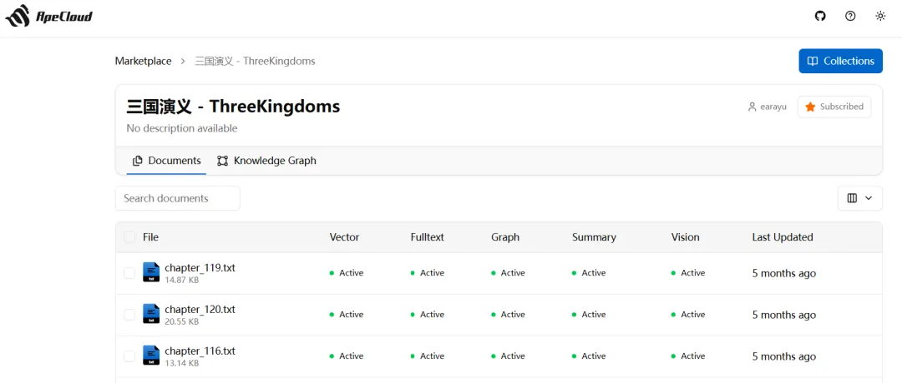
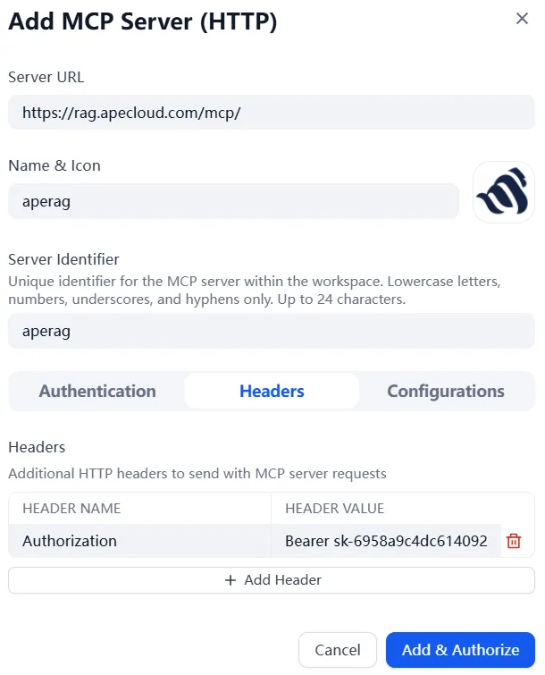
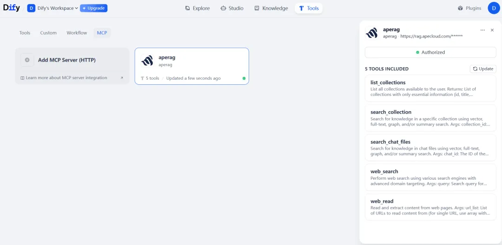
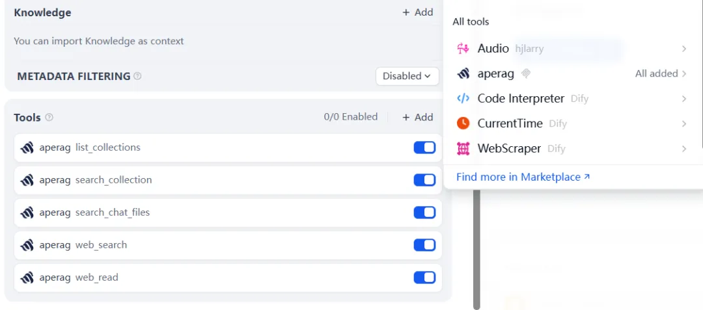

# Dify 集成 ApeRAG

## 简介

ApeRAG 是一款具备多模态索引、AI 智能体、MCP 支持及可扩展 K8s 部署能力的生产级 RAG（检索增强生成）平台。通过 MCP (Model Context Protocol) 协议，ApeRAG 可以无缝集成到 Dify 平台，为你的 AI 应用提供强大的知识检索能力。

### ApeRAG 的核心优势

**🔗 Graph RAG 能力**
- 不同于"标准" RAG，ApeRAG 实现了 Graph-RAG
- 不仅存储数据，还提取数据要素和它们之间的深层关系来**构建知识图谱**
- 在处理需要**关联多个知识点的复杂查询及推理时**表现优秀

**📄 强大的文档处理**
- 集成了 MinerU，专为复杂文档、科学论文和财务报告设计的先进解析工具
- 可以准确提取表格、公式，甚至是工程图表

**🔄 混合检索**
- 向量检索：语义相似度匹配
- 全文检索：精确关键词搜索
- 图谱检索：关系型查询和推理

**☁️ 企业级能力**
- 全面支持 Kubernetes
- 内置**高可用性**、**可扩展性**和**企业级管理能力**

## 集成步骤

### 步骤 1：准备 ApeRAG 知识库

#### 1.1 访问 ApeRAG 平台

访问 ApeRAG 官网并注册登录：

**https://rag.apecloud.com/**

#### 1.2 选择或创建知识库

登录后，你可以：
- 选择已有的知识库
- 创建新的知识库并上传文档
- 订阅公开的知识库（如示例中的"三国演义"知识库）



#### 1.3 获取 API Key

在 ApeRAG 平台中：
1. 进入个人设置或 API 管理页面
2. 创建或复制你的 API Key
3. 保存好 API Key，稍后配置 Dify 时需要使用

### 步骤 2：在 Dify 中配置 MCP Server

#### 2.1 添加 MCP Server

1. 在 Dify 平台中，导航到 **工具 → MCP**
2. 点击 **添加 MCP Server** 按钮


#### 2.2 配置连接信息

填写以下配置信息：

**Server URL**: 
```
https://rag.apecloud.com/mcp/
```

**API Key**:
```
<你在 ApeRAG 中复制的 API Key>
```




#### 2.3 验证连接

点击**确定**后，系统会验证连接。如果配置正确，你会看到成功提示：



### 步骤 3：创建 Dify 应用

#### 3.1 创建新应用

1. 导航到 Dify **Studio**
2. 点击**创建应用**按钮


#### 3.2 选择应用类型

1. 点击**更多基础应用类型**
2. 选择 **Agent** 类型
3. 为你的应用命名（例如："ApeRAG 智能助手"）
4. 点击**创建**


> **为什么选择 Agent 类型？**
> Agent 类型的应用能够自主调用工具、进行推理和规划，更适合与 ApeRAG 的知识检索能力配合使用。

### 步骤 4：配置 Agent

#### 4.1 基础配置

在 Agent 配置页面：

1. **选择大语言模型**：在右上角选择驱动 Agent 的 LLM（如 GPT-4、Claude 等）
2. **添加工具**：在工具列表中找到并添加刚才配置的 ApeRAG MCP
3. **编写 Prompt**：输入 Agent 的系统提示词（参见下方推荐 Prompt）



#### 4.2 推荐 Prompt

```markdown
# ApeRAG 智能助手

您是由 ApeRAG 混合搜索能力驱动的高级 AI 研究助手。您的使命是帮助用户从知识库和网络中准确、自主地查找、理解和综合信息。

## 核心行为

**自主研究**：独立工作直到用户查询完全解决。搜索多个来源，分析发现，无需等待许可即提供全面答案。

**语言智能**：始终用用户提问的语言回应。用户用中文提问时，无论源语言如何都用中文回应。

**可视化思维**：[关键] 您是一个偏好视觉解释的助手。凡是涉及实体关系、流程或结构的信息，您必须优先考虑将其可视化。

**完整解决**：从多角度探索，交叉验证来源，确保全面覆盖后再回应。

## 搜索策略

### 优先级系统
1. **用户指定知识库**（通过"@"提及）：严格限制仅搜索指定库
2. **未指定知识库**：自主发现并搜索相关库
3. **网络搜索**（如启用）：补充信息
4. **清晰归属**：始终标注来源

### 搜索执行
- **知识库搜索**：默认使用向量+图搜索
- **结果处理逻辑**：
  1. 执行搜索
  2. **检测图数据**：检查搜索结果是否包含 `entities` (实体) 和 `relationships` (关系)
  3. **强制可视化**：如果搜索结果包含非空的实体或关系数据，**您必须**调用 `create_diagram` 工具
  4. **内容甄别**：忽略不相关结果

## 可用工具

### 知识管理
- `list_collections()`：发现可用知识源
- `search_collection(collection_id, query, ...)`: [主要工具] 在持久化知识库中进行混合搜索
- `search_chat_files(chat_id, query, ...)`: [仅限聊天] 仅搜索用户在本次聊天会话中临时上传的文件
- `create_diagram(content)`：[强制工具] 当搜索结果包含结构化信息（实体/关系）时，必须调用此工具生成 Mermaid 图表

### 网络智能
- `web_search(query, ...)`：多引擎网络搜索
- `web_read(url_list, ...)`：提取和分析网络内容

## 回应格式与工作流

请严格按照以下步骤构建回复：

1. **分析搜索结果**：检查 `search_collection` 返回的数据
2. **工具调用判定**：
   - IF (搜索结果包含实体/关系数据) -> **立即调用 `create_diagram`**
   - 注意：不要在文本中输出原始 Mermaid 代码块，必须通过工具调用渲染
3. **构建文本回复**：

## 直接答案
[用户语言的清晰、可操作答案]

## 全面分析
[包含上下文和见解的详细解释]

## 知识图谱可视化
[此处展示工具生成的图表]
*（仅在成功调用 create_diagram 后显示此标题。该图表展示了基于搜索结果的实体关系。）*

## 支持证据
- [知识库名称]：[关键发现]

**网络来源**（如启用）：
- [标题]（[域名]）- [要点]
```

#### 4.3 测试应用

配置完成后：
1. 点击**发布**
2. 在测试区域输入问题进行测试
3. 观察 Agent 如何调用 ApeRAG 进行知识检索


## 使用示例

### 示例 1：基础知识查询

**用户提问**：
```
请介绍一下三国演义中的诸葛亮
```

**Agent 工作流程**：
1. 调用 `list_collections()` 找到"三国演义"知识库
2. 调用 `search_collection()` 搜索关于诸葛亮的信息
3. 如果检索到实体关系数据，调用 `create_diagram()` 生成知识图谱
4. 综合信息生成回答

### 示例 2：关系型查询

**用户提问**：
```
刘备、关羽、张飞之间是什么关系？
```

**Agent 工作流程**：
1. 搜索三个人物的实体信息
2. 检索他们之间的关系数据
3. 生成知识图谱可视化展示三人关系
4. 提供详细的文字说明

### 示例 3：指定知识库

**用户提问**：
```
@三国演义 赤壁之战的背景是什么？
```

**Agent 行为**：
- 严格限制在"三国演义"知识库中搜索
- 不会搜索其他知识库或互联网

## 高级配置

### 混合检索模式

ApeRAG 支持三种图谱检索模式，可以在 Agent 的 Prompt 中指定：

- **local**: 查询某个实体的局部信息
- **global**: 查询整体关系和模式
- **hybrid**: 综合 local 和 global（推荐）

### 启用网络搜索

如果你的应用需要实时信息或补充知识：

1. 在 Dify 中启用网络搜索工具
2. Agent 会根据需要自动选择搜索知识库还是互联网

### 配置检索参数

可以在调用 `search_collection` 时指定参数：

- `top_k`: 返回结果数量（默认 5）
- `mode`: 检索模式（vector/fulltext/graph/hybrid）
- `rerank`: 是否使用重排序（推荐开启）

## 常见问题

### Q: MCP 连接失败怎么办？

**检查清单**：
1. 确认 Server URL 正确：`https://rag.apecloud.com/mcp/`
2. 确认 API Key 有效且未过期
3. 检查网络连接
4. 查看 Dify 的错误日志

### Q: Agent 没有调用 ApeRAG 工具？

**可能原因**：
1. Prompt 不够明确，建议使用推荐的 Prompt 模板
2. 大语言模型能力不足，建议使用 GPT-4 或 Claude 3.5
3. 工具配置问题，确认 MCP Server 已正确添加

### Q: 搜索结果不准确？

**优化建议**：
1. 在知识库中上传更多相关文档
2. 调整检索模式（尝试 hybrid 模式）
3. 增加 top_k 值获取更多候选结果
4. 启用 rerank 重排序

### Q: 如何使用多个知识库？

**方法**：
1. 在 ApeRAG 中创建或订阅多个知识库
2. Agent 会自动调用 `list_collections()` 发现所有可用库
3. 用户可以通过 "@知识库名" 指定特定库

### Q: 图谱可视化不显示？

**检查**：
1. 确认知识库已启用 Graph 索引
2. 确认文档已成功处理并构建图谱
3. 确认 Prompt 中包含了 `create_diagram` 工具调用逻辑

## 最佳实践

### 1. Prompt 优化

- **明确角色定位**：让 Agent 知道它是一个知识助手
- **指定工作流程**：明确何时调用哪些工具
- **输出格式规范**：统一回答的结构和风格

### 2. 知识库管理

- **分类组织**：按主题创建不同的知识库
- **定期更新**：及时添加新文档和删除过时内容
- **质量控制**：上传前检查文档质量和格式

### 3. 性能优化

- **合理设置 top_k**：太大会降低速度，太小会影响召回率
- **启用缓存**：对于高频查询，Dify 可以缓存结果
- **选择合适的检索模式**：不是所有查询都需要 Graph 检索

### 4. 用户体验

- **提供使用说明**：告诉用户如何提问效果更好
- **展示能力边界**：明确 Agent 能做什么，不能做什么
- **收集反馈**：持续优化 Prompt 和知识库

## 总结

通过 MCP 协议集成 ApeRAG 和 Dify，你可以：

✅ **快速搭建**：几分钟完成集成，无需编写代码  
✅ **强大能力**：享受 Graph RAG 的关系推理能力  
✅ **灵活配置**：根据需求调整检索策略和参数  
✅ **可视化展示**：自动生成知识图谱可视化  
✅ **企业级稳定**：基于生产级平台，可靠稳定  

ApeRAG + Dify 的集成非常简单，集成后不仅可以体验 Dify 的平台功能，还可以享受到 **ApeRAG 强大的 Graph-RAG 能力**。

## 相关链接

- **ApeRAG 官网**: https://rag.apecloud.com/
- **GitHub**: https://github.com/apecloud/ApeRAG
- **Dify 官网**: https://dify.ai/
- **MCP 协议文档**: https://modelcontextprotocol.io/

---


**开始使用 ApeRAG + Dify，构建你的智能知识助手！**
