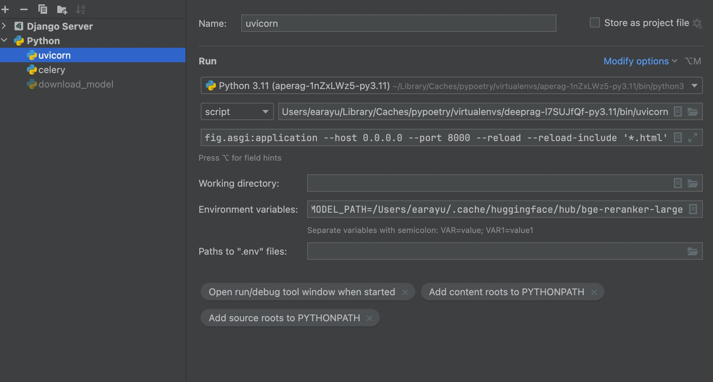
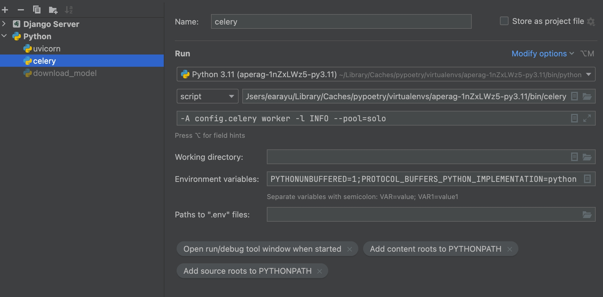

# 调试指南

本文说明如何在本地调试 ApeRAG 后端 API 和 Celery 异步任务。示例以 PyCharm 为主，但命令同样适用于 VS Code 或其他 IDE。

## 准备本地环境

在项目根目录执行：

```bash
make env-dev
make infra-up
make db-migrate
```

常用服务命令：

```bash
make serve-api
make serve-worker
make serve-beat
make serve-web
```

如果需要手动执行，也可以使用下面的命令配置 IDE。

## 调试后端 API

后端入口是 FastAPI app：

```text
aperag.app:app
```

PyCharm 配置建议：

| 配置项 | 值 |
| --- | --- |
| 类型 | Python |
| 名称 | `backend` |
| Python 解释器 | 项目 `.venv/bin/python` |
| 模块或脚本 | `uvicorn` 可执行文件，或以模块方式运行 `uvicorn` |
| 参数 | `aperag.app:app --host 0.0.0.0 --log-config scripts/uvicorn-log-config.yaml` |
| 工作目录 | 项目根目录 |
| 环境变量 | `PYTHONUNBUFFERED=1` |

命令行等价启动：

```bash
uvicorn aperag.app:app --host 0.0.0.0 --log-config scripts/uvicorn-log-config.yaml
```

启动后访问：

- API 文档：<http://localhost:8000/docs>
- 健康检查和业务 API：以当前 OpenAPI 为准



## 调试 Celery worker

Celery 入口是：

```text
config.celery
```

常规本地 worker 命令：

```bash
make serve-worker
```

调试断点时建议使用单进程池，避免任务跑在子进程或线程中导致断点不稳定：

```bash
celery -A config.celery worker -l INFO --pool=solo
```

PyCharm 配置建议：

| 配置项 | 值 |
| --- | --- |
| 类型 | Python |
| 名称 | `celery` |
| Python 解释器 | 项目 `.venv/bin/python` |
| 脚本路径 | `celery` 可执行文件 |
| 参数 | `-A config.celery worker -l INFO --pool=solo` |
| 工作目录 | 项目根目录 |
| 环境变量 | `PYTHONUNBUFFERED=1;PROTOCOL_BUFFERS_PYTHON_IMPLEMENTATION=python` |



## 调试 beat / 定时任务

如果任务依赖 Celery beat 调度，需要同时启动 beat：

```bash
make serve-beat
```

或手动启动：

```bash
celery -A config.celery beat -l INFO
```

调试这类问题时，建议分开启动 API、worker 和 beat，避免多个进程日志混在一起。

## 断点建议

| 场景 | 建议断点位置 |
| --- | --- |
| API 请求参数不符合预期 | 对应 `aperag/domains/**/api/routes.py` handler |
| 业务逻辑结果不符合预期 | 对应 `aperag/domains/<domain>/service/**` |
| 异步任务没有执行 | Celery task 定义处和调用 task 的 service 处 |
| 文档处理或索引异常 | knowledge_base / indexing 相关 service 和 worker 流程 |
| 对话或智能体异常 | conversation / agent_runtime 相关 service |

模块化重构后，新代码优先落在 `aperag/domains/<domain>/`。如果旧路径仍能 import，多数只是兼容 shim；调试时应优先跳到 domain 内的真实实现。

## 常见问题

### 断点没有命中

优先确认：

- IDE 使用的是项目 `.venv/bin/python`；
- 工作目录是项目根目录；
- Celery worker 调试时使用了 `--pool=solo`；
- 请求实际进入的是当前启动的本地服务，而不是 Docker Compose 或远端服务。

### 数据库迁移未执行

运行：

```bash
make db-migrate
```

如果需要检查 SQLAlchemy 模型和 migration 是否一致：

```bash
make db-check
```

### 任务卡住或没有消费

检查 Redis、worker 和 beat 是否都在运行：

```bash
make infra-up
make serve-worker
make serve-beat
```

如果使用 Docker Compose 启动整套系统，则查看对应容器日志：

```bash
docker-compose logs -f
```
